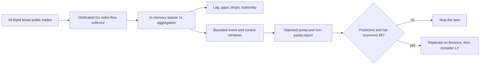

# Architecture

Status: partially current reference.

Last reviewed: 2026-08-13.

The core service descriptions remain useful, but this file does not yet contain the
complete momentum-capture and notification-outbox topology. Its bounded order-flow
section is historical and retired. Until `docs/current-architecture-refresh-v1`
regenerates the diagrams from Compose and executable entrypoints, use
[the documentation source-of-truth map](docs/README.md) and treat the production
Compose file as authoritative for deployed service boundaries.

## Overview

Schurfer is a private multi-service trading platform. One product, several services.
The web UI is behind a login with no public exposure.

## Services

### Hot path (latency sensitive)

- **api-gateway** (Go). REST and websocket endpoints for the web UI. Reads from Redis
  (hot state) and Postgres (cold storage). Runs a background ticker that computes the
  signal score (`scoreSignals`, 5 components) for the private measurement feed and
  writes `signals:{base}` to Redis. Its authenticated health report also exposes
  container-visible host load, memory, root-filesystem usage, and the existing
  `market:hotset:health` counters. It does not mount the Docker socket or host secrets.
- **execution** (Python, FastAPI, ccxt). Reads pump scores from Redis with a
  freshness check, records +20% measurement candidates, and independently enforces
  the +30% hard entry floor before the order path. It runs risk checks, places and
  closes orders on exchanges, monitors open positions for TP, SL, and max-hold, and
  exposes manual control endpoints. Public dry-run market clients cover the scanner's
  17 venues, while account, position, and order paths receive only separately
  constructed authenticated clients.
- **performance accounting** (shared pure Python package). Defines the versioned
  gross/net calculation used by analytics replay and paper execution. Paper costs
  are a conservative model with explicit completeness status. Missing slippage
  preserves observable gross P&L but withholds net P&L. Real exchange accounting is
  not treated as modeled paper accounting.
- **paper exit-liquidity observation** (execution + journal). On a paper close,
  execution samples a bounded fresh order book and stores the first executable
  buy-to-close quote in `app.trade_exit_liquidity_observations`. This is separate
  from the decision-time modeled `trades.exit_slippage_bps`, append-once per trade,
  and best effort so a venue or persistence failure cannot undo a paper close.
- **collector** (Go). Streams all active Bybit linear ticker topics, including best
  bid and ask, and publishes normalized versioned events to NATS
  `market.bybit.ticker.*`.
- **market-hotset** (Go). Consumes the Bybit NATS ticker feed. It keeps a bounded
  ten-minute in-memory prebuffer for the broad venue and activates at most 12 symbols
  from the private `pumps:measurement` feed for four hours. Only active symbols are
  retained as five-second Redis Streams, capped at 3,600 bars and expired after one
  day. It also publishes event-rate, lag, invalid-event, dropped-event, persistence,
  and hot-set health counters. This path is measurement-only and has no order access.
  The Python scanner remains the pump source until the stream detector is validated.

### Warm path (analytical and research)

- **analytics** (Python). One image with three focused entry points:
  - the long-running pump scanner polls exchange tickers via ccxt (not via NATS),
    computes pump episodes, persists OI and funding snapshots, and atomically writes a
    private `pumps:measurement` feed from +20% plus a public `pumps:latest` feed from
    +30% to Redis;
  - the long-running outcome resolver idempotently backfills forward prices, MAE, and
    MFE for recorded decisions from exchange OHLCV, then drains bounded recovery work
    for validated funding, OI, long/short, and liquidation histories around pump
    episodes. A separate resolver version reuses the same durable tables for
    funding-only history around mature closed episodes through seven days, without
    duplicating the other derivatives series;
  - the on-demand, read-only measurement report aggregates dataset health, outcome
    coverage, and descriptive cohort results from Postgres. Dedicated research CLIs
    include exact-venue long-horizon returns with signed funding and stop-survival
    diagnostics.
- **notifier** (Go). Reads `pumps:latest` from Redis, sends Telegram alerts on new
  pump episodes, and records successful point-in-time deliveries in Postgres. A
  Postgres measurement failure is retried from an AOF-backed Redis outbox and never
  causes a duplicate Telegram alert.

### UI

- **web** (TypeScript, React, Vite). Dashboard, pump scanner, token detail, account
  view, and live status/load view. Talks to api-gateway over REST and websockets.

## Data flow

```
Exchanges (REST tickers)
    |
Analytics (Python, ccxt polling)
    |
pumps:measurement (Redis, private, +20%)
    +----> api-gateway ticker (scoreSignals)
    |          |
    |      signals:{base} (Redis)
    |          |
    +----> Execution measurement + hard +30% entry gate
    |
pumps:latest (Redis, public, +30%)
    +----> Notifier (Telegram + app.pump_alert_deliveries)
    |
    +----> api-gateway REST/WebSocket -> Web UI

Trade decisions (Postgres) <---- Outcome resolver (Python, exchange OHLCV)
    |
On-demand measurement report (Python, read-only)

Pump episodes (Postgres) <---- Outcome resolver (Python, CCXT derivatives history)
    |
Versioned context runs + idempotent public samples (Postgres)

collector (Go) --> NATS market.bybit.ticker.*
    |
market-hotset (Go)
    +----> market:hot:bars:bybit:{symbol} (bounded Redis Streams)
    +----> market:hotset:health (Redis)
```

### Historical bounded order-flow pilot (retired)

This lane ended with a no-go verdict. The implementation and description remain for
auditability; they are not an active collection or strategy plan and must not be used
as the architecture template for momentum capture.

The retired lane was deliberately narrower than a general market-intelligence
platform:



Every listed perpetual is observed from the start so pre-pump windows are not
left-censored. This does not mean writing one dense row per symbol per second. Empty
buckets are omitted, raw trades do not traverse NATS by default, and unmatched
non-pump periods are retained only through bounded matched controls. The service
remains behind the optional `orderflow` Compose profile for audit and reproduction;
it is not an active experiment. Every persisted record identifies the
`bybit_orderflow_pilot_v1` capture contract and distinguishes exchange event time,
local receive time, and pump `first_observed_at`. Its production run was a bounded
measurement trial, not a trading signal.

The analytics image mounts the bounded volume read-only. The
`bybit_orderflow_pilot_report_v1` reader streams one gzip subject file at a time,
validates the activation boundary and capture identity, and keeps early-long,
squeeze-avoidance, and delayed-short results separate.

## Redis key registry

| Key                                                  | Owner       | TTL    | Schema / purpose                                                        |
| ---------------------------------------------------- | ----------- | ------ | ----------------------------------------------------------------------- |
| `pumps:measurement`                                  | analytics   | 300s   | private +20% feed with `entry_min_change_pct` for scoring and research  |
| `pumps:latest`                                       | analytics   | 300s   | public +30% subset for API, Web, and Telegram                           |
| `notifier:seen:{pump_event_id}`                      | notifier    | 30d    | `"1"`, de-dupes one threshold alert per durable pump episode            |
| `notifier:alert_delivery_outbox`                     | notifier    | none   | AOF-backed retry list for Postgres alert-delivery measurements          |
| `notifier:alert_delivery_dlq`                        | notifier    | none   | malformed alert-delivery measurements requiring inspection              |
| `signals:{base}`                                     | api-gateway | 120s   | score, verdict, episode id, qualification anchor, and components        |
| `trader:seen:{base}`                                 | execution   | varies | `"1"`; 1m measurement, 5/30m skips, or 24h traded de-duplication        |
| `execution:signal_readiness`                         | execution   | 180s   | latest trader tick: pumps, evaluated, ready, deferred, reason counts    |
| `market:hot:bars:bybit:{symbol}`                     | hotset      | 24h    | bounded five-second bars for active Bybit measurement symbols           |
| `market:hotset:health`                               | hotset      | 30s    | event rate, lag, drops, errors, persisted bars, and active symbol count |
| `market:hotset:bybit`                                | hotset      | varies | restart-safe symbol registry with absolute hot-window expiries          |
| `market:hotset:bybit:metadata`                       | hotset      | none   | base, pump event id, and activation reason for registered Bybit symbols |
| `market:orderflow:health`                            | orderflow   | 30s    | pilot rate, lag, drops, buffers, captures, storage, and trial status    |
| `trading:enabled`                                    | execution   | no TTL | `"true"/"false"`, kill switch                                           |
| `trading:daily_pnl`                                  | execution   | none   | float string (USD), monitoring cache                                    |
| `risk:pnl_ready`                                     | execution   | 120s   | `"1"`, positive lease. Absent or stale means trading is blocked         |
| `journal:pending_close:{exchange}:{base}:{trade_id}` | execution   | none   | durable retry marker: close confirmed on-exchange, journal write failed |
| `lock:order:{exchange}:{base}`                       | execution   | 30s    | `{owner}` UUID, distributed order lock                                  |
| `position:opened_at:{exchange}:{base}`               | execution   | 24h    | Unix timestamp string                                                   |
| `position:sl_order_id:{exchange}:{base}`             | execution   | none   | exchange SL order id, used by position reconciliation                   |
| `position:entry:{exchange}:{base}`                   | execution   | none   | entry price plus context                                                |
| `position:side:{exchange}:{base}`                    | execution   | none   | `"long"/"short"`                                                        |
| `trade:id:{exchange}:{base}`                         | execution   | none   | open trade id pointer, CAS-guarded on close                             |
| `position:paper:*`                                   | execution   | none   | paper and DRY_RUN position state                                        |

> The source of truth for accounting is Postgres (`app.trades`, `realized_pnl_today`),
> not Redis. The durable-daily-PnL work replaced the old ephemeral `daily_loss:{date}`
> and `pnl:{exchange}:{date}` keys. Redis holds hot state plus the `risk:pnl_ready`
> lease only. `app.trades` separates gross and net P&L and stamps every row with an
> accounting version and status. Rows created before the cost model remain
> `legacy_price_only_v1`; their net result is unknown rather than assumed equal to
> gross.

## Storage

| Database         | Purpose                                                            |
| ---------------- | ------------------------------------------------------------------ |
| **PostgreSQL**   | pumps, snapshots, derivatives context, decisions, outcomes, trades |
| **TimescaleDB**  | OHLCV series, tick data, funding history                           |
| **Redis**        | hot state (pump list, signal scores, locks, position metadata)     |
| **Local volume** | capped order-flow event/control aggregates during the trial        |

### Capacity and retention guardrails

- The API status page reports real interval CPU utilization separately from
  one-minute load pressure, plus host memory, swap, disk, ticker event rate, stream
  lag, drops, and persistence failures.
- A host-side systemd collector writes a sanitized atomic container snapshot. The
  API reads the mounted snapshot but has no Docker socket and no Docker control
  capability. Container metrics include CPU, memory, PIDs, health, and restart
  count.
- Local raw-research storage is capped and stops before root filesystem use reaches
  80%. At least 15 GiB remains reserved for the operating system and deployments.
- The first 24-hour Bybit public-trades trial measures actual event volume,
  compression, CPU, memory, and bytes/day. Retention values remain configurable until
  that measurement exists.
- Long-lived raw windows use Parquet+Zstd in object storage. Local deletion requires a
  successful upload, checksum verification, and a persisted manifest.
- PostgreSQL stores point-in-time features, decisions, outcomes, and artifact
  metadata. It is not used as an unbounded raw-trade firehose.

## Exchanges

Scanning is wider than trading. Data coverage does not equal tradeable venues.

- Scanner (data): 17 CEX perp markets by default. binance, bybit, okx, gate, bitget,
  mexc, kucoin, bingx, coinex, phemex, cryptocom, htx, lbank, bitmart, xt, toobit, and
  blofin. This includes Binance. We scan it for data even though we cannot trade its
  perps from Poland.
- Execution (trading): only exchanges with both an API key and secret configured are
  activated at startup. Binance perps are not traded (blocked for Poland residents).

## Deployment

- Production: Hetzner Cloud (Nuremberg), Docker Compose prod stack behind Caddy.
- Dev: local Docker Compose.
- CI: GitHub Actions.
- Access: Tailscale only. SSH and the web UI both go over the tailnet. Caddy serves
  the Tailscale hostname with a static `tailscale cert`, and public ports 80 and 443
  are closed with ufw. Postgres is reachable through an SSH tunnel over Tailscale.

## Logging

All services use structured JSON logging.

- Python: `structlog`.
- Go: `slog` (stdlib).

## Tax and regulatory

Trades only own capital. No third-party funds and no investment-advice service. This
stays in the "personal trading" category. Confirm specifics with a professional before
any monetization.
