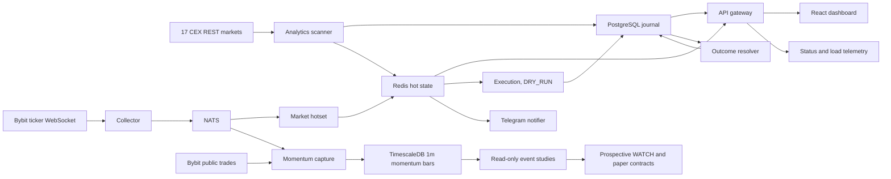

# Schurfer

> Private crypto trading platform: pump scanner, signal analytics, automated execution.

## Status

Live in production on Hetzner, private access over Tailscale, running in DRY_RUN
(paper mode, no real orders). The platform scans 17 perpetual venues, records
point-in-time decisions and liquidity, resolves forward outcomes from 15 minutes
through 28 days for explicitly scoped contracts, and replays locked strategy variants
on matched episodes. The pump-short baseline remains research-only while its frozen
contracts mature. The primary new evidence lane is bounded Bybit early-momentum
capture: the public-trade feed plus ticker/open-interest observations are aggregated
into one-minute TimescaleDB bars under an explicit storage and canary budget. It does
not authorize live capital or unconditional multi-venue expansion. See
[ROADMAP.md](ROADMAP.md) for gates and [docs/README.md](docs/README.md) for the
documentation map.

## What it does

- Scans 17 CEX perpetual markets every 60s for price pumps above a configurable threshold
- Persists pump episodes with peak %, retrace %, and timeline snapshots (+1h/+4h/+24h)
- Scores each active pump on 5 components: age, price extent, OI trend, funding rate, retrace from peak (0 to 10)
- Captures bounded Bybit one-minute momentum-flow bars with explicit gaps, drops, lag,
  and storage telemetry
- Token detail page: OHLCV chart (5m/15m/1h/4h), exchange breakdown, episode history, signal components
- Telegram alerts on new pump detection
- Automated short execution when `AUTO_TRADE=true`: opens positions on high-score pumps, monitors TP/SL/max-hold, closes automatically
- Emergency kill-switch (`/stop`/`/resume`), daily loss limit, max position count, duplicate position guard
- Live status page for dependencies, server CPU/load, memory, disk, market throughput,
  lag, drops, and persisted hot-set bars

## System at a glance



## Stack

| Layer              | Technology                                                     |
| ------------------ | -------------------------------------------------------------- |
| Analytics scanner  | Python 3.13, ccxt, psycopg3, redis-py, structlog               |
| Execution service  | Python 3.13, FastAPI, ccxt, redis-py, structlog                |
| API gateway        | Go 1.26.6, chi, pgx, go-redis                                  |
| Bybit WS collector | Go 1.26.6, NATS                                                |
| Telegram notifier  | Go 1.26.6                                                      |
| Frontend           | React 19, Vite, TypeScript, shadcn/ui, lightweight-charts      |
| Storage            | PostgreSQL 17 + TimescaleDB, Redis 7                           |
| Message bus        | NATS 2 with JetStream                                          |
| Infra              | Docker Compose (dev), Hetzner Cloud + Caddy + Tailscale (prod) |

## Project structure

```
apps/
├── analytics/       Python  - pump scanner, persistence, snapshots, OI/funding collection
├── api-gateway/     Go      - REST API, OHLCV proxy, pump history, signal scoring, Redis ticker
├── collector/       Go      - Bybit/Binance feeds, bounded hotset, and momentum-capture
│                              binaries (cmd/momentumcapture is Bybit, unsuffixed -- named
│                              before Binance existed; cmd/momentumcapturebinance is Binance)
├── execution/       Python  - order execution, risk checks, position monitor, signal trader
├── notifier/        Go      - Telegram alerts, reads Redis pumps:latest
└── web/             TS      - React dashboard (/pumps, /pumps/:base)

packages/
├── journal/         Python  - SQLAlchemy models, Alembic migrations
└── performance/     Python  - versioned gross/net accounting shared by replay and paper

infra/
└── docker/
    ├── docker-compose.dev.yml
    └── init-db.sql

docs/
├── README.md        documentation index and source-of-truth map
├── adr/             architecture decision records
├── architecture/    reviewed current/target architecture plans
├── contracts/       versioned wire and delivery contracts
├── research/        frozen protocols, feasibility studies, and discovery ledger
├── strategies/      strategy specs
├── runbooks/        operational procedures
└── tasks/           bounded external/upstream engineering tasks
```

## Quick start

### Prerequisites

- Docker + Docker Compose
- Python 3.13 + [uv](https://docs.astral.sh/uv/)
- Node 22 + [pnpm](https://pnpm.io/)
- Go 1.26.6

### 1. Install dependencies

```bash
make install
```

### 2. Configure environment

```bash
make dev-init          # generates .env with hashed admin password
```

Add optional variables to `.env`:

```env
# Exchange API keys for execution service (only exchanges with both key+secret are activated)
BYBIT_API_KEY=...
BYBIT_API_SECRET=...

# Telegram alerts (optional)
TELEGRAM_BOT_TOKEN=<your bot token>
TELEGRAM_CHAT_ID=<your chat or channel id>

# Scanner tuning (optional, defaults shown)
PUMP_MEASUREMENT_MIN_PCT=20
PUMP_ENTRY_MIN_PCT=30
SCAN_INTERVAL=60
PUMP_EXCHANGES=binance,bybit,okx,gate,bitget,mexc,kucoin,bingx,coinex,phemex,cryptocom,htx,lbank,bitmart,xt,toobit,blofin

# Automated trading (disabled by default, enable only after paper testing)
AUTO_TRADE=false
SIGNAL_POSITION_USD=50
SIGNAL_LEVERAGE=3
SCORE_THRESHOLD=6
MEASUREMENT_STRATEGY_VERSION=pump_short_measurement_v1
```

### 3. Start infrastructure

```bash
make dev               # starts postgres, redis, nats, api-gateway, analytics, collector, notifier, execution
```

### 4. Run database migrations

```bash
make migrate
```

### 5. Start the frontend

```bash
cd apps/web && pnpm dev
```

Open [http://localhost:5173](http://localhost:5173) and log in with `admin` and the password set during `dev-init`.

## Services

| Service           | URL / Port            | Notes                                                |
| ----------------- | --------------------- | ---------------------------------------------------- |
| Frontend (dev)    | http://localhost:5173 | Vite dev server, proxies /api to gateway             |
| API gateway       | http://localhost:8000 | REST API, signal scoring ticker                      |
| Execution service | http://localhost:8001 | Order execution, internal only                       |
| PostgreSQL        | localhost:5432        | user: schurfer, db: schurfer                         |
| Redis             | localhost:6379        | pump state, signal scores, position locks            |
| NATS              | localhost:4222        | versioned market events between collector and hotset |

### Key API endpoints

```
GET  /api/pumps                      current pump list (from Redis)
GET  /api/pumps/:base                single token current data
GET  /api/pumps/:base/ohlcv          OHLCV candles (interval=5|15|60|240, limit=N)
GET  /api/pumps/:base/history        all episodes for a token
GET  /api/pumps/:base/signals        short-readiness score (0-10, 5 components)
GET  /api/pumps/history              filtered history (exchange, since, until)
GET  /api/health                     dependency, server-load, and market-pipeline telemetry
GET  /api/account/balance            exchange balances
GET  /api/account/positions          open positions
POST /api/account/order              place order
POST /api/account/positions/close    close position manually
POST /api/account/stop               emergency kill-switch
POST /api/account/resume             resume trading
GET  /healthz                        service health check
```

## Data retention

The production server is intentionally not a raw market-data warehouse. Redis keeps
bounded hot state, PostgreSQL keeps durable decisions and research outputs, and raw
market data is admitted only under an explicit byte budget. Momentum capture does not
persist raw trades: it stores one minute per eligible symbol with buy/sell histograms,
top trades, burst measures, OI, price, provenance, and explicit completeness flags.
Historical token-behavior OHLCV is a separate, hashed Parquet+Zstd dataset generated
by a bounded read-only job rather than an always-on firehose.

- stop raw writes at 80% disk usage;
- reserve at least 15 GiB for the operating system and deployments;
- measure real bytes/day for 24 hours before locking retention;
- measure hot and steady-state compressed bytes/day separately during every capture
  canary;
- use Timescale compression and retention policies only under their registered disk
  gates;
- keep report/backfill compute off the constrained production host when real
  `MemAvailable` headroom is insufficient;
- retain Parquet+Zstd artifacts only with a manifest and verified content hashes;
- expand beyond Bybit only after capture integrity and host-capacity gates pass;
- authorize strategy promotion only from point-in-time predictive and economic
  evidence, never from data availability alone.

## Development commands

```bash
make verify       # full pre-PR gate: lint, types, tests, build, compose config
make test         # run all tests (Python + Go + TS)
make lint         # run all linters via pre-commit
make ci-lint      # run the exact all-files lint gate used by GitHub Actions
make format       # auto-format Python, Go, TypeScript
make security     # pip-audit + govulncheck + pnpm audit
make dev-logs     # tail all service logs
make dev-stop     # stop containers
make dev-reset    # stop containers and wipe all data volumes
make migrate      # run Alembic migrations against local DB
make momentum-capture-health  # inspect optional local momentum capture (Bybit; unsuffixed
                               # name predates Binance -- see momentum-capture-binance-health)
```

## License

Proprietary. All rights reserved.
