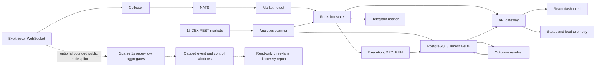

# Schurfer

> Private crypto trading platform: pump scanner, signal analytics, automated execution.

## Status

Live in production on Hetzner, private access over Tailscale, running in DRY_RUN
(paper mode, no real orders). The platform scans 17 perpetual venues, records
point-in-time decisions and liquidity, resolves forward outcomes from 15 minutes
through 7 days, and replays locked strategy variants on matched episodes. Current
research keeps the low-impact taker and fixed-risk wider-stop contracts frozen while
they collect prospective evidence. A discovery replay found no support for requiring
50% to 200% pumps, so the next independent data lane is an optional, capped Bybit
public-trades pilot that tests timing rather than another entry-floor tweak. It is not
an unconditional multi-exchange firehose. See [ROADMAP.md](ROADMAP.md).

## What it does

- Scans 17 CEX perpetual markets every 60s for price pumps above a configurable threshold
- Persists pump episodes with peak %, retrace %, and timeline snapshots (+1h/+4h/+24h)
- Scores each active pump on 5 components: age, price extent, OI trend, funding rate, retrace from peak (0 to 10)
- Token detail page: OHLCV chart (5m/15m/1h/4h), exchange breakdown, episode history, signal components
- Telegram alerts on new pump detection
- Automated short execution when `AUTO_TRADE=true`: opens positions on high-score pumps, monitors TP/SL/max-hold, closes automatically
- Emergency kill-switch (`/stop`/`/resume`), daily loss limit, max position count, duplicate position guard
- Live status page for dependencies, server CPU/load, memory, disk, market throughput,
  lag, drops, and persisted hot-set bars

## System at a glance



## Stack

| Layer              | Technology                                                     |
| ------------------ | -------------------------------------------------------------- |
| Analytics scanner  | Python 3.13, ccxt, psycopg3, redis-py, structlog               |
| Execution service  | Python 3.13, FastAPI, ccxt, redis-py, structlog                |
| API gateway        | Go 1.24, chi, pgx, go-redis                                    |
| Bybit WS collector | Go 1.24, NATS                                                  |
| Telegram notifier  | Go 1.24                                                        |
| Frontend           | React 19, Vite, TypeScript, shadcn/ui, lightweight-charts      |
| Storage            | PostgreSQL 17 + TimescaleDB, Redis 7                           |
| Message bus        | NATS 2 with JetStream                                          |
| Infra              | Docker Compose (dev), Hetzner Cloud + Caddy + Tailscale (prod) |

## Project structure

```
apps/
├── analytics/       Python  - pump scanner, persistence, snapshots, OI/funding collection
├── api-gateway/     Go      - REST API, OHLCV proxy, pump history, signal scoring, Redis ticker
├── collector/       Go      - Bybit ticker websocket publisher and bounded hotset consumer
├── execution/       Python  - order execution, risk checks, position monitor, signal trader
├── notifier/        Go      - Telegram alerts, reads Redis pumps:latest
└── web/             TS      - React dashboard (/pumps, /pumps/:base)

packages/
├── journal/         Python  - SQLAlchemy models, Alembic migrations
└── performance/     Python  - versioned gross/net accounting shared by replay and paper

infra/
└── docker/
    ├── docker-compose.dev.yml
    └── init-db.sql

docs/
├── adr/             architecture decision records
├── contracts/       versioned wire and delivery contracts
├── strategies/      strategy specs
└── runbooks/        operational procedures
```

## Quick start

### Prerequisites

- Docker + Docker Compose
- Python 3.13 + [uv](https://docs.astral.sh/uv/)
- Node 22 + [pnpm](https://pnpm.io/)
- Go 1.24

### 1. Install dependencies

```bash
make install
```

### 2. Configure environment

```bash
make dev-init          # generates .env with hashed admin password
```

Add optional variables to `.env`:

```env
# Exchange API keys for execution service (only exchanges with both key+secret are activated)
BYBIT_API_KEY=...
BYBIT_API_SECRET=...

# Telegram alerts (optional)
TELEGRAM_BOT_TOKEN=<your bot token>
TELEGRAM_CHAT_ID=<your chat or channel id>

# Scanner tuning (optional, defaults shown)
PUMP_MEASUREMENT_MIN_PCT=20
PUMP_ENTRY_MIN_PCT=30
SCAN_INTERVAL=60
PUMP_EXCHANGES=binance,bybit,okx,gate,bitget,mexc,kucoin,bingx,coinex,phemex,cryptocom,htx,lbank,bitmart,xt,toobit,blofin

# Automated trading (disabled by default, enable only after paper testing)
AUTO_TRADE=false
SIGNAL_POSITION_USD=50
SIGNAL_LEVERAGE=3
SCORE_THRESHOLD=6
MEASUREMENT_STRATEGY_VERSION=pump_short_measurement_v1
```

### 3. Start infrastructure

```bash
make dev               # starts postgres, redis, nats, api-gateway, analytics, collector, notifier, execution
```

### 4. Run database migrations

```bash
make migrate
```

### 5. Start the frontend

```bash
cd apps/web && pnpm dev
```

Open [http://localhost:5173](http://localhost:5173) and log in with `admin` and the password set during `dev-init`.

## Services

| Service           | URL / Port            | Notes                                                |
| ----------------- | --------------------- | ---------------------------------------------------- |
| Frontend (dev)    | http://localhost:5173 | Vite dev server, proxies /api to gateway             |
| API gateway       | http://localhost:8000 | REST API, signal scoring ticker                      |
| Execution service | http://localhost:8001 | Order execution, internal only                       |
| PostgreSQL        | localhost:5432        | user: schurfer, db: schurfer                         |
| Redis             | localhost:6379        | pump state, signal scores, position locks            |
| NATS              | localhost:4222        | versioned market events between collector and hotset |

### Key API endpoints

```
GET  /api/pumps                      current pump list (from Redis)
GET  /api/pumps/:base                single token current data
GET  /api/pumps/:base/ohlcv          OHLCV candles (interval=5|15|60|240, limit=N)
GET  /api/pumps/:base/history        all episodes for a token
GET  /api/pumps/:base/signals        short-readiness score (0-10, 5 components)
GET  /api/pumps/history              filtered history (exchange, since, until)
GET  /api/health                     dependency, server-load, and market-pipeline telemetry
GET  /api/account/balance            exchange balances
GET  /api/account/positions          open positions
POST /api/account/order              place order
POST /api/account/positions/close    close position manually
POST /api/account/stop               emergency kill-switch
POST /api/account/resume             resume trading
GET  /healthz                        service health check
```

## Data retention

The production server is intentionally not a raw market-data warehouse. Redis keeps
bounded hot state, PostgreSQL keeps durable decisions and research outputs, and raw
market data is admitted only under an explicit byte budget. The optional order-flow
pilot observes every Bybit perpetual but persists only sparse one-second event and
matched-control windows rather than dense symbol-seconds or every raw trade.

- stop raw writes at 80% disk usage;
- reserve at least 15 GiB for the operating system and deployments;
- measure real bytes/day for 24 hours before locking retention;
- keep local aggregate windows under a configurable 5 GiB / 14-day hard cap during
  the bounded trial;
- derive 5s/1m views during analysis until longer retention proves useful;
- upload selected Parquet+Zstd windows only after checksum verification;
- expand beyond Bybit only after a point-in-time predictive and economic gate passes.

## Development commands

```bash
make verify       # full pre-PR gate: lint, types, tests, build, compose config
make orderflow-pilot-report ARGS="--root /path/to/orderflow"
make test         # run all tests (Python + Go + TS)
make lint         # run all linters via pre-commit
make ci-lint      # run the exact all-files lint gate used by GitHub Actions
make format       # auto-format Python, Go, TypeScript
make security     # pip-audit + govulncheck + pnpm audit
make dev-logs     # tail all service logs
make dev-stop     # stop containers
make dev-reset    # stop containers and wipe all data volumes
make migrate      # run Alembic migrations against local DB
```

## License

Proprietary. All rights reserved.
