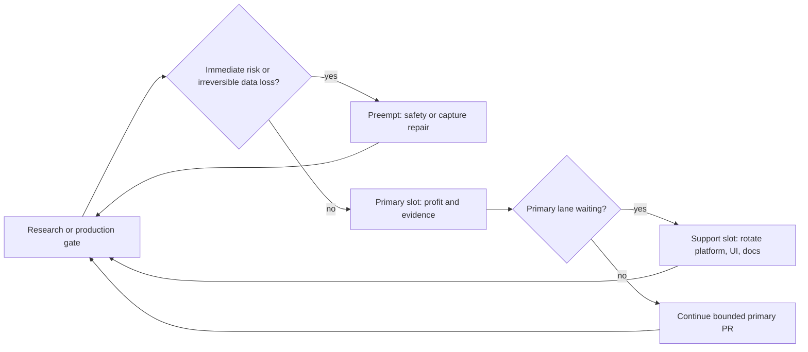

# Roadmap

> Living document. Updated as we progress. Last refreshed 2026-09-01.

## Current focus

Update only these four lines after every merge -- this is the fast-path
status check, not a place for narrative.

```
Current primary: research/cex-activity-offline-denominator-v1
State: in_progress
Next after current primary merges: research/cex-activity-discovery-completion-v1
User decision required: no
```

## Autonomy rules (when to just proceed, when to ask)

"Primary slot" / "support slot" (see the WIP limits below) are a
parallelism cap, not a permission gate -- do not stop and ask just because
a slot is occupied. Use this order:

- **Next PR is unambiguous and its prerequisites are met** -- start it,
  no question needed.
- **Current PR is in review** -- fix the findings; this is still the same
  slot, not a new one.
- **Primary is idle waiting on data/cohort maturity to accumulate** -- the
  slot is free for the next independent profit/evidence item; take it.
- **Primary depends on someone else's PR** -- help land that PR (fix
  review findings on request) or take a support-slot item. Do not open a
  third research direction while two are already active (see the WIP
  limits below) -- that repeats the exact mistake this rule exists to
  prevent.
- **Ask the user only when**: choosing hypothesis parameters that aren't
  already frozen, accepting additional identity/collision risk, enabling
  live trading, or performing any production mutation or deployment.
- **A referenced hypothesis/contract isn't found where expected** --
  search every active branch (including open PRs not yet merged, e.g. via
  `git fetch origin <branch>`) before concluding it's missing. If it
  genuinely isn't registered anywhere, register it as part of the current
  primary slot -- preferably in the current branch -- rather than opening
  another research direction.

## Guiding principle

The biggest unknown is whether the strategy has edge after fees, funding, and
slippage. The most expensive mistake is not architecture. It is under-collected,
non-recoverable data. Order-book depth and spread at signal time cannot be
reconstructed later. So we start collecting evidence now and build everything else
in parallel or after.

"Ship new functionality over refactoring working code" still holds. The point is
that right now the highest-value new capability is the measurement layer, not a
strategy feature. Code can be written any time. Today's order book will not exist
tomorrow.

The parked idea catalog lives in [IDEAS.md](IDEAS.md). It is frozen until edge is
proven. Post-MVP strategy and exit improvements live in the exit-strategy notes.
Cross-cutting reliability and performance review claims are triaged in the
[engineering findings register](docs/engineering/findings-register.md). A reported
finding does not enter this delivery queue until code, tests, production metrics, or
a bounded benchmark confirms it; rejected and measurement-only claims remain in the
register so they are not repeatedly rediscovered or implemented by assertion.

## Delivery portfolio and WIP limits

Schurfer advances several product lanes, but it does not implement all of them at
once. Parallelism means that collectors and frozen cohorts may accumulate evidence
while another bounded change is being built. It does not mean keeping many unfinished
branches open or alternating between unrelated changes inside one pull request.

At most two implementation pull requests may be active at once:

1. **Primary slot: profit and evidence.** This slot is always assigned to the highest
   value available work that can establish, reject, or execute an edge: capture of
   non-recoverable inputs, a frozen research read, an executable-cost check, a WATCH
   or paper strategy, or a safety requirement that blocks those activities.
2. **Support slot: one bounded enabling change.** Rotate this slot between platform
   reliability, operations, UI, and documentation. Prefer work that can finish while
   the primary lane is waiting for a canary, a forward cohort, or an external review.

Passive production collection, a scheduled checkpoint, and a merged contract waiting
for maturity do not occupy an implementation slot. A production incident, capital
safety defect, data corruption risk, or failure of non-recoverable capture preempts
both slots until it is contained. Ordinary refactoring, visual polish, and speculative
scaling never preempt a healthy evidence-producing lane.

Use the following rolling target for every ten merged pull requests. This is an
engineering allocation, separate from the experiment-family budget below.

| Lane                           | Target per 10 merged PRs | Examples                                                                            |
| ------------------------------ | -----------------------: | ----------------------------------------------------------------------------------- |
| Profit and evidence            |               at least 5 | capture, discovery/confirmation reports, WATCH/paper candidates, costs and capacity |
| Reliability and data platform  |                  about 2 | durability, recovery, bounded queues, venue adapters, resource protection           |
| UI and research tooling        |                  about 1 | token workspace, event timeline, progressive Research rendering                     |
| Documentation and architecture |                  about 1 | current-state diagrams, ADR supersession, roadmap/archive maintenance               |
| Gate-driven flex               |                  about 1 | whichever lane removes the highest-value proven blocker                             |

Do not run more than two consecutive support PRs from UI, documentation, or general
refactoring unless they remove an explicit blocker or active operational risk. After
every merge or research verdict, select the next work again from current evidence;
the roadmap order is not a reason to build a now-irrelevant item.



Documentation changes normally accompany the code or decision they describe. A
dedicated documentation PR is justified for cross-cutting drift, navigation, or
architecture cleanup, but must have an explicit file list and finish condition. UI
work follows the same rule: one coherent user workflow per PR, with backend contracts
defined first and no empty navigation for capabilities that do not exist yet.

### Near-term interleaving from 2026-08-31

Supersedes the 2026-08-29 list below for current prioritization (retained as decision
log, not current instruction). Written because that list drifted materially behind
actual state: PR 1-3 of the source-lead derivative-market-evidence sequence
(#313-315) are merged and `ROUTE_EVIDENCE_INDEPENDENTLY_VERIFIED = True` is live; the
forward cohort it unlocked is registered (#316, `source_lead_forward_cohort_v1`,
cohort start `2026-09-03`, earliest possible read `~2026-10-01` -- item 12 below); the
OPG `/pumps/<TOKEN>` fix is merged and deployed (#317); this Readiness-concurrency PR
is the current, last-queued support-slot item, not a future one. Applies the same
WIP-limit rule: at most one primary (profit/evidence) and one support (bounded
enabling change) slot.

1. **Finish the current support PR:
   `fix/research-readiness-handler-concurrency-v1`.** Close remaining review
   findings, merge, deploy API + web. Once this lands, no further queued
   support-slot item exists -- the support slot goes idle until something new
   needs it, rather than immediately pulling in Markets/Assets catalog (item
   11 below) ahead of primary-slot work.
2. **[Done, `research/pump-analytics`, PR #297, merged 2026-09-03.]** HYP-017
   (radar-outcome, WATCH as a +25%-within-24h precursor): the colleague's
   final review round found the pre-fix greedy pair-matching algorithm could
   systematically lose pairs, making the recorded 189-pair read
   methodologically unreliable as evidence for any verdict -- status changed
   `rejected` -> `parked` accordingly (see `docs/research/discovery-ledger.md`
   for the full amendment). HYP-016 (CEX taker-burst activity) stays `parked`
   / `report_not_produced_operationally_unresolved`, not a negative result.
   Landed: restored the 100-episode evidence floor, bounded the radar query,
   added a positive burst-arithmetic test, replaced greedy control matching
   with deterministic maximum-cardinality bipartite matching
   (`MATCHING_POLICY_VERSION`), deduplicated direction/control primitives.
3. **`research/cex-activity-offline-denominator-v1` (current primary).** What
   HYP-016 actually needs to become answerable at all -- a point-in-time
   5m/24h relative-activity denominator computed off the production hot path
   (frozen extract or offline replica), full instrument universe, a runtime
   bound that cannot repeat the 12-minute production I/O incident. No
   Telegram, no live capture; this is infrastructure for a discovery query,
   not a product. `momentum_flow_bidirectional_burst_offline_repository.py`:
   `OfflineBarsExtractRepository.extract_bars_to_parquet` does the only part
   that ever touches production -- a plain indexed range SELECT (no window
   functions), chunked by day via the live path's own `candidate_query_windows`
   so the two can never drift on chunk boundaries -- and writes the result to
   a local Parquet file; `fetch_candidate_extreme_minutes_offline` then runs
   the SAME 5m/24h RANGE-window burst computation via DuckDB against that
   file, with zero further production load no matter how many times a
   discovery run needs repeating while iterating. Proven equivalent to the
   live path, not just similar to it:
   `test_offline_query_matches_live_query_on_identical_seeded_data` asserts
   the two paths return bit-identical `BurstMinute` tuples on the same seeded
   Postgres data. Caught one real bug in the process: DuckDB silently
   converts a tz-aware Python `datetime` to the session's local (host-
   dependent) timezone when binding/storing it as a plain `TIMESTAMP` --
   fixed by pinning the DuckDB session `TimeZone` to `'UTC'` and using
   `TIMESTAMPTZ` throughout instead of bare `TIMESTAMP`. Wiring this into
   `cex_activity_discovery_report.py` itself, and actually re-running HYP-016
   against it, is the next item (4), not this one -- this PR is infra only.
4. **Then: `research/cex-activity-discovery-completion-v1`.** Re-run HYP-016's
   already-registered, pre-declared two-direction family (buy/sell,
   Holm-corrected) on the now-computable denominator, full candidate universe,
   the same already-viewed `2026-08-18` -> `2026-08-27` window (discovery-only,
   permanently -- see HYP-016's own instruction not to re-view it as
   confirmation). Selects at most one direction to freeze for a future
   untouched forward cutoff, or closes the idea.
5. **Then: `research/liquidation-maker-upper-bound-v1`.** Binance/Bybit
   liquidation capture is live in production
   (`schurfer-liquidation-capture-binance`/`-bybit`, both healthy) -- test
   maker-style reversion on the accumulated liquidation-event history itself,
   not the 2 live-paper trades this idea started from: independent episodes,
   exact venue, a limit level fixed in advance, price merely touching that
   level counted only as an optimistic potential fill (never an actual one),
   costs, MFE/MAE, adverse selection. A negative result closes the direction
   before any L2/shadow-capture infrastructure gets built for it.
6. **Then, only if 5 is positive: bounded shadow capture** (BBO/L2, queue-aware
   potential fills, partial fills, opportunity loss, capacity) -- still no real
   orders.
7. **[Done, `research/token-universe-coverage-v1`] Point-in-time listing
   coverage and a non-survivorship-biased control group.** This item
   originally read `research/token-universe-identity-and-expansion-v1`
   and described canonical on-chain/exchange identity instead of a bare
   ticker, plus never silently merging two distinct tokens sharing a
   symbol (e.g. 牛来 vs. NIULAI). Before writing any code, that turned out
   to already be fully implemented and merged --
   `feat/momentum-universe-identity-foundation-v1` (2026-08-15) and
   `feat/momentum-universe-identity-resolution-v1` (2026-08-17, worked
   example verbatim: "`base=BTR` on two venues with close onboarding
   dates is a candidate, not proof of the same asset"), both above under
   Phase 1. **Read those two entries and
   `docs/research/momentum-universe-identity-resolution-v1.md` before
   registering any future item that sounds like "cross-venue instrument
   identity" -- this item's own original text duplicated them by not
   checking first.** The one real, verified gap this PR actually closed:
   `app.momentum_universe_snapshots` only gets a new row on a
   capture-process restart (irregular), so "was base X listed on venue E
   at historical instant Y" and "every base that was ever a real
   candidate during a window, including ones since delisted" were
   unanswerable. `MomentumUniverseIdentityRepository.instruments_as_of`/
   `universe_seen_in_window` plus the pure `token_universe_coverage.py`
   (`mark_currently_ready`/`delisted`/`AsOfCoverage`/`WindowCoverage`)
   close exactly that, reading only already-persisted snapshot history --
   no schema change, no new capture. Colleague review, round 2, caught
   two P1s that would have corrupted the exact denominator this item
   exists to produce: the window query originally excluded the carry-in
   snapshot before `window_start`, so a window with zero capture-process
   restarts inside it reported an empty universe instead of the one
   genuinely listed throughout (fixed: an admissibly-fresh carry-in, per
   a required `max_carry_in_staleness`, is now included, with
   `WindowCoverage.has_reliable_coverage` reporting when it is not); and
   grouping was by bare `native_market_id` instead of `identity_key`, so
   a market id delisted and later relisted under the same ticker would
   have been merged with its predecessor (fixed: keyed by `identity_key`
   throughout, matching this codebase's own existing identity system).
   Both fixes are proven against real Postgres by tests written to
   reproduce the original bugs. See
   [token-universe-coverage-v1.md](docs/research/token-universe-coverage-v1.md).
   Prerequisite for item 8, not itself a profit/evidence result on its
   own.
8. **[Done, `research/serial-pump-regimes-v1`, after two colleague-review
   rounds of five P1 fixes each] What happened after a first pump on a
   given asset -- using every radar episode
   (not only ones that went on to "win"), recurrence count and
   inter-episode intervals, venue expansion, BTC/market-adjusted return,
   `15m`/`1h`/`4h`/`1d`/`7d`/`30d` horizons, MFE/MAE/time-to-peak/
   retrace/delisting.** Discovery-only, no verdict -- explicit user
   decision; the historical window stays discovery-only, any future
   confirmation runs on a new, untouched forward cutoff, never on the
   window already viewed here. Before writing any new merging logic,
   found that "every radar episode, recurrence count and inter-episode
   intervals" was already built and colleague-review-hardened in
   `pump_recurrence_integrity_report.py`'s own `Episode`/`Regime`/
   `merge_episodes_into_regimes` -- reused directly via
   `PumpRecurrenceIntegrityRepository.load()` rather than reimplemented.
   New code: `serial_pump_regimes.py` (pure forward-outcome resolution)
   and `serial_pump_regimes_report.py` (I/O + `make serial-pump-regimes-
report`/`make prod-serial-pump-regimes-report`, no required bound -- an
   explicit user decision to keep the default an unbounded run). Venue
   expansion reuses item 7's own `instruments_as_of`. OHLCV fetched live
   via the existing cached `ohlcv.fetch_symbol_candles`, not a new frozen
   dataset -- an explicit user decision, to keep the report runnable
   against the live, growing regime population.
   **First colleague-review round (2026-09-01) found five P1s in the
   first draft, all fixed** -- see
   [serial-pump-regimes-v1.md](docs/research/serial-pump-regimes-v1.md)
   for the full account: (1) the decision instant was anchored to
   `regime.last_seen_at`, a running maximum a future episode can still
   extend, answering "after the last episode once the regime is fully
   formed" rather than item 8's own "after a FIRST pump" -- fixed by
   anchoring `decision_boundary_ms` to `regime.first_seen_at` instead,
   which is set once and never revised by a later merge; (2) entry price
   used the boundary candle's own CLOSE, only known a full timeframe
   after the decision instant -- a look-ahead -- fixed to use that
   candle's OPEN, known instantly; (3) OHLCV/venue-expansion identity was
   picked from a bare `base` ticker (`fetch_candles` reconstructing
   `f"{base}/USDT:USDT"`), exactly the class of bug the identity
   foundation/resolution PRs and the recurrence-integrity audit exist to
   prevent -- fixed via `_resolve_regime_identities` (requires every
   `SourceIdentityObservation` for a regime's own episodes, per exchange,
   to agree on one `identity_key`/`unified_symbol` with no
   `identity_conflict`, else fails closed) feeding `fetch_symbol_candles`
   an already-resolved unified symbol; (4) a horizon resolved as long as
   the tail candle reached far enough, even with a leading or internal
   gap in the path -- fixed with an exact gapless-sequence check
   (`ohlcv.covers_window_without_gaps`, made public for this reuse),
   split into distinct `leading_candle_gap`/`internal_candle_gap`
   reasons; (5) venue expansion's `ready_after` check could read a
   still-future instant as if today's current snapshot were already the
   answer -- fixed with an `evaluation_at` parameter gating the check to
   `after_at_matured=False`/`ready_after=None` whenever the 30-day-
   forward point has not actually occurred yet. Two P2s also fixed: one
   regime's own OHLCV fetch failure used to propagate through
   `asyncio.gather` and lose the whole run's already-completed work
   (fixed: per-regime try/except -> `ohlcv_fetch_failed`, plus
   `concurrency <= 0` now rejected before it could hang a
   `Semaphore(0)` forever); and reproducibility metadata was incomplete
   (`make serial-pump-regimes-report` never passed `--code-revision`/
   `--working-tree-dirty`, and `input_fingerprint` only covered episodes,
   not the identity observations that also determine exchange/symbol
   choice -- both fixed). A real bug (`render_json` stringifying the
   entire report via `repr()` instead of producing real nested JSON,
   `json_ready` never handling a bare dataclass) was separately caught by
   a live smoke run against real data before the colleague review, not by
   the unit tests written before that run -- fixed and covered by two
   regression tests that parse the rendered JSON back and inspect
   individual fields.
   **Second colleague-review round (2026-09-01) found five more P1s in
   the round-1 identity/venue-expansion machinery itself, all fixed** --
   see [serial-pump-regimes-v1.md](docs/research/serial-pump-regimes-v1.md)
   for the full account: (1) identity resolution still ran over a
   regime's FULL episode set, so a much-later merged episode's own first
   identity observation could get used to pick an earlier decision
   instant's OHLCV exchange -- a "future-known route selection" look-
   ahead round 1's own first_seen_at anchor made more likely to bite, not
   less -- fixed by restricting identity resolution to episodes already
   known by the decision boundary; (2) the resolver silently dropped an
   observation with a `None` identity_key instead of treating it as
   evidence of an incomplete observation, and never checked `base_asset`
   at all -- fixed by reusing `pump_recurrence_integrity_report.
   identity_reason` (already built, already reviewed) instead of a
   second, weaker check; (3) recurrence counting is still ticker-based
   (an accepted characteristic of the reused `merge_episodes_into_regimes`,
   not rearchitected) but now carries a disclosed
   `next_regime_same_asset` overlay confirming or refuting same-asset
   identity per recurrence link, rather than presenting every same-base
   regime pair with unstated confidence; (4) venue expansion only checked
   readiness on an exchange this regime already had a source-derived
   identity on -- structurally excluding the exact "first-time listing on
   a new venue" case the feature exists to detect -- fixed with a
   disclosed two-tier match (`identity_key` when available, a
   ticker-based fallback when not, both reported via
   `VenueExpansionEntry.match_basis`); (5) `MarketPathCacheCorruptError`/
   `MarketPathCacheWriteError` were swallowed by the same generic
   per-regime except that also wrongly discarded already-computed
   horizon outcomes on a venue-expansion-only failure -- fixed by letting
   the two cache exceptions propagate and fail the whole run loudly (per
   `market_path_cache.py`'s own contract), and giving venue expansion its
   own separate try/except downstream of the horizons. Three more P2s:
   markdown output used to surface only per-horizon medians, hiding
   almost everything else the report computes -- now includes a
   `## Regimes` table and a `## Horizon detail` table; `input_fingerprint`
   ignored the `--base` filter for identity observations -- now narrowed
   to the retained episodes' own event_ids; and the "hold or sell"
   framing overclaimed economically (gross returns only, no
   spread/fees/slippage/funding) -- now disclosed in the module
   docstring, the CLI's own `--help`, and the rendered markdown header,
   naming `packages/performance`'s `calculate_performance`/
   `CostParameters` (already used by `source_lead_forward_cohort.py`) as
   the required follow-up before any number here is read as an economic
   recommendation. 77 tests total (up from 34).
9. **Passively maturing in parallel, no PR needed yet:**
   `research/pump-short-maker-entry-prospective-v1` (registered, item 11
   below) around `2026-09-21`; `source_lead_forward_cohort_v1` (registered,
   item 12 below) around `2026-10-01`. Freezing and implementing each
   one's evaluator/report plumbing against synthetic fixtures now, before
   either cohort matures, is exactly the right order -- the danger this
   codebase's prospective-research discipline actually guards against is
   building or changing an evaluator _after_ real, mature outcomes are
   already visible (see `source_lead_forward_cohort_v1`'s own
   `resolve_episode`/`formal_verdict`, already frozen this way, before
   this same cohort's own start date). What must wait is the formal run:
   reading either cohort's real result exactly once, at its own
   pre-declared checkpoint/evidence floor, never earlier and never
   re-peeked.
10. **Deferred, explicitly not silently dropped: LBank-first sequencing.**
    Named a registered money-first direction elsewhere in this document,
    but it sits behind several data PRs and still has no exact native
    historical OHLCV path (see
    [CCXT-003](docs/tasks/ccxt/003-lbank-perpetual-ohlcv-research.md)) --
    it does not compete for the primary slot until that gap closes.
11. **Deprioritized, split into its own sequence, not started: Markets/
    Assets catalog.** Unchanged from the 2026-08-29 list below -- still
    starts only once the primary slot is not occupied by 2-8 above.
12. **Execution-readiness gates, before any maker/live step above ever places a
    real order:** exact partial-fill adoption (`executed_amount` as the
    exchange's own value, cancel the remainder), crash/restart reconciliation,
    an operational smoke test against authenticated read-only/trading-disabled
    exchange clients. Live position reconciliation and `clientOrderId`-keyed
    `submission_unknown` recovery are already implemented and merged (#299,
    `apps/execution/schurfer_execution/reconciliation.py`/
    `reconciliation_worker.py`/`order_attempts.py`) -- do not re-plan or
    rebuild either.

### Near-term interleaving from 2026-08-29

Supersedes the 2026-08-13 list below for current prioritization (retained as decision
log, not current instruction). Written to resolve several parallel branches/threads
that had accumulated without an explicit order: `research/source-lead-derivative-
market-evidence-v1` (merged, PR 1 of 3), `research/pump-analytics` (a colleague's
branch, blocked on its own review), the Research-page production incident (fixed),
and a proposed Markets/Assets catalog UI overhaul. Applies the WIP-limit rule above:
at most one primary (profit/evidence) and one support (bounded enabling change) slot.

1. **Primary slot: `research/source-lead-derivative-market-evidence-v1` PR 2 (registry
   v3, evidence-backed).** New `source_lead_identity_registry_v3.json` (same 14
   assets, evidence_sha256s pointing at the v3 bundles merged in PR 1), new
   `EXPECTED_REGISTRY_VERSION`/`EXPECTED_REGISTRY_FINGERPRINT`, migration 0043,
   `verify_registry_against_evidence` extended to cross-check
   `source_market_evidence`/`target_market_evidence` against each link's
   `instrument_identity_key`. `ROUTE_EVIDENCE_INDEPENDENTLY_VERIFIED` stays `False` --
   zero behavior change to `qualify_source_lead`'s output, deployable and bakeable in
   production with no risk to money-relevant capture.
2. **Primary slot, next: PR 3 (flip the switch).**
   `ROUTE_EVIDENCE_INDEPENDENTLY_VERIFIED = True`, `QUALIFICATION_VERSION` bump,
   `IDENTITY_REGISTRY_V3_START` cutover, Go dashboard mirror. This is the only step in
   the current plan that actually changes what `qualify_source_lead` can return --
   the closest thing to "money" in everything currently in flight.
3. **Independent of slots 1-2: `research/pump-analytics` (colleague-owned).** Not our
   PR to build -- the colleague fixes their own review blockers (matching-cardinality,
   burst-arithmetic test coverage, 100-episode floor, radar-query bound, direction
   tuple duplication, O(n^2) CEX matching) on their own branch and resubmits for
   review. Does not block or wait on 1-2.
4. **Support slot: `fix/token-activity-non-pump-assets-v1`.** `/pumps/<TOKEN>` for an
   asset with no pump episode (e.g. a paper trade from `early_momentum_v4`) currently
   reads as "not found"; it should read as "no pump episode, but available through
   [strategy]". Small, bounded, no schema change.
5. **Support slot, next: Go `Readiness()` handler concurrency** (tech debt, logged
   above under "Tech debt and DX") -- `errgroup` + per-call timeout for the remaining
   live sub-queries, so the class of incident just fixed in the Research page cannot
   recur on a different section as data volume grows. Not urgent; pick up when nothing
   higher-value is queued for the support slot.
6. **Gated, not started: CEXTrack / `research/post-pump-hold-exit-foundation-v1`
   validation.** Do not build new live capture infrastructure to test this. The
   momentum-capture workers already freeze and record the **full** USDT-perpetual
   universe on each captured exchange (not a selective set of past pumpers -- see
   `apps/collector/cmd/momentumcapturebinance/main.go`'s own "frozen universe"
   design), so a bounded, read-only discovery report against the minute bars already
   accumulated (same pattern as `liquid_taker_report.py`) can test "does elevated
   activity predict continuation vs. blow-off" today, with no new production
   commitment. Only if that report shows a real, money-relevant effect does building
   a bounded live signal (in-memory ring window, online activity ratio, only
   threshold-crossing events written to Postgres) become a separately gated decision.
   The one real data gap: multi-exchange listing expansion is not tracked over time by
   existing capture (Bybit/Binance only) -- if the hypothesis specifically needs that,
   the fix is a small periodic listing-catalog snapshot, not full order-flow capture.
   Sequenced after `research/pump-analytics` lands, since building a new analysis on
   top of that branch's still-disputed matching logic would repeat the same review
   cycle twice.
7. **Deprioritized, split into its own sequence, not started: Markets/Assets catalog.**
   `feat/market-catalog-api-v1` -> `feat/markets-screener-ui-v1` ->
   `feat/asset-market-pages-v1` -> `feat/asset-activity-timeline-v1` ->
   `feat/market-watchlists-v1`, one PR at a time through the support slot (never as
   one big-bang PR, per the "one coherent user workflow per PR" rule above). Valuable
   for research/ops visibility and directly motivated by the OPG incident (item 4),
   but it is not itself a money step, so it never competes with the primary slot and
   starts only once 1-2 and `research/pump-analytics` are no longer occupying
   attention.

### Near-term interleaving from 2026-08-13

The support lane starts now, not after the momentum verdict. Use this order after the
current planning branch merges, reselecting only when a gate or incident changes the
facts. The numbers express the intended merge order where practical, not a dependency
from a support PR to the next primary PR. Support work may overlap one primary PR and
never blocks the next profit or evidence step.

1. `fix/bybit-momentum-capture-integrity-v1`: archive the canary, correct universe and
   backpressure, and make the repeat safe.
2. `feat/momentum-flow-watch-v1`: freeze and deploy the prospective evaluator and
   timing audit.
   **Implemented on `feat/momentum-flow-watch-v1`:** the numerical contract is documented in
   `docs/research/momentum-flow-watch-v1.md`. It evaluates persisted complete bars in
   a separate worker, registers its first-start cohort boundary and contract hash in
   Postgres, and records every WATCH, signal rejection, quality rejection, and state
   suppression with point-in-time features and latency timestamps. It does not alter
   the pump scanner or start paper execution.
3. `docs/documentation-system-v1`: inventory documentation, add its source-of-truth
   map, classify drift, and define the bounded refresh PRs. This is the first support
   PR while WATCH deployment is reviewed or the repeat canary begins.
4. `feat/momentum-flow-paper-v1`: add the `$50` exact-venue discovery paper probe and
   bounded outcomes.
   **Implemented on `feat/momentum-flow-paper-v1`:** the prospective worker claims
   each frozen WATCH before requesting a non-recoverable order-book quote, records
   exact Bybit ask/bid VWAPs for a `$50` unlevered long, and resolves the registered
   5/15/30/60/120/240-minute outcomes with conservative costs. Missing or late quotes,
   interrupted entry claims, and unresolved exits stay explicit in the denominator.
   The contract is documented in `docs/research/momentum-flow-paper-v1.md`; this is
   paper discovery instrumentation only and does not change pump-short execution.
5. `feat/binance-momentum-adapter-v1`: implement and probe the adapter, disabled by
   default.
6. `refactor/web-design-contract-v1`: begin real UI implementation with shared tokens,
   page header, async states, formatters, API errors, and one reviewed accessible
   primitive layer. This runs while Bybit paper and canary observations accumulate;
   it does not wait for the 2-to-4-week momentum verdict.
7. `analysis/momentum-flow-episode-study-v1`: link pumps, WATCH decisions, matched
   controls, latency, and outcomes under the registered measurement rules.
   The first read may run after at least 24 hours of corrected zero-drop capture and
   must include every measured pump at or above the existing 20% measurement floor,
   not only traded pump-short episodes. Compare point-in-time flow/OI states at
   15/30/60/120/240-minute leads with deterministic non-pump controls, then report
   WATCH recall, false-WATCH rate, lead-time distribution, MFE/MAE, and after-cost
   paper outcomes. This initial read is descriptive and cannot tune WATCH thresholds
   on the same window.
   **Implemented on `analysis/momentum-flow-episode-study-v1` (partial --
   measurement prerequisites for HYP-014, not the full confirmation-track read):**
   `momentum_flow_episode_study_report.py` covers the coverage funnel, an exact-
   instrument matched-control selector (nearest calendar distance, +-24h
   self/other-pump exclusion, liquidity-balance diagnostic -- see
   `docs/research/momentum-flow-episode-study-v1.md`), the per-lookback event-vs-
   control descriptive comparison, WATCH recall/lead-time, and liquidity/repeat-
   token segments. It does not compute false-WATCH rate, MFE/MAE, after-cost
   economics, capacity, p-value/Holm correction, or a promotion verdict -- those
   remain a later report once this one shows the prerequisites are satisfiable. No
   CCXT call, so it runs safely as a `prod-*` target. Does not move HYP-014 out of
   `parked`; no discovery-ledger row is logged from this report's own output.
8. `docs/current-architecture-refresh-v1`: update current service and data-flow
   diagrams, supersede stale ADRs, and move retired operational paths out of the
   current architecture view.
9. `feat/binance-momentum-canary-v1`: activate a bounded Binance trial only if the
   corrected Bybit and host-capacity gates pass.
10. Select the next item from evidence: the next UI workflow, notifier delivery,
    Confirmation contract, or a demonstrated capacity blocker.

This sequence deliberately places documentation at steps 3 and 8 and UI code at step 6. No support item waits for the final strategy verdict, but none delays the initial
WATCH and paper instrumentation either.

## Current state (2026-08-10)

- Live in production on Hetzner. Private access over Tailscale only. Caddy serves
  the Tailscale hostname with a static cert. Public ports 80 and 443 are closed
  with ufw.
- Trading mode is `AUTO_TRADE=false`, `DRY_RUN=true`. No real orders. Paper
  simulation only, accumulating data. `SCORE_THRESHOLD=6`.
- The durable decision/outcome dataset and market-quality gate are live. The scanner
  now has 17 configured linear-USDT perp venues. The immediate task is measuring
  which venues add unique discoveries or useful lead time before adding more feeds.
- The original near-trigger Bybit order-flow family is retired after its endpoint
  sensitivity read dissolved the apparent signal. Pump-short remains a measured,
  losing baseline rather than a proven strategy; its registered challengers keep
  collecting, but no additional score tuning is authorized without new information.
- Token-behavior history is at step 2 of a gated three-step feasibility line. A
  DB-only identity preflight found 51 exact same-venue instruments; the current
  bounded live OHLCV sample must now prove real pagination, retention, and gap
  behavior before any full historical dataset is built.

## Research portfolio and capital discipline

Schurfer has two explicit goals. First, test whether a strategy has executable net
edge. Second, build a reusable market-research platform only where shared
infrastructure directly reduces the cost or latency of those tests. Platform work is
not a substitute for strategy evidence.

### Four research levels

| Level        | What happens                                            | Parallelism                           | What the result means                  |
| ------------ | ------------------------------------------------------- | ------------------------------------- | -------------------------------------- |
| Observation  | Bounded collectors record non-recoverable data          | Several collectors at once            | Creates a dataset, no claim            |
| Discovery    | Cheap screens against already-collected/historical data | Wide, batched — many variants at once | Generates a hypothesis, proves nothing |
| Confirmation | A frozen contract plus a new untouched forward cohort   | At most 2 concurrent lines            | Tests whether an edge reproduces       |
| Promotion    | Paper fills with real costs, then micro-live            | One strategy at a time                | Tests real executability               |

Discovery is meant to be wide and cheap — running many combinations against one
IDEAS.md candidate in a single pass is encouraged, not discouraged. It is not free or
unlimited, though: reusing one historical window across many variants turns that
window into a training set for everything screened against it, so a good result from
the same window afterward is not new evidence — it needs its own untouched forward
cutoff before Confirmation, exactly like a cross-family result already requires. A
batch of many cheap screens will also produce false positives at a predictable rate
even when nothing in it has real edge. [docs/research/discovery-ledger.md](docs/research/discovery-ledger.md)
logs every registered screen, including rejected and parked ones, so a batch can
never quietly present its one positive row as the whole story.

The portfolio is bounded as follows:

- From `2026-07-29`, spend at most 10 new experiment families before a portfolio
  review on `2026-11-30`. An experiment family is a new collector, signal, replay
  family, or execution model entered in the discovery ledger or moved to
  Confirmation — not a count of pull requests. One family can take several PRs
  (infrastructure, then a screen, then a report); one PR can also carry more than one
  family. Track pull-request count separately as an engineering-velocity signal, not
  as this budget. Maintenance, security fixes, and re-running an already-registered
  report never consume it.

  **Count as of `2026-08-16`: 5 of 10 spent.** HYP-011 (pump-reversion), HYP-012
  (source-lead), HYP-013 (token-behavior), and HYP-014 (momentum-flow), all entered in
  [docs/research/discovery-ledger.md](docs/research/discovery-ledger.md); plus the
  OI-growth baseline filter (`confirmed_oi_growth_baseline_filter_v1`, registered
  `2026-08-10`) as a genuinely new signal moved toward Confirmation,
  not a variant of an existing one. Three borderline cases are counted as continuations
  of an already-spent family, not new ones, and are not in the 5: the liquid-taker
  wider-stop shadow (registered `2026-08-01`) reuses the complete HYP-008 selector and
  cohort, testing one stop-width challenger against the unchanged baseline; the
  open-ended-margin funding-buffer study (starts `2026-08-03`) reuses the same
  `liquid_taker_candidate_v1` selector, measuring different checkpoints on the same
  underlying candidate rather than a new one; HYP-015 (`2026-08-16`) is a continuation
  of HYP-014's own momentum-flow family, an informal exit-hold/stop-loss discovery
  sweep against `momentum_flow_paper_v1`'s own already-collected probes, not a new
  signal. HYP-013 itself parked with status
  `insufficient_triggers` on its first real pass (2026-08-11) — the frozen
  47-instrument token-history dataset produced only 60 formal-sample episodes, and the
  most aggressively cash-gating candidate kept only 7 of them, short of the
  materiality floor; no statistical comparison actually ran. It still spends the
  budget slot because the family reached the discovery ledger with a real result, per
  this section's own rule that counting happens at the ledger-entry event, not at a
  positive outcome. Bybit early-momentum capture (item 5, PR1-3) is still collector
  infrastructure only, with no discovery-ledger entry or Confirmation move yet, and
  will be counted only if and when a real momentum screen produces a loggable
  result, not for the collector merging.

- Keep no more than two active Confirmation-level lines (a frozen contract plus its
  own forward cohort) at once. Pump reversion is the primary line. One cheap
  market-intelligence probe may run in parallel. Other ideas stay in Discovery until
  a line passes its gate or is stopped.
- A sample is not promotion-ready from event count alone. It must cover at least four
  distinct UTC calendar weeks, report concentration by week and asset, and show
  sensitivity to removing the busiest week. A future regime classifier may refine
  this rule, but cannot weaken it retrospectively.
- Within-family Holm or Bonferroni correction does not control false discovery across
  all research directions. Results from separate listing, order-flow, on-chain, and
  pump-reversion families remain discovery evidence until they survive an untouched
  forward cohort. A single nominal `p < 0.05` result across many directions is not a
  production authorization.

The current `$50` paper notional is a comparable research unit, not an earnings
claim. Every candidate must publish capacity and capital economics before micro-live:

1. estimate executable opportunities per day, fill rate, net basis points per trade,
   concurrent positions, capital occupancy, and monthly P&L at the measured notional;
2. estimate the notional ceiling at the candidate's impact limit by venue and show
   whether expected profit still exceeds server, data, funding, and operational costs;
3. size from fixed dollar risk, not leverage. Cap notional by risk budget divided by
   stop distance, measured executable depth, and portfolio heat;
4. if micro-live is later authorized, begin at the lower of `$50` notional, the
   venue's practical minimum, `0.25% of allocated equity / stop_fraction`, and the
   measured low-impact capacity. Do not increase more than `1.5x` at one checkpoint;
5. require at least 50 new closed live observations with realized fills and costs,
   stable drawdown, and no risk-control breach before considering another size step.

No live capital is authorized by this roadmap. If conservative capacity implies
economically immaterial profit even when the edge survives, stop strategy-specific
engineering and keep only the reusable research output.

## Active course from 2026-08-10

The next product direction is **evidence-first early momentum detection**, not more
parameter tuning around the currently unprofitable pump-short baseline. The intended
product is an independent market-intelligence system that can identify accumulation,
breakout, squeeze, and later reversion states. Public alert channels may be used to
name useful product concepts and construct post-hoc case studies, but they are never
a data source, ground-truth label, dependency, or reason to copy an undisclosed
signal. Every production claim must come from Schurfer's own timestamped inputs.

This is deliberately different from the retired order-flow family. That family
tested near-trigger one-minute taker imbalance and failed. The new family may proceed
only as a separately versioned experiment over **hours of pre-price accumulation**,
combining point-in-time OI amount/value, aggressive buy/sell notional, price response,
turnover, and eventually liquidations. It must not reuse the retired family name,
cutoff, report, or positive-looking eight-episode slice.

Execute the following sequence. Only one implementation PR is active at a time;
once a bounded collector is deployed and merely accumulating observations, the next
analysis PR may proceed without counting that passive collection as a second build
front.

1. **Finish `analysis/token-history-ohlcv-sample-v1` (current branch).** Keep it a
   non-representative, deterministic live probe: one instrument per
   exchange/history bucket, at most 365 daily bars per instrument, sequential clients,
   exact same-venue identity, explicit partial coverage, and no outcome/score join.
   Run the canonical sample only after merge and archive one JSON result plus its
   hash. Any human-readable Markdown summary must be derived from that archived JSON,
   not produced by a second live fetch that could legitimately observe different
   exchange behavior. Record API calls, raw and normalized page sizes, latency,
   retries, gaps, client failures, and coverage outcome separately.
2. **Make a no-code step-3 decision from that sample.** Full token-history fetching
   is authorized only if at least 80% of selected probes return normally, there are no
   unexplained page-budget truncations, internal/trailing missing full days stay below
   1% on the usable probes, and the 365-day probes fit within 10 API calls each with
   p95 call latency below 5 seconds. A transient failure may be repeated once; a
   persistent venue failure narrows or stops that venue instead of weakening the
   contract globally. If the gate fails, archive the result and stop this family at
   feasibility rather than building storage around unusable history.
3. **[Implemented, PR #174] Build the bounded historical dataset only if step 2
   passes.** Stores exact-venue daily OHLCV as partitioned Parquet with schema
   version, CCXT version, identity key, request/observation bounds, source
   timestamps where available, gap flags, and file hashes. DuckDB reads
   partitions; the catalog is a file-based `manifest.json` written atomically
   per run and re-verified against disk after every write, not a Postgres
   table. No queue, object store, ClickHouse, cross-venue ticker matching, or
   5-minute year-long firehose was introduced. See the token-behavior-history
   entry above for the real production run's numbers.
4. **[Implemented, PR #187/#188; run 2026-08-11] Run one wide token-behavior
   discovery report.** Compute only pre-decision descriptors: prior spike count and
   magnitude, realized volatility, historical drawdown/recovery time, range
   compression/expansion, volume shock, listing age, and recurrence of similar
   moves. Evaluate them together in one discovery family with cash-inclusive
   after-cost economics, capacity, week/asset concentration, multiple-testing
   correction, and holdout-by-time. The output can nominate at most one frozen
   forward filter; it cannot edit the score or justify historical trading.
   Registered as HYP-013 in
   [docs/research/discovery-ledger.md](docs/research/discovery-ledger.md), status
   `parked`: the frozen 47-instrument dataset produced only 60 formal-sample
   episodes, and the most aggressively cash-gating of the 4 candidates
   (`above_median_recovery_days`) kept only 7 of its 35 resolved episodes,
   short of the pre-registered 10-trade materiality floor — `insufficient_triggers`,
   no bootstrap/Holm comparison actually ran. Report archived at
   `backups/reports/token-behavior-discovery-2026-08-11.{md,json}` (outside git).
   A re-attempt needs a
   non-overlapping forward window with materially more history than this ~2-week
   dataset covers before this line can be revisited.
5. **Start a bounded Bybit early-momentum capture as the next non-recoverable-data
   PR.** Extend the existing ticker websocket decoder to retain both `openInterest`
   and `openInterestValue`; reuse public trades to aggregate taker buy/sell notional.
   Since only 1-minute aggregates are persisted (not raw trades), whatever notional
   buckets are not tracked at capture time can never be recovered later: track a
   non-cumulative, log-spaced notional histogram per side (roughly `<1k, 1-2.5k,
2.5-5k, 5-10k, 10-25k, 25-50k, 50-100k, 100-250k, 250-500k, 500k-1M, >=1M`) plus
   top-K largest notionals and short-window (10s/30s) burst metrics within each
   1-minute bar, with block/RPI-flagged trades tracked separately from ordinary flow.
   Cumulative "at least this size" views are derivable from the histogram after the
   fact; fixed cumulative tiers alone are not, since the boundary a discovery read
   later needs cannot be un-guessed from data that was never kept at that resolution.
   Cover the whole eligible linear-USDT universe continuously so activation cannot
   create left-censoring. Persist 1-minute base bars only; 5-minute/hour views are
   computed from them at query time (or via a derived continuous aggregate), not
   written as their own separately-maintained rows. No bounded event window table in
   this PR: the 1-minute series over the whole universe is itself the bounded,
   queryable structure item 8's state-machine model will define windows against, and
   picking a trigger before that model exists would bake in the "one magic threshold"
   item 8 explicitly rules out. Initial discovery lookbacks are 5/15/30 minutes and
   1/2/4/8/12/24 hours; none is primary until a discovery read ends and a fresh
   forward cutoff is registered. Store exchange/event/receive times, sequence/gap
   diagnostics, reconnects, lag, and drop counters. Alerts are WATCH-only; no paper or
   real long is opened by this PR.

   **Calibration-pass scaffolding (`analysis/bybit-early-momentum-event-study-v0`,
   2026-08-11), built while the item 6 checkpoint runs, not a substitute for item 8's
   own discovery report.** Freezes `momentum_flow_state_v1` as one family for the
   ten-family budget (three lanes: `early_long`, `distribution_short`,
   `pump_short_flow_veto`; see `momentum_flow_protocol.py` for the full
   pre-registration), joins old pump-event/price history with the new momentum-flow
   bars around each trigger's -24h..+4h window, and reports only descriptive
   statistics -- coverage, flow availability, per-lookback price/OI/flow means. It
   computes no p-value, Holm correction, profit factor, or promotion verdict, and its
   own CLI refuses to run against live data before the checkpoint's own 72h cutoff
   (`2026-08-13T19:05:41.810000Z`) has elapsed. Correction (2026-08-11, colleague
   review, before any real run): an earlier draft of this note claimed the family
   budget is spent only at a later canonical outcome-bearing read, not at this
   calibration pass -- that contradicted `momentum_flow_protocol.py`'s own
   pre-registration, which is correct and takes precedence. Looking at real data to
   choose which of the three lanes to carry forward, and roughly what threshold range
   to consider, is itself a use of the data that must count: the calibration run,
   once it actually executes (not at this PR's merge, since it cannot run before
   `2026-08-13T19:05:41.810000Z`), is what spends the slot -- 4/10 -> 5/10 as of that
   date -- logged to the discovery ledger with a descriptive, non-promotable status
   even though it reaches no statistical verdict. Matches the precedent already set by
   HYP-013 (item 4 above): a `parked`/no-verdict result still consumes a budget slot,
   counted at ledger-entry, not at a positive outcome. See the "before item 5 is
   registered" gate below.

6. **Hold a 48-to-72-hour resource and data-quality checkpoint.** Start with a hard
   512 MiB/1 CPU container budget. Storage is two separate gates, not one, since a
   single number conflates the hot uncompressed chunk with the compressed
   steady-state one: hot/uncompressed growth at most 1.5 GiB/day, compressed
   steady-state growth at most 500 MiB/day. A hypertable's rows live in per-chunk
   child tables, not the parent relation, so measure both gates with
   `hypertable_detailed_size(...)` (or `hypertable_size(...)` for the quick total),
   not plain `pg_relation_size` on the parent, and report chunk count/compression
   state with compressed and uncompressed footprint tracked separately rather than
   one blended number. Confirm against real measured disk growth over an interval,
   not extrapolated from a single row, per the real capture-and-compression
   benchmark in
   `packages/journal/migrations/versions/0024_bybit_momentum_bars_1m.py`'s own
   docstring. Require zero persistence/drop errors, bounded reconnects, p99
   processing lag below one second, RSS below 400 MiB, and no sustained host
   swap-in/swap-out. Keep at least 1 GiB `MemAvailable` before starting ad-hoc report
   containers. If the 4 GB production host cannot satisfy those bounds, do not
   silently consume swap: run reports locally through the DB tunnel and move the
   always-on collector to a separate 8 GB VPS before expanding venues. A Mac mini is
   useful for DuckDB/backfills/ML, not as the sole unattended 24/7 market collector.

   **48-hour canary diagnosis (2026-08-12):** persistence remained clean and the
   service itself stayed small, but the registered gate failed on 10,270 input queue
   drops and sustained host swap activity. The stored table remained fail-closed:
   2,171,867 of 2,221,160 rows were complete (97.78%), while affected rows were
   explicitly marked incomplete. The catalog also proved the known scope gap was
   material: the frozen 735-symbol universe included dated futures, stock
   perpetuals, and commodity perpetuals. The dated contracts alone contributed
   17,645 incomplete rows while carrying only 14,282 trades. The local remediation
   branch `fix/bybit-momentum-perpetual-universe-v1` decodes Bybit's official
   `contractType` and `symbolType`, allows only standard or innovation crypto
   `LinearPerpetual` USDT contracts, rejects unknown classifications fail-closed,
   and exposes every inclusion/exclusion count in health. The narrow allowlist is
   scoped to momentum capture and its drift check; the shared ticker collector keeps
   its existing universe until that separate production contract is reviewed.
   Bybit-designated stock and commodity derivatives are deferred to separately
   versioned research universes; they are not silently treated as crypto. This does
   not reclassify crypto tokens such as XAUT when Bybit itself reports them in the
   standard crypto class. Do not deploy or restart the running canary before its fixed
   72-hour cutoff. Queue-pressure remediation and a bounded repeat canary remain
   separate follow-ups.

   **Queue-pressure remediation (`fix/bybit-momentum-capture-integrity-v1`):** the
   burst tracker now maintains ordered 10-second and 30-second rolling sums instead
   of sorting and rescanning the whole active tail for every ordinary trade. The rare
   out-of-order path retains the previous exact recomputation semantics. A 5,000-trade
   local burst improved from roughly 200 ms to 1.2 ms on the same machine, while an
   exact-reference test and a bounded 20,000-trade regression preserve the recorded
   totals and burst maxima. Health schema v2 adds bounded p95/p99/max latency for feed
   receive-to-handle, handlers, flush, and Redis health publication; Telegram keeps a
   compact p99/max view while the complete measurements remain in Redis and checkpoint
   JSON. These are implementation and observability results, not a passed production
   gate. Merge does not authorize a restart before the original 72-hour checkpoint,
   and only a new bounded canary can confirm that live input drops are eliminated.

   **72-hour canary verdict (2026-08-13):** the original run failed its registered
   quality gate, specifically on 23,834 input-queue drops and sustained host swap
   activity. The persistence path itself remained clean: 3,182,504 rows persisted,
   with zero writer drops, persistence errors, retries, or payload-hash mismatches.
   Resource measurements also passed their storage and process bounds: hot growth was
   1,128 MiB/day against the 1.5 GiB/day ceiling, compressed steady-state growth was
   estimated at 222 MiB/day against 500 MiB/day, and momentum-capture RSS was about
   25 MiB. This is a failed capture-integrity canary, not a failed momentum thesis.
   The fixed result is archived outside git at
   `backups/reports/momentum-canary-2026-08-13.json` with SHA-256
   `55bd4e135a6ab77775592e764b232a6bcf06764390c37ac52ef174271e51baf3`.

   The registered calibration read at the same fixed cutoff is HYP-014, status
   `parked`. On merged report v3 it built 2,730 event timelines, including 266 events
   with raw flow rows, but zero cumulative flow lookbacks passed the fail-closed
   minute-completeness rule. OI remained independently observable for 135 amount and
   154 USD-value timelines. Mean OI amount/value rose from +3.95%/+14.26% at -12h to
   +14.05%/+37.04% at the pump trigger, a descriptive lead consistent with an
   accumulation or squeeze path, but there were no matched controls, after-cost
   economics, or promotional statistics. No threshold or lane is selected from this
   read. The first report run exposed a mechanical OI anchor-window defect; the
   invalid artifact was retained, the bug was regression-tested, and the canonical
   report was rerun from clean merged `main` at revision `e7e61d2` with the same
   cohort and cutoff. See
   [docs/research/discovery-ledger.md](docs/research/discovery-ledger.md).

   Production deployment of the fixes and the bounded repeat canary is blocked by
   the existing capacity gate: the 4 GB host had only 674 MiB `MemAvailable`, below
   the required 1 GiB. Do not bypass this check. Resize or move the always-on host to
   at least 8 GB, then deploy the already-merged perpetual-universe, queue-pressure,
   and OI-anchor fixes and restart the 24/48/72-hour checkpoint epoch.

7. **Prepare Binance immediately, but activate it only after a corrected Bybit
   checkpoint and host-capacity gate pass.** The Bybit canary has already justified
   continuing the momentum data lane: it produced dense, queryable observations with
   clean persistence and useful coverage diagnostics. It has not authorized immediate
   multi-venue activation: queue drops, incomplete bars, and active host swap proved
   that duplicating the deployed path now would scale a known defect.

   Preparation may proceed while the corrected Bybit canary accumulates: freeze the
   normalized venue contract, implement and unit-test the Binance adapter, add a
   disabled Compose profile, run bounded read-only endpoint probes, and calculate its
   expected event, CPU, memory, and storage rates. None of these steps may subscribe
   to the full Binance universe continuously in production.

   Use this activation sequence:
   1. archive the fixed-window Bybit canary result;
   2. deploy the perpetual-universe and queue-pressure corrections;
   3. run a bounded Bybit repeat with the same explicit quality and resource gates;
   4. finish the disabled Binance implementation while that repeat runs;
   5. enable a separate bounded Binance canary only after at least 48 clean Bybit
      hours show zero queue/writer drops, bounded lag, clean persistence, and no active
      swap churn.

   The current 4 GB host is not authorized for two dense continuous venue feeds. Its
   measured low `MemAvailable` and swap activity already trigger capacity preparation.
   Before enabling Binance, either resize the always-on host to at least 8 GB or move
   capture to a separate host, then re-measure the same gates. More RAM is safety
   headroom, not a substitute for fixing backpressure. Keep reports, DuckDB backfills,
   and future ML off the always-on capture host when they can run locally.

   First publish a capability matrix for OI amount/value, trades with aggressor side,
   liquidation stream, timestamps, symbol identity, rate limits, and reconnect
   semantics. Add at most one small source group and one target/confirmation group per
   PR. Gate/MEXC/XT are candidate discovery sources; Binance/Bybit/OKX/Bitget are
   candidate confirmation and execution venues. A venue survives only if it adds
   point-in-time lead, coverage, or executable depth, not merely another copy of the
   same event. Designing for 10-20 venues is allowed; connecting all 10-20 before
   measuring the first group is not.

   **Pre-gate matrix scaffolding (`analysis/momentum-venue-capability-matrix-v1`,
   2026-08-12; no venue enabled):** the typed fail-closed matrix and review view live
   in `apps/collector/internal/momentumvenue` and
   `docs/research/momentum-venue-capability-matrix-v1.md`. They distinguish
   `implemented`, `officially_documented`, `probe_required`, `unsupported`, and
   `not_audited`; documentation alone never authorizes capture. The first reviewed
   expansion candidate is Binance USD-M. Its `aggTrade` granularity is not silently
   equated with Bybit individual trades, current native OI value remains unresolved,
   and its force-order stream is explicitly censored. The matrix also records an
   Bybit scope gap found during the live canary: the deployed `FetchSymbols()` filters
   linear/Trading/USDT but does not decode `contractType` or `symbolType`. The local
   remediation described under item 6 closes that gap for the next bounded canary;
   it is intentionally not deployed into the current fixed window. This preparation
   does not bypass item 6: any Binance connection remains blocked until a corrected
   Bybit canary passes.

   **Capability preflight (`analysis/binance-momentum-capability-preflight-v1`,
   2026-08-14; still no venue enabled):** live-verified REST findings recorded in
   `docs/research/binance-momentum-capability-preflight-v1.md`. Refines the matrix's
   OI-value entry: `openInterestHist` does carry a native `sumOpenInterestValue`, but
   only at 5-minute-or-coarser granularity, not point-in-time comparable to Bybit's
   ticker-pushed value. Confirms Binance's universe filter is structurally cleaner
   (`contractType=TRADIFI_PERPETUAL` cleanly tags tokenized-stock/commodity
   perpetuals; `underlyingType=INDEX` tags the 2 non-single-asset instruments) but
   universe churn is real (127 of 865 raw symbols were `SETTLING` at fetch time).
   Live WebSocket throughput, timestamp lag, and reconnect behavior remain
   unmeasured -- deferred to a bounded probe with real outbound WS connectivity, not
   attempted from this investigation's own sandboxed environment. Also measured,
   via direct SSH check, that the host now reports 7.6 GiB total RAM / 4 CPUs
   (`free -h`, `nproc`) -- up from the original 4 GB host this section's own gate was
   written against. Note this is 7.6 GiB, not a full 8 GiB: typical for a
   nominally-marketed "8 GB" cloud plan once `free -h`'s binary GiB and any
   hypervisor-reserved memory are accounted for, but not independently confirmed
   against the actual Hetzner plan spec here. Whether this counts as clearing the "at
   least 8 GB" gate as originally written is a judgment call for whoever owns that
   gate, not asserted by this preflight -- and clearing it would not by itself
   authorize item 6's Bybit checkpoint gate, which is unrelated and still open.

   **Source-contract refactor (`refactor/momentum-source-contract-v1`, 2026-08-14;
   still no behavior change to the running collector):** the new `momentumsource`
   package (`apps/collector/internal/momentumsource`) defines `UniverseSource`,
   `TradeSource`, `TickerSource`, `OpenInterestSource`, and the shared event
   envelope. The `bybit` package's new `Adapter` implements them by wrapping the
   existing, UNMODIFIED `bybit.Source` -- `cmd/momentumcapture/main.go` still
   talks to `bybit.Source` directly and does not import either new package.
   Building the adapter found the
   capability matrix's own diagram was wrong to show Bybit routing OI through its
   own `OpenInterestSource`: Bybit's OI arrives embedded in the same ticker push
   `TickerSource` already streams, so a second subscription would double Bybit's
   own WebSocket connection count for data already received once. `Adapter`
   therefore does not implement `OpenInterestSource`; `OpenInterestFromTicker`
   derives the same reading from an already-consumed ticker update instead. See
   docs/research/momentum-source-contract-v1.md. Rewiring the live binary onto
   these interfaces is deliberately deferred to its own reviewed step, not folded
   into this PR: the currently-running instance is the corrected canary this
   section's own item 6 is actively measuring toward its 24/48/72-hour checkpoint.

   **Binance momentum source (`feat/binance-momentum-source-v1`, 2026-08-15;
   implemented and unit-tested, still no Compose profile or running binary):**
   `apps/collector/internal/binance` implements `UniverseSource`, `TradeSource`,
   and `OpenInterestSource` for real -- unlike Bybit, Binance's OI genuinely is
   a separate REST poll, so `Adapter` implements that interface directly instead
   of deriving it from a ticker push. Deliberately does not implement
   `TickerSource` yet (Binance's markPrice/bookTicker streams do not map onto
   TickerUpdate's fields without conflating different kinds of price) or poll
   `openInterestHist` (the coarse native value the preflight found). See
   docs/research/binance-momentum-source-v1.md. Extracted apps/collector/
   internal/wsstream during this PR: read-liveness, read-timeout
   classification, session-id generation, and two small pure helpers had been
   copy-pasted from bybit verbatim; both packages now share one implementation,
   bybit's own call sites unchanged. Live WebSocket throughput, timestamp lag,
   and reconnect behavior against real Binance servers remain unverified --
   open work for `feat/binance-momentum-capture-v1` (this section's own item 6
   equivalent for Binance), which also owns the actual Compose profile and
   database writer.

   **Multivenue canary telemetry (`refactor/momentum-canary-multivenue-v1`,
   2026-08-15; merged, not yet deployed):** the next PR starts a second
   momentum-capture process, and its Redis health snapshot needed somewhere
   to go that would not collide with the running Bybit canary's own.
   `momentumcapture.HealthKey` was a single unparameterized constant every
   venue's process would have shared -- Binance's health snapshot would have
   silently overwritten Bybit's the moment it started publishing, exactly
   the "no shared/masking counters" failure this section's own item 6 is
   trying to measure honestly. `Health` now carries an `Exchange` field,
   `HealthKey` takes it as a parameter, and `RedisStore.StoreHealth` fails
   closed on an unset `Exchange` rather than falling back to some default
   venue. The canary-checkpoints script, the Makefile health targets, and
   doc references were all updated to the new
   `market:momentumcapture:health:bybit` key. See
   docs/research/momentum-canary-multivenue-v1.md. **Operational note: this
   PR touches the file backing the currently-running Bybit canary process.
   Deploying it restarts that process. Do not deploy until this section's
   own item 6 24/48/72-hour checkpoint decision is made** -- merging to
   `main` alone does not deploy or restart anything.

   **Binance momentum capture (`feat/binance-momentum-capture-v1`,
   2026-08-15; implemented and unit-tested, Compose profile disabled by
   default):** `cmd/momentumcapturebinance`, a complete second capture
   binary structurally parallel to `cmd/momentumcapture` -- own event loop,
   own health snapshot (`Exchange: "binance"`), own writer bound to the
   SAME `timeseries.bybit_momentum_bars_1m` table (already exchange-scoped
   by its own primary key, no new migration needed). The one structural
   difference: this process has no ticker feed at all, since
   `binance.Adapter` does not implement `TickerSource` -- its only
   price-or-OI signal is an in-process `PollOpenInterest` REST poll, so
   every Binance bar's OHLC/bid/ask stays permanently nil, OI-only. Wired
   into a disabled-by-default `momentum-capture-binance` Compose profile in
   both dev and prod, with its own start/stop/health Makefile targets (the
   prod start target gated by the same RAM/disk capacity check
   `prod-momentum-capture-start` already uses). See docs/research/binance-
   momentum-capture-v1.md. **Not activated by this PR: this section's own
   "activate it only after a corrected Bybit checkpoint and host-capacity
   gate pass" rule still applies in full** -- the profile stays off until a
   human runs the start target deliberately, after both gates pass.

8. **Launch a prospective WATCH and paper baseline early; wait 2-4 UTC weeks for a
   verdict, not for the first measurement deployment.** After the fixed 72-hour
   calibration read and the capture-integrity fixes, freeze one broad
   `momentum_flow_watch_v1` state machine from input distributions without consulting
   forward returns. Deploy it alongside the corrected Bybit canary so every future
   evaluation is recorded at decision time rather than reconstructed later.

   The complete delivery order, evidence cadence, pump/control linkage, mathematical
   definitions, latency attribution, and versioning rules live in
   [docs/research/momentum-flow-validation-plan-v1.md](docs/research/momentum-flow-validation-plan-v1.md).
   That document is a planning protocol, not the numerical WATCH contract; the latter
   is frozen separately before its first forward outcome is observed.

   Model a sequence (accumulation: OI and buy flow rise while price is contained;
   breakout; squeeze/liquidations; and reversion) rather than one magic threshold.
   WATCH evaluation must fail closed on incomplete bars, missing fresh OI, detected
   feed gaps, stale quotes, or unresolved identity. Record both qualifying and rejected
   evaluations with reason codes so false-WATCH rate and opportunity capacity have a
   real denominator.

   A `$50`, unlevered, exact-venue paper probe may open immediately from the same
   frozen WATCH contract. It uses a bounded position/cooldown policy, a pre-declared
   primary exit and cost model, and an executable decision-time quote. This early
   paper lane is discovery instrumentation, not promotion evidence. Its data belongs
   to the inspected discovery window; any candidate selected from it still requires a
   new untouched Confirmation cohort under item 9.

   Persist the complete timing chain: exchange event time, local receive time,
   aggregate bucket close, state evaluation, WATCH decision, quote request/response,
   simulated fill, notification delivery, and later outcome resolution. Decompose
   source-to-receive, receive-to-aggregate, aggregate-to-decision,
   decision-to-executable-quote, and total source-to-paper-fill latency. This
   distinguishes a slow system from a deliberately later signal definition. The
   existing pump scanner may arrive an hour after an external accumulation alert
   because it waits for a price-pump threshold; that is not evidence of an hour of
   compute latency.

   After 2-4 UTC weeks, run the formal discovery report over the frozen baseline.
   Report opportunities/day, lead time relative to Schurfer's own pump events,
   precision, false WATCH rate, maximum adverse/favorable excursion, common-exit
   after-cost long economics, liquidity/capacity, latency attribution, and stability
   by asset, week, venue, and market regime. Missing inputs are unresolved, never
   neutral. ML is allowed only as a later benchmark against the frozen simple-rule
   baseline and time-split data; it is not an excuse to fit the discovery window.

   **Implemented on `analysis/momentum-flow-discovery-read-v1` (descriptive read,
   collecting):** `momentum-flow-discovery-report` reads the frozen Bybit and Binance
   WATCH/paper contracts directly from Postgres, validates their registered hashes,
   measures same-venue WATCH-to-pump precision/recall, operational gaps, executable
   paper economics/costs, MFE/MAE, latency, capacity at the probed size, and
   concentration by asset and UTC week. It has a discovery-specific frozen cohort
   state and never mutates the episode-study boundary. Fewer than four distinct UTC
   weeks, incomplete venue coverage, missing contracts, or absent probes remain
   `COLLECTING`; missing capacity above the frozen probe size and BTC regime stay
   explicitly unresolved. Because no outcome threshold was registered before this
   cohort accrued, the report can only become `READY_FOR_MANUAL_REVIEW`, never emit
   an automatic promotion/stop verdict. Any selected candidate still requires the
   untouched Confirmation cohort in item 9.

   **Binance WATCH shadow (`feat/binance-momentum-watch-v1`, 2026-08-15;
   implemented and unit-tested, Compose profile disabled by default):** a
   second WATCH worker running the exact same frozen `momentum_flow_watch_v1`
   thresholds, scoped to Binance's own captured bars via its own contract
   identity (`BINANCE_WATCH_CONTRACT`, distinct `watch_version`, so its own
   Postgres advisory lock, `_runs` row, and Redis health key never collide
   with the live Bybit worker's). Every threshold reused byte-identical from
   the live contract, enforced by a test -- no retuning `min_cross_section_size`
   for Binance's smaller universe; if that turns out to be a real limiting
   factor, real data should show it before the bar gets loosened.
   `run_watch_worker` gained `contract`/
   `contract_sha256` parameters (defaulting to the live Bybit contract, zero
   behavior change for the existing entrypoint) rather than being forked --
   `evaluate_bucket` and the repository layer were already contract-
   parameterized, only the outer orchestration and the Redis health key were
   hardcoded to one venue. See docs/research/binance-momentum-watch-v1.md.
   **Not activated by this PR: this section's own Compose profile stays off
   until `feat/binance-momentum-capture-v1`'s own activation gates pass and
   Binance bars actually exist to watch.**

   **Momentum universe identity foundation
   (`feat/momentum-universe-identity-foundation-v1`, 2026-08-15;
   implemented and unit-tested, including a real-Postgres integration
   suite and a verified migration upgrade/downgrade/upgrade cycle):**
   foundation half of cross-venue instrument identity -- designed with a
   colleague before implementation started, matching the same "Foundation"
   vs. full-resolution split the pump-scanner's own "Canonical instrument
   identity" checklist item (this file, phase 2) already uses. Adds
   durable, versioned per-instrument identity metadata (native market id,
   base/quote/settle, onboarding time, a fail-closed identity status with
   no `confirmed`/`conflict` value yet -- a single venue's own catalog
   fetch has no way to know either) for both Bybit and Binance, persisted
   atomically alongside each venue's own frozen universe. A new shared
   `momentumsource.Instrument` type replaces near-duplicate per-venue
   catalog metadata; a new `catalog_version` (separate from
   `universe_version`) catches an identity-relevant change a same-symbol-
   set hash alone would miss (a delisted-and-relisted ticker under the
   same native market id); two new tables
   (`app.momentum_universe_snapshots`/`_instruments`, natural composite
   keys, no surrogate id) store one row set per fetch, atomically linked.
   See docs/research/momentum-universe-identity-foundation-v1.md. **Not
   cross-venue matching: nothing here compares two venues' own instruments
   against each other -- that is a separate, not-yet-built resolution PR.
   Operational note: touches `cmd/momentumcapture/main.go`'s own startup
   sequence with a genuine new behavior (a new database write before
   capture starts), not a passive addition -- deploy only at a deliberate
   capture-epoch boundary, same standing discipline as every other PR in
   this section.**

   **Momentum universe identity resolution
   (`feat/momentum-universe-identity-resolution-v1`, 2026-08-17;
   implemented and unit-tested, including a real-Postgres integration
   test and a sanity run against real prod data):** resolution half of
   cross-venue instrument identity, completing item 8. A pure classifier
   groups every captured exchange's own ready instruments by `(base,
   canonical_market_type)` and assigns each group member its own
   `match_status` (`candidate`/`confirmed`/`conflict`/`insufficient_
   evidence`/`manual_review_required`/`not_same_asset`, per the
   foundation doc's own colleague-specified vocabulary and worked
   example). Venue-count-agnostic by design (a cluster model, not
   hardcoded Bybit/Binance columns) -- adding a third venue later is new
   capture-side work, not a schema or classifier rewrite. Two new tables
   (`app.momentum_universe_asset_clusters`/`_cluster_members`), a new
   ad-hoc report (`make momentum-universe-identity-match`, not a
   persistent worker -- the upstream snapshot data itself only refreshes
   on a capture-process restart, so a periodic timer would be premature).
   Real prod data (2026-08-17, 516 Bybit / 525 Binance ready instruments):
   463 clusters, 904 confirmed / 18 candidate / 4 insufficient_evidence /
   0 conflict / 0 manual_review_required members. See docs/research/
   momentum-universe-identity-resolution-v1.md.
   **Tracking note (explicit user decision, not an oversight): the
   established-both-sides branch promotes straight to `confirmed` from a
   bare `base` + `canonical_market_type` match alone, which the
   foundation doc's own review explicitly warned against in general. This
   was a deliberate choice to ship the simpler rule now and tighten it
   later once a real second evidence source exists (e.g. a price-
   correlation check) -- revisit this branch specifically when that
   evidence source is built, do not assume it stays this permissive
   forever.**

   **Binance aggTrade WS routing fix (`fix/binance-market-stream-route`,
   2026-08-15; merged):** the Binance canary was activated the same day
   (after the corrected-Bybit and host-capacity gates both cleared) and
   immediately hit a silent, 100% trade-feed outage -- the WS handshake
   for `<symbol>@aggTrade` succeeded every time (`101 Switching
Protocols`, no error, no reconnect) but zero application frames ever
   arrived, for any symbol, because Binance's own ping/pong keepalive
   convention (`wsstream.ConfigureReadLiveness`, refreshing the read
   deadline on any control frame) kept the transport looking healthy the
   whole time. Root cause (found by a colleague, independently verified
   twice from two separate networks before the fix landed): Binance
   started routing WS streams by category (public/market/private) as of
   their own 2026-04-23 WebSocket migration; "market" streams (aggTrade,
   markPrice, kline, liquidations) now require the routed
   `wss://fstream.binance.com/market/stream` endpoint, while "public"
   streams (`bookTicker`, which is why it looked fine in the same
   incident) still resolve on the old unrouted `/stream` path. Renamed
   `wsBaseURL` -> `wsMarketBaseURL` (constant and `Source` field) so a
   future public/private stream can't casually reuse the market-routed
   constant, and pinned `NewSource()`'s default URL with a regression
   test. ~30k bars written during the outage window are all already
   `trades_complete=false`/`complete=false` (no completeness bug, nothing
   to quarantine). **Open follow-up, not yet built: a data-liveness
   circuit breaker** (`symbols_missing_trades_count` staying near 100% of
   subscribed symbols past a short warm-up window should itself be a
   fail-closed condition -- alert loudly and/or stop persisting -- not
   just a passive health field nothing reacts to; this exact gap is what
   let the outage run silently for 25+ minutes before manual
   investigation caught it).

   **Telegram alerts for momentum_flow paper probes
   (notifier's own `momentum_flow_alerts.go`, 2026-08-16):** closes a real
   visibility gap found the same night -- 140+ real paper longs had
   opened (Bybit and Binance both) with zero Telegram notification and no
   web visibility, because `notifier` only ever watched `pumps:latest`
   (the pump-scanner's own key), nothing about `momentum_flow`'s own
   tables. New poller (same shape as `source_lead_health.go`'s own
   pattern: a bounded lookback window each tick, per-row Redis `SetNX`
   dedup) alerts once on paper entry and once on each probe's own FINAL
   (max-hold) outcome, not all six intermediate horizons. Deliberately
   NOT merged into the pump-scanner's own alert format -- a distinct 🔭
   icon and explicit "MOMENTUM-FLOW LONG" naming, so a WATCH/paper signal
   is never visually mistaken for the already-promoted pump-short
   strategy's own live alerts. Web visibility (a separate momentum_flow
   tab, plus a unified but clearly-tagged Trades view) shipped 2026-08-16
   (see `PumpsPage.tsx`'s own Scanner tabs, `TradesPage.tsx`'s own
   `OriginBadge`).

   **Alert redesign (2026-08-16):** the original "research probe, not a
   live position" wording named neither the strategy nor why a symbol
   qualified, and used an em-dash. Replaced with an explicit
   "MOMENTUM-FLOW LONG" label, the triggering WATCH decision's own
   feature snapshot (60m return / OI growth / buy imbalance, LEFT JOINed
   by `watch_id` so a pruned evaluation row degrades to omitting the line
   rather than failing the alert), readable UTC timestamps for both
   detection and fill, and leverage/margin stated explicitly (`$150
   notional, 3x leverage ($50 margin)` for `momentum_flow_paper_v1_lev3`,
   `$50 notional, no leverage` for the unlevered v1/Binance contracts) --
   see `formatMomentumFlowOpenMessage`/`formatMomentumFlowOutcomeMessage`
   in `momentum_flow_alerts.go`.

   **Binance WATCH input-readiness gate
   (`fix/binance-watch-input-readiness-v1`, 2026-08-17):** `momentum_flow_
   watch_binance` had produced zero `watch` decisions since its own
   2026-08-15 startup -- Binance capture bars never populate close*price
   (a documented v1 limitation) and `_fresh_oi` requires an OI reading
   within the exact 1-minute bucket being evaluated, which Binance's
   sequential-blocking OI poller structurally cannot meet (measured p50
   127s / p95 255s / max 1010s per-symbol refresh gap against a 60s
   target). Both workers reported `status: "ok"` the whole time -- health
   answered "did my tick run" not "can my upstream even feed me." Two new
   statuses (`blocked_upstream_incompatible`, `degraded_dependency*
   unavailable`): both `run_watch_worker`/`run_paper_worker`check
   readiness every tick, before acting, and neither raises/exits when
   blocked -- they stay in their own loop and resume`"ok"`on their own
   once the upstream recovers, no restart needed (a first draft crash-
   looped instead; a colleague review caught this and two other P1s --
   see docs/research/binance-watch-input-readiness-v1.md's own "Colleague
   review" section for the full list, including the most serious one: the
   first draft's paper worker stopped servicing already-open positions'
   own stops/exits while blocked).`run_watch_worker`checks a *complete*
   recent bar with`close_price > 0`; `run_paper_worker`checks its
   upstream WATCH worker's own health hash for a *recent*`status: "ok"`   (a stale one does not count) and only gates new entries, never
   existing-position bookkeeping.`momentum-watch-binance`/`momentum-
   paper-binance` stopped on prod (`momentum-capture-binance`stays up --
   trades/OI remain useful for offline discovery and PR3's own scheduler
   work). See docs/research/binance-watch-input-readiness-v1.md for the
   full incident writeup, retroactive`input_contract_incompatible`
   labeling of the 2026-08-15..2026-08-17 period, and the 4-PR
   remediation sequence this unblocks
   (`feat/momentum-trade-price-source-v1`->
  `fix/binance-oi-poll-scheduler-v1`->
  `analysis/binance-watch-input-coverage-v1`->
  `feat/binance-momentum-watch-v2`, conditional). **Sequenced ahead of
   item 9 (multivenue combiner): a combiner premised on Binance
   independently confirming a WATCH decision cannot be validated while
   Binance structurally cannot produce one.**

   **Trade-derived price source (`feat/momentum-trade-price-source-v1`,
   2026-08-17):** PR2 of the 4-PR remediation sequence above, fixing root
   cause 1 (`missing_price`, 100% of evaluations). `momentum.Engine` gained
   a `PriceSource` type fixed per-`Engine` at construction -- Bybit stays on
   `PriceSourceTickerLast` (byte-for-byte unchanged: same ticker-derived,
   arrival-order Open/Close), Binance moved to `PriceSourceAggregateTrade`
   (OHLC from accepted aggTrade prices, using each trade's own `EventAt` --
   not arrival order -- for Open/Close, since Binance's public WS trade
   delivery has materially weaker ordering guarantees than Bybit's own
   internal NATS-relayed ticker feed). New canonical, venue-agnostic price-
   provenance fields (`PriceSource`, `First/LastPriceEventAt`,
   `First/LastPriceReceivedAt`, `PriceObservedThisMinute`) are populated
   identically in spirit by both venues, plus additive capability-
   completeness fields (`OpenInterestComplete`/`PriceComplete`) alongside
   the existing `TickerComplete`/`TradesComplete` (not a rename -- a bigger,
   separate change deliberately deferred). `momentum_flow_watch_evaluator`'s
   `stale_quote` check now reads the canonical `last_price_received_at`
   instead of `last_ticker_received_at` (for Binance, secretly the OI
   poller's own timestamp, not a price timestamp) -- the reason-code string
   itself is unchanged, per explicit colleague-review instruction not to
   silently repurpose a frozen v1 contract's reason code. Also folds in an
   independently colleague-found bug: `binance.PollOpenInterest`'s own
   `ObservedAt` was captured before the HTTP response was read rather than
   after. New real-Postgres integration test seeds rows shaped exactly as
   the Go writer now persists them for both `price_source` values and
   proves both clear the evaluator's full quality gate through the same
   code path production uses -- the exact end-to-end gap identified in
   binance-watch-input-readiness-v1.md's own "Process critique." See
   docs/research/momentum-trade-price-source-v1.md for the full writeup.
   `momentum-watch-binance`/`momentum-paper-binance` remain stopped on prod
   pending PR3 (OI poll scheduler) and a coverage read.

   **OI poll scheduler (`fix/binance-oi-poll-scheduler-v1`, 2026-08-17):**
   PR3 of the 4-PR remediation sequence, fixing root cause 2
   (`missing_fresh_oi`, ~94% of evaluations). The previous
   `binance.PollOpenInterest` ran a single goroutine on a single
   `time.Ticker`, one blocking HTTP request per tick -- `time.Ticker`
   drops missed ticks rather than queueing them, so any request slower
   than the per-symbol delay (~114ms at ~525 symbols) stalled the ENTIRE
   round-robin, not just that symbol (measured real per-symbol OI refresh
   gap: p50 127s / p95 255s / p99 505s / max 1010s against a 60s target).
   Replaced with a bounded concurrent worker pool (`OpenInterestSchedulerConfig
   {Workers, RateLimitPerMinute}`, default 8 workers / 1200 req-min, both
   overridable via `OI_POLL_WORKERS`/`OI_POLL_RATE_LIMIT_PER_MINUTE`) paced
   by a real token bucket (`internal/binance/ratelimit.go`) -- worker count
   hides HTTP latency, the token bucket alone enforces the rate. `GET /
   fapi/v1/openInterest` 429/418 responses now pause the WHOLE pool (not
   just the worker that hit it) for the response's own `Retry-After`,
   compare-and-swap-extended so concurrent hits never shorten an
   already-longer pause; a 418 logs at Error, a 429 at Warn.
   `X-Mbx-Used-Weight-1m` is parsed and logged at Warn past 80% of the real
   2400/min budget. `checkOpenInterestGaps`'s own threshold is no longer a
   hardcoded 180s constant -- computed at startup from the real universe
   size and configured rate (floored at 30s so a tiny universe's own
   near-zero expected cycle cannot false-positive on ordinary request
   jitter). At 525 symbols and the default config, one full round now
   takes ~26s, roughly 5x faster than the previous design's own p50. See
   docs/research/binance-oi-poll-scheduler-v1.md for the full writeup.
   `momentum-watch-binance`/`momentum-paper-binance` remain stopped on prod
   pending PR4's own coverage read.

   **WATCH input-coverage report (`analysis/binance-watch-input-coverage-v1`,
   2026-08-17):** PR4, tooling only -- built ahead of the 24-48h clean-data
   window it needs a full read from, so it is ready to run the moment
   enough has accumulated post-PR2/PR3, rather than sitting idle waiting.
   Descriptive only: no threshold tuning, no outcomes, no re-enable
   decision made by the report itself. Since `momentum-watch-binance`
   stays stopped, no `momentum_flow_watch_evaluations_1m` rows exist to
   read for this window -- `binance_watch_input_coverage_report.py`
   instead REPLAYS the real, unmodified
   `momentum_flow_watch_evaluator.prepare_symbol_evaluation` against
   already-captured bars for every bucket in the window, using
   `BINANCE_WATCH_CONTRACT` unchanged (a deliberate choice over a
   hand-rolled SQL approximation: `prepare_symbol_evaluation` IS the
   frozen v1 contract). New `MomentumFlowWatchRepository.
   list_bucket_starts_in_window` enumerates buckets for offline analysis,
   scoped by the contract's own (exchange, market_type, capture_version)
   over a half-open `[since, until)` range. A colleague-review pass on
   the first draft found and fixed two real issues: an omitted `--until`
   defaulted straight to `now()` with no margin, which would have
   replayed the newest 1-2 buckets before capture had actually finished
   writing them (not a real quality-gate failure, just real time not
   having caught up) -- now padded by `decision-delay-seconds + 30s`
   past `now()` when not given explicitly; and the bucket-by-bucket
   replay loop had no upper bound, so an accidentally wide window could
   silently turn into a slow, DB-hammering job -- now fails loudly past
   `--max-buckets` (default 3000, comfortably covering this report's own
   24-48h target) rather than truncating and mislabeling what was
   actually covered. `make binance-watch-input-coverage-report ARGS='
   --since ...'` / `make prod-binance-watch-input-coverage-report`.

   **Binance bookTicker capture (`analysis/binance-bookticker-capture-v1`,
   2026-08-18):** not part of the 4-PR remediation sequence above -- the
   first slice of a separate "capture non-recoverable data now, fit
   later" plan agreed after the 2026-08-17 discovery-screen colleague
   review. Closes a gap that existed since `cmd/momentumcapturebinance`
   first shipped: `binance.Adapter` never implemented `momentumsource.
   TickerSource`, so `LastBidPrice`/`LastAskPrice` were the only two
   columns Binance bars never populated (OHLC was already fixed by
   `feat/momentum-trade-price-source-v1`). Motivated concretely by the
   same-day forensic read of the 8 real `momentum_flow_paper_v1`
   stop_loss trades, which found exit spread consistently 2-6x wider than
   entry spread right at the stop -- visible only as two snapshot points
   (entry/exit quote) with nothing in between. New `internal/binance/
   bookticker.go` (`RunBookTicker`, mirroring `trades.go`'s own shard/
   reconnect pattern) subscribes to Binance's `bookTicker` stream on the
   OLD unrouted `/stream` path (not `/market/stream` -- `trades.go`'s own
   2026-08-15 incident this split traces to), wired into a new
   `handleBookTicker` as this process's second `AddTickerObservation`
   producer (`handleOpenInterest` is the first), `BidPrice`/`AskPrice`
   only -- no migration, no writer change, the columns and write path
   already existed. Real bug found and fixed while writing this, caught
   by its own test before touching a live connection: Binance's
   bookTicker payload carries both `"b"`/`"a"` (price) and `"B"`/`"A"`
   (quantity) in the same frame, and Go's `encoding/json` case-insensitive
   fallback silently let the quantity clobber the price in a struct that
   declared only the lowercase-tagged fields. See docs/research/binance-
   bookticker-capture-v1.md for the full writeup, including this PR's own
   "What this PR does not do" (no lifecycle/reconnect counters, no gap
   detector, Binance only).

   **Causal Early Momentum x Momentum Flow ensemble study (planned after clean
   `early_momentum_v2` accounting begins, `analysis/alt-long-momentum-ensemble-shadow-v1`):**
   keep both parent strategies frozen and independently reportable. They detect
   related but non-identical stages of the same broad `alt_long_momentum` risk
   family: Momentum Flow reacts to cross-sectional OI/buy-flow acceleration,
   while Early Momentum waits for contained accumulation followed by a price
   breakout. A preliminary same-venue timing read on `2026-08-21` found only 19
   Early entries with a Momentum Flow entry within 60 minutes (19/83 Early
   entries and 19/209 opened Momentum probes), so neither parent should be
   replaced by a hard AND rule. The small overlapping slice looked stronger,
   but it is exploratory and cannot authorize sizing or capital.

   Build a separate prospective shadow contract with four mutually exclusive
   causal lanes: `momentum_only`, `early_breakout_only`,
   `early_armed_then_flow`, and `flow_then_breakout_scale_in`. Persist the Early
   WATCH/armed event before any later confirmation, use canonical instrument
   identity plus `episode_id`, and evaluate confirmation windows of 15/30/60
   minutes. Every lane must use the quote available only after its own decision;
   in particular, a later breakout may scale a position opened by Momentum Flow,
   but must never be used to assign the earlier Momentum Flow fill to a strategy
   that could not yet know the breakout would occur. Record base and scale-in
   legs separately, including executable VWAP, fees, funding, MFE/MAE, occupancy,
   and missed/rejected opportunities.

   Treat both parents and the ensemble as one correlated portfolio-risk cluster,
   not three independent allocations. Until the study establishes incremental
   value, a same-symbol second signal either confirms the existing episode or is
   explicitly rejected; it must not silently open another full-size position.
   Compare incremental net EV, drawdown, opportunity loss, capital occupancy,
   and concentration against each frozen parent on the same forward window.
   Promotion requires a new untouched cohort and the normal diversity/capacity
   gates. This remains a continuation study of the existing early-momentum/
   momentum-flow hypotheses unless and until a genuinely new selector is entered
   in the discovery ledger.

9. **Register at most one Confirmation shadow if the discovery gate passes.** Freeze
   one primary lookback, eligibility rule, entry quote, stop, bounded exit horizons,
   cost model, minimum sample/diversity, and no-go rule on a new untouched cohort. The
   discovery WATCH/paper baseline from item 8 may keep running operationally, but its
   already-inspected observations never enter this Confirmation result. Real capital
   remains behind the normal promotion ladder. If no robust precursor survives, stop
   strategy claims and keep only the independently useful market-intelligence view
   without inventing another threshold.
10. **Let existing contracts mature without new tuning PRs.** Run the registered
    OI-growth, source-lead, liquidity, banded-price-extent, and pump-short checkpoint
    reports at their already frozen gates. The `2026-08-31` decision remains: promote
    one bounded shadow supported by forward evidence or park pump-short. These reads
    do not block collection of non-recoverable early-momentum data, but they do block
    further production score/exit/leverage changes.
11. **Consolidate Telegram delivery behind `schurfer-notifier` as a single notification
    gateway.** Telegram sends are currently split across independent, unaudited paths:
    execution sends paper open/close directly
    (`apps/execution/schurfer_execution/notify.py`); the notifier sends both `🔥` pump
    alerts (recorded in `app.pump_alert_deliveries`) and scanner stale/recovered
    (never recorded anywhere); research/momentum checkpoints and the backup script
    each send on their own. This surfaced as a real gap while investigating a
    scanner-stale/recovered pair on `2026-08-10`: comparing total chat volume against
    `pump_alert_deliveries` looked like evidence of an unknown sender, but was actually
    an invalid comparison across paths with different audit coverage, not a proven
    second process. Maintenance/reliability work, not a new experiment family; does not
    consume the ten-family budget and does not block the momentum-capture canary. Four
    PRs, each keeping the previous senders working until migrated:
    1. `feat/notification-contract-and-outbox-v1`: a versioned envelope
       (`notification_id`, `dedup_key`, `producer`, `kind`, `severity`, `payload`) on a
       Redis Stream with a consumer group, matching the durable-stream pattern
       execution already uses for decisions, plus an
       `app.notification_deliveries` audit table (producer, kind, dedup_key,
       timestamps, status, attempts, error, payload hash).
       **Implemented on `feat/notification-contract-and-outbox-v1` (2026-08-12):**
       the machine-readable v1 contract and operational rules live in
       `docs/contracts/notification-delivery-v1.md`; the durable queue is
       `notifications:outbox:v1`, its backlog-safe group is
       `notifier-delivery-v1`, and migration `0025` adds the audit and idempotency
       boundary. This step publishes no production messages, starts no consumer,
       and leaves every existing Telegram sender unchanged. Runtime decoding and
       publishing code lands with its first real consumer and producer instead of
       remaining unreachable in this contract-only change.
    2. `feat/notifier-unified-delivery-v1`: notifier consumes the stream through one
       Telegram client, with bounded retry/backoff, rate limiting, priority
       (`critical > trade > research > info`), and health counters (pending,
       delivered, failed, oldest-pending age, DLQ size).
    3. `refactor/migrate-notification-producers-v1`: move execution's paper
       open/close, the scanner's pump alerts and stale/recovered, and the
       research/momentum checkpoints onto the new contract one producer at a time,
       then the backup script; remove `TELEGRAM_BOT_TOKEN` from every container
       except notifier once its producer is migrated.
    4. `feat/notification-observability-v1`: a delivery status view (source, kind,
       sent/failed/pending, oldest pending, DLQ, latency) plus
       `make prod-notifier-health`; only then retire the old `_notify`/`notify.py`/raw
       `curl` call sites.
       Delivery is at-least-once, stated plainly rather than promised as exactly-once:
       Telegram has no real idempotency key, so `dedup_key` plus delivery state bounds
       duplicates without eliminating the rare crash-window repeat. No shared Python/Go
       Telegram SDK, no bot token handed to every service, and no single big-bang
       migration PR.
12. **Evolve the web UI as a bounded support lane, without displacing profit work.**
    The current dashboard is functional but its page-level spacing, tables, loading
    states, navigation, and token links have diverged as domains were added. The
    reviewed target architecture and delivery order live in
    `docs/architecture/web-ui-evolution-v1.md`: formalize the shared design contract,
    make Research readiness snapshot-backed and progressively rendered, make
    `/tokens/:base` the canonical asset workspace, add a typed event timeline and
    chart markers, then introduce the responsive sidebar shell. Keep React, Vite,
    Tailwind, TanStack Query, and Lightweight Charts; evaluate one accessible headless
    primitive layer without a big-bang library migration. Run at most one UI PR at a
    time, preferably during canary and evidence-collection waits. Capture correctness,
    strategy evidence, execution safety, and non-recoverable data collection always
    take precedence. Token analysis and event visualization rank above cosmetic polish.
13. **Audit architecture and documentation fitness before structural rewrites.** The
    repository contains valid historical decisions alongside current-state drift: old
    ADRs describe AWS hosting, self-hosted CI, Redux/RTK, and Go execution, while the
    deployed system uses Hetzner, GitHub-hosted CI, TanStack Query, and Python
    execution. Treat this as a decision audit, not automatic authorization to rewrite
    working services.

    The first bounded audit PR must inventory every service and shared datastore with:
    current responsibility, owner of writes, latency and availability needs, measured
    CPU/memory/storage cost, failure blast radius, current language/framework, known
    limits, and an explicit `keep`, `adjust`, or `replace` verdict. A planned stack that
    differs from implementation is evidence to review the decision, not proof that the
    implementation is wrong. For example, Python execution should move to Go only if
    measured latency, concurrency, reliability, deployment, or maintenance costs
    justify the migration and exceed its order-safety risk.

    Refresh the current architecture and data-flow diagrams, create a documentation
    index and source-of-truth map, mark obsolete ADRs as superseded rather than editing
    history, archive retired operational paths, and record concrete revisit triggers.
    Multi-venue capture, on-chain and wallet graphs, portfolio analytics, tokenized
    assets, ML workloads, and public-product boundaries belong in target architecture
    views, clearly separated from what is deployed today. Any code migration found by
    this audit requires its own prioritized PR and competes under the delivery
    portfolio limits above.

Before item 5 is registered as a new experiment family, update the discovery ledger
and count all families introduced since `2026-07-29` against the ten-family budget
(see the running count in Research portfolio and capital discipline above; item 5
does not appear in it yet, since PR1-3 are collector infrastructure with no
discovery-ledger entry or Confirmation move of their own; the count only grows for
this line once a real momentum screen produces a loggable result). This
administrative gate cannot be skipped merely because the collector is cheap.

## Previous committed sequence (2026-08-03; retained as decision log)

Keep the current measurement services running while this queue is executed. Safety
and data-integrity fixes do not consume the evidence-producing PR budget. Do not mix
these independent changes into one branch.

1. **[Completed] Finish point-in-time source-lead identity review.** Merge the current bounded
   review-queue PR after independent review. The authenticated page exposes only raw
   source/target identity observations; the Python report remains the sole conflict
   classifier. No equal-ticker link is approved by the UI or report skeleton.
2. **[Completed] Repair Bybit WebSocket read liveness.** Add a renewable read
   deadline to ticker and public-trade streams, reset it after every received frame,
   and route silence through the existing reconnect loop. Publish timeout/reconnect
   diagnostics and test a half-open connection. This protects the order-flow evidence
   being collected now and is the immediate next PR after identity review.
3. **[Completed] Make execution order locks renewable.** Replace the fixed 30-second
   assumption in both open and close paths with an owner-checked lease heartbeat and
   retain the atomic owner-only release. Test a deliberately slow exchange path and
   lease loss. This is required before button-approved or automatic live orders, but
   does not block current `DRY_RUN` measurement.
4. **[Completed] Escalate unresolved exchange fills durably.** Resolve price from average, price,
   then valid cost/filled and trade evidence. If it remains unknown, persist a
   de-duplicated incident, revoke PnL readiness, alert Telegram once, retry, expose it
   in status, and send recovery after reconciliation. Never fabricate a fill price.
5. **[Stopped 2026-08-06: no lane passed] Close the Bybit order-flow
   discovery gate.** Read early-long, squeeze-avoidance, and
   delayed-short as separate books. If no lane has pre-trigger lead time,
   multi-asset/day robustness, and plausible after-cost value, stop the
   order-flow line and do not add Binance or L2. If one lane passes, register exactly
   one untouched forward shadow contract:
   - early-long wins: Bybit-only aggressive-buy acceleration while price remains
     below a frozen move cap, with a source-time $50 quote, rejected fills as cash,
     fixed-dollar risk, a hard stop, and bounded 30/60/120-second exits;
   - squeeze-avoidance wins: add one shadow-only veto to the existing short book;
   - delayed-short wins: add one shadow entry-timing challenger after buy pressure
     fades.

   **2026-08-06, step 1: `gate_inconclusive_endpoint_completeness`, not a lane
   verdict.** Ran and archived the unmodified `v1` report (never edited the
   registered contract for this decision) — see
   `backups/reports/orderflow-pilot-v1-2026-08-06.{json,md}`. Result: 8 complete
   matched episodes, 8 asset clusters, 5 UTC market days, against a registered
   threshold of 100/30/7. Root cause found: `ORDERFLOW_MAX_ENDPOINT_STALENESS_MS`
   (5000ms) is applied independently at the anchor plus four post-trigger
   horizons across the event and all 3 controls — roughly 20 conditions that must
   _all_ pass — and on Bybit's actual per-symbol trade frequency for pump
   candidates, the anchor alone is fresh enough only ~35% of the time. This said
   the registered `v1` completeness contract was a poor fit for real trade
   frequency; it did not by itself say whether any lane has a pre-trigger effect.

   **2026-08-06, step 2: `bybit_orderflow_endpoint_sensitivity_v1` closes the
   gate — stopped, no lane passed.** Built a read-only, versioned sensitivity
   report (`orderflow_endpoint_sensitivity_report.py`) that re-parses the same
   raw captures without touching `v1`, evaluating 5/10/15/20/30s side by side
   (60s shown only as an explicitly unusable diagnostic bound for the 1-minute
   lane) — see `backups/reports/orderflow-endpoint-sensitivity-2026-08-06.md`.
   At 15-20s the sample is already adequate (92-146 complete episodes, 33-45
   clusters, 8 UTC days), so this is a real read, not another data-volume
   shortfall. Result: every lane's rank correlation between its feature and its
   return lift collapses toward zero as the sample grows from N=8 (5s) to
   N=146-232 (20-30s) — early-long 0.69→-0.04, squeeze-avoidance 0.88→0.07,
   delayed-short's return lift even flips sign (-0.66%→+0.03%). This is the
   textbook signature of small-sample noise dissolving with more data, not a
   real effect strengthening or holding stable. early-long's median return lift
   stays positive across all bounds, but with no accompanying stable
   correlation this is better explained by a tautology (a token just flagged as
   pumping tends to keep rising briefly relative to an arbitrary matched
   control) than by the order-flow feature itself. No lane showed pre-trigger
   lead time, robustness, or plausible value — stop the order-flow line. Do not
   add Binance, L2, ticker/mid capture, 5-6 controls, or a 24h accumulation
   layer. The freed market-intelligence slot goes to item 6 (Gate source-lead),
   not both at once.

6. **Advance Gate source-lead only after identity evidence exists.** Review exact
   Gate/Binance/Bybit links, archive authoritative evidence and hashes, bump registry
   plus qualification versions, deploy, and choose the next clean UTC cutoff for one
   `gate_source_lead_4h_v1` cohort. Historical confirmed survivors cannot enter it.

   **[x] Candidate tooling, registered 2026-08-06.**
   `gate_identity_candidate_tooling.py` fetches Gate's own official
   currency/network contract addresses (`ccxt.fetch_currencies`, public, no
   keys needed) plus CoinGecko as secondary corroboration, and proposes one of
   five statuses (`candidate`/`conflict`/`insufficient_evidence`/`not_same_asset`/
   `manual_review_required`) per (base, target exchange) pair. **It never writes
   `approved=true`** — every output still needs the human review checklist in
   the module docstring applied before entering the registry. Primary identity
   is chain + normalized contract address, never a ticker alone, so a symbol
   collision or a wrapped/native mismatch cannot be silently merged, and a
   migrated contract surfaces as a conflict rather than resolving to whichever
   address looks newer. Live-verified against real data: `UB` (Unibase) —
   Gate's contract cleanly resolves to CoinGecko's canonical project, but
   Binance/Bybit are perpetual-only (no on-chain contract for a derivative) and
   our trading API keys have no wallet-read scope to check their spot side
   either, so the tool honestly returns `manual_review_required` rather than a
   false `candidate` — this is the expected, structural outcome for
   perpetual-only listings, not a bug. `make gate-identity-candidate-tooling
ARGS='--base <TICKER> --target-exchange binance'`.

   **Derivatives regime feasibility (long/short ratio), registered 2026-08-06.**
   `app.pump_derivatives_context_samples` already holds real `binance`
   `long_short_ratio_history` and `open_interest_history` series for hundreds of
   episodes — collected as a side effect of ordinary operation, not a new
   collector. Before spending a research PR on any feature built from it,
   `derivatives_regime_feasibility.py` answers one question only, without
   looking at any outcome/PnL association: does a large enough, honestly
   eligible sample exist. Canonical scope, never mixed: `binance` only,
   `long_short_ratio_history` only, `derivatives_context_v2` only, `5m` only —
   funding/OI and other exchanges/timeframes are separate scopes, never
   combined into one series. One continuous feature only
   (`(recent_median[-30m,0) - baseline_median[-4h,-30m)) / baseline_MAD`, exact
   `42`/`6` point counts, `MAD = 0` → unresolved) — no OI, no liquidations, no
   multi-factor model until this one is read. Liquidations (only `htx`, tiny N)
   stay a descriptive appendix, never their own family.

   2026-08-06 first read (`backups/reports/derivatives-regime-feasibility-2026-08-06.md`):
   142 feature-complete episodes, 73 bases — both already past the 100/30
   thresholds — but only **2 UTC weeks** against the required 4, and the
   largest single week holds **69% of the sample**. Status: `collecting`, not a
   sample-size problem but a **temporal-concentration** one;

   2026-08-18 second read (`backups/reports/derivatives-regime-feasibility-2026-08-18.md`):
   331 feature-complete episodes, 145 bases, **4 UTC weeks**. The largest single
   week holds 36.6% of the sample. Status: `coverage_ready`. The sample has
   cleared the strict temporal concentration requirements, authorizing the
   registration of `analysis/long-short-ratio-regime-v1`.
   do not register
   the historical-discovery LSR read (`analysis/long-short-ratio-regime-v1`)
   until week concentration is broken up by more calendar time passing, even
   though the raw episode/base counts already clear their own bars. Also found:
   `has_unconflicted_binance_source` is the dominant bottleneck (301 → 142
   eligible episodes, 53% loss) — everything downstream of a present Binance
   source resolves at 100%, so the pipeline itself is reliable once that one
   precondition is met.

   **Evidence-capture tooling, PR #310, merged 2026-08-28.**
   `source_lead_identity_evidence.py` fetches Gate currency data, the public
   Binance Alpha token catalog, CoinGecko, and on-chain `decimals()` for both
   sides via keyless public RPC, block-pinned before the call (not
   `"latest"`), and classifies each candidate as `exact_contract` /
   `same_asset_multichain_candidate` / `third_party_bridge_only` via
   `_validate_identity_class` — computed from the fetched evidence itself,
   never trusted from the caller's own classification (caught a real
   misclassification this way: EDEN was hand-entered as `exact_contract`
   with source on ethereum and target on bsc — different chains, different
   addresses — before this check existed). Bundles are content-hashed,
   written atomically (staged, then moved into place only on full success),
   and re-integrity-checked on every load. 23 bundles captured and committed
   under `evidence/source_lead/v2/`.

   **Registry v2 activation, `research/gate-source-lead-registry-
   activation-v2`, not yet merged.** `source_lead_capture.py`'s target
   resolution now goes through the identity registry's own
   `instrument_identity_key` (matched by native `market_id` via ccxt's
   `markets_by_id`, then confirmed by an exact recomputed-identity match)
   instead of guessing a unified symbol from the base ticker — the
   `f"{base}/USDT:USDT"`-style reconstruction `AI_RULES.md` forbids
   outright. `qualification_version` bumped to
   `source_lead_qualified_capture_v2`, registry v2 (14 assets, 28
   gate↔binance links) pinned by a fingerprint CHECK CONSTRAINT (migration
   0041). `IDENTITY_REGISTRY_V2_START` (2026-08-28) stops any capture from
   before the registry existed from ever being treated as v2-qualified
   prospective evidence, checked before any network call, not only at
   qualification time.

   Two colleague-review rounds after the first activation commit
   (`d8c194d`) found and fixed real gaps: `qualify_source_lead` inferring
   identity confirmation from `status=='sampled'` instead of checking
   `identity_verified`/`identity_match_method` explicitly; every capture
   failure mode tagged `registry_exact_v2` regardless of whether a market
   was ever actually resolved (split into `registry_lookup_v2` vs
   `registry_exact_v2`, pinned by a second CHECK CONSTRAINT, migration
   0042); the dashboard's `target_eligible`/spread/impact metrics counting
   `status='sampled'` rows with no `identity_verified` filter; the registry
   loader checking `evidence_sha256`'s string format but never opening the
   bundle it names to confirm the content, `identity_class`, or
   `evidence_url` actually back that link; and an exchange client being
   created and its full market catalog loaded even for a target with zero
   registered routes in the batch (bybit currently has none).

   **Resolved: registry v2 stays asset-identity-only for now.** The live
   re-verification against ccxt's own markets at capture time proves a
   registered `instrument_identity_key` genuinely _exists_ on the exchange,
   not that it names the _right_ project's perpetual rather than a
   different, ticker-colliding one that happens to share a symbol — the
   evidence bundles vouch for asset identity (on-chain contract match
   across Gate/Binance Alpha/CoinGecko), never for the derivative market
   itself (no native id/type/quote-settle/onboard-time evidence exists for
   any exchange's futures listings today). Rather than build independent
   futures-market evidence now (`exchangeInfo`-equivalent per exchange —
   real scope, tracked as future work, not started), `qualify_source_lead`
   keeps computing identity/liquidity/venue-selection to completion but
   (`ROUTE_EVIDENCE_INDEPENDENTLY_VERIFIED = False`) never returns
   `status='qualified'` — the would-be selection is recorded in full under
   `details['would_select']` on an excluded row instead of discarded. Ships
   activation and starts collecting/measuring immediately; only the
   `qualified` claim and the money-first net-EV tracking wait on real route
   evidence.

7. **[Completed] Fix duplicate-alert spam from premature episode closure on
   thin/flaky venues.** `app.pump_events`
   closes an episode once `miss_count` reaches its threshold and opens a new
   `pump_event_id` on the next detection (`persistence.py`'s `_CLOSE_DUE` /
   `_INSERT_EPISODE`). The notifier de-dupes per `pump_event_id`
   (`notifier.go`'s `seenKey`), so one real, still-elevated pump that briefly drops
   out of the scan window on a thin-liquidity/flaky venue re-alerts every time it
   reopens. Observed on `2026-08-03`: CATE on LBank sent 4 Telegram alerts across
   ~70 minutes for what was one continuous +4900-5500% move, confirmed via 4 distinct
   `pump_event_id`s (2569, 2578, 2580, 2584) in the notifier's own logs — not a
   Redis/notifier restart, not a duplicate-notification bug, just repeated episode
   reopening. Not a safety issue (no capital at risk), just channel noise. Fix
   direction chosen: fix the notifier only, leave `app.pump_events`/`miss_count`
   untouched (episode-lifecycle semantics may matter to other consumers, not
   evaluated). Added a dedicated `notifier:reopen_cooldown:{base}` key (45 minutes,
   set above the largest observed reopen gap in the CATE incident with margin) that
   is refreshed on every suppressed reopen, so it keeps sliding for as long as a
   base keeps reopening and only lets a new alert through once the base has been
   fully quiet for the whole window. This is a bug fix, not an experiment family,
   and does not consume the evidence budget above.

The liquid-taker and wider-stop cohorts continue unchanged toward their August 27
and August 29 checkpoints. The open-ended margin study remains a background boundary
test. Korean listings, more order-flow venues, DEX/on-chain smart money, paid data,
and ML stay parked until one active lane passes or is stopped.

## Near-term delivery sequence: execution and exit decision

The measurement foundation and shared paper/replay performance accounting are live.

- [x] Automate registered checkpoint closure on the host without mounting the Docker
      socket into an HTTP service. An hourly systemd timer runs at most one due report,
      enforces a host lock plus RAM/disk preflight, archives validated JSON and SHA-256,
      preserves candidate registry writes, sends edge-triggered Telegram state changes,
      and exposes sanitized next-run/report/verdict state on the authenticated Research
      page. Terminal outcomes do not rerun automatically and the scheduler cannot alter
      production strategy settings.

The immediate question is narrower: does the tradeable pump-reversion signal survive
the production exit mechanics, and can its execution be improved without taking
unbounded tail risk? Existing entry, score, and exit cohorts continue collecting, but
no new confirmatory family is added until this question is resolved. Production
remains `DRY_RUN=true`, `AUTO_TRADE=false`.

1. **[Completed] Matched cohort economics.** Keep the read-only
   [survival SQL](docs/analysis/pump_short_survival.sql) as an auditable screen and
   extend `decision-quality-report` on one completely resolved
   episode set for `score_any`, `score_4`, and `score_6`. Separate gross return,
   entry impact, modeled exit impact, fees, conservative funding, and net return.
   Segment completed trades by venue, spread, and round-trip impact, but do not
   subtract spread twice: bid/ask VWAP impact is already measured against mid. Reuse
   one decision, entry, and exact candle path for paired full-v1, clock-only,
   initial-SL-plus-clock, and fixed-240-minute exit ablations. Report how many
   initial-stop exits would later be positive at 240 minutes and the MAE required to
   reach that result. These are discovery diagnostics; interacting deltas are not
   additive and cannot change production.
2. **[Completed, collecting] Exit-time liquidity observation.** At every paper close, fetch a
   bounded fresh order book and persist the executable buy-to-close quote: timestamp,
   best bid/ask, mid, spread, size-specific ask VWAP impact, latency, status, and
   error. Preserve the existing decision-time modeled exit impact instead of
   overwriting it. This is an observed exit quote, not an actual fill. Failure to
   fetch it must never block or erase the paper close. Ship the schema and collector
   early so observations accrue.
3. **[Completed 2026-08-29, do_not_promote] Prospective liquid taker candidate.**
   `liquid_taker_candidate_v1` (registered `2026-07-30T00:00:00Z`): the existing
   entry, score, taker execution, and full-v1 exit rules, requiring the recorded
   market-quality gate and decision-time round-trip impact at the configured notional
   to be at most 20 bps. Binance was treated as a pre-declared sensitivity slice, not
   an eligibility rule. Promotion needed at least 100 eligible episodes, 30 asset
   clusters, four calendar weeks, complete pairing, and a positive conservative
   cluster interval.

   **2026-08-29, formal, `do_not_promote`.** Reached full maturity at the 4-week
   checkpoint: 494 eligible episodes, 207 asset clusters, 4 calendar weeks. Point
   estimate **-0.22%** net return per episode, 95% cluster-bootstrap CI
   **[-0.45%, -0.01%]** — the entire interval is negative, holding under the
   busiest-week exclusion (-0.34%) and minimum top-asset exclusion (-0.23%). Per
   this repo's own rule, a negative mature test EV is `FAIL`, not a promotion.
   Archived: `backups/reports/liquid-taker-2026-08-29.{json,md}`
   (sha256 `be1e55ce8115f1f534562e5b7c65763d4cf8d568e4b9bceda57de63fb2e065a7`),
   `decision_input_fingerprint` `052eaa2efa7cd474ba70f3c4e5697cfc0cdd5b722f956f372f27b26a0fa4781c`.
   `pump_short_v1_market_quality`'s liquid-taker slice is closed; no further
   promotion decision is pending on this candidate.

4. **[Completed, collecting] Long-horizon and signed-funding research.** The resolver already stores 24-hour,
   72-hour, and 7-day outcomes. Add them as separate research rows with mature N,
   exact-venue coverage, MFE, MAE, baseline-stop survival, funding settlement count,
   signed funding cash flow, and capital occupancy. Never turn missing funding into
   zero or call every funding rate a cost or credit. Show expected concurrent
   positions before proposing a longer hold. The report pins
   `positive_rate_long_pays_short_v1`: positive rates credit a modeled short and
   negative rates debit it. Public Binance and OKX payloads were checked for raw to
   unified sign preservation on 2026-07-29. Before any live use, validate every
   enabled venue against its official contract and at least one authenticated account
   funding-ledger settlement.
   A separate prospective open-ended margin study starts on `2026-08-03`. It adds
   exact-venue 14-, 21-, and 28-day checkpoints plus a versioned 28-day funding lane.
   Its report compares observed MAE with collateral/notional buffers from 25% through
   200%. This is a no-`max_hold` research path, not an unlimited-loss production
   strategy or an exact liquidation model. It remains background measurement while
   `liquid_taker_candidate_v1` keeps the primary Phase 3 slot. At 30 exact 14-day
   paths/10 clusters/two weeks, fail early if 80% survival already needs more than
   100% collateral; the same final no-go applies at 100 exact 28-day paths/30
   clusters/four weeks. A positive boundary result may calibrate only a separately
   registered bounded fixed-risk exit. Its final positive interpretation also needs
   a point-in-time BTC-dominance and aggregate-funding regime sensitivity. See
   [the frozen contract](docs/research/open-ended-margin-v1.md).
5. **[Completed, awaiting first run] Exit discovery on the matched tradeable
   cohort.** `virtual-exit-discovery-report` compares the baseline, registered
   breakeven, no-progress, combined, and bounded-extension exits with two fixed-risk
   stop variants: 1.5x the baseline stop and 3x prior 14-bar ATR clamped to 1x-2x
   baseline. Every arm uses the same first market-quality-allowed decision, next
   complete 5-minute entry, exact venue, prior-only ATR window, and longest forward
   path. Wider stops reduce notional by `baseline_stop / effective_stop`, and the
   primary metric is risk-normalized net return. The report also shows drawdown and a
   simple 3x price-distance buffer, which is not an exchange liquidation model. This
   historical result is discovery-only and cannot promote a policy or change
   production.
6. **[Completed, insufficient evidence] Maker OHLCV upper bound.**
   `maker-entry-report` fixes one primary passive level before reading the result:
   a hypothetical post-only sell at the recorded decision-time best ask. The order
   becomes active at the first bar strictly after the decision and expires after 15
   minutes. Use complete exact-venue one-minute bars when possible and label a
   complete five-minute fallback separately. A bar crossing the limit is only a
   potential fill. Exposure starts on the following bar, so the unknown ordering
   inside the fill bar cannot create look-ahead. Unfilled orders are cash, maker
   entry slippage is zero, the optimistic maker fee is explicit, and every protective
   exit remains taker with the recorded exit-impact model. Report fill rate, missed
   baseline winners, stops within 30 minutes, bars that may have made the old limit
   marketable and therefore rejected by post-only, path coverage, costs, and net
   return including cash. This discovery result cannot prove post-only acceptance,
   queue position, partial fill, executable size, or authorize a shadow or live
   change. Preserve the original 5m taker baseline for continuity, but add a
   same-resolution 1m taker control so candle granularity is no longer hidden inside
   the maker delta. Split immediate activation-time marketability from later
   between-bar gaps, publish fixed cash sensitivities for activation rejection and
   exact touches, and report median return, cluster concentration, cluster-bootstrap
   bounds, and the result without the largest asset cluster. At the frozen
   `2026-07-29T18:42:07.816848Z` cutoff, optimistic mean net was `+0.46%`, but it fell
   to `-0.03%` when activation-marketable fills became cash and to `-0.30%` when
   exact touches also became cash. Every cluster interval crossed zero and the
   defensive result was single-cluster fragile. OBS-009 is parked. Do not tune the
   limit or timeout on this cohort and do not build the paper post-only simulator.
7. **[Completed 2026-08-29, do_not_promote] Prospective liquid-taker wider-stop shadow.**
   `liquid_taker_wider_stop_shadow_v1` reproduces the complete HYP-008 selector and
   compares the unchanged liquid-taker baseline with exactly one challenger on the
   same exact-venue path. The challenger widens only the initial stop to 1.5x and
   reduces notional to two thirds, preserving modeled initial-stop dollar risk.
   No-trigger episodes are cash for both variants and any missing input makes the
   pair unresolved. Formal inference needs the earliest prefix with at least 100
   episodes, 30 asset clusters, four UTC weeks, and complete pairing. Both the
   challenger's absolute 95% lower bound and its paired-delta lower bound must be
   positive, including busiest-week and top-five-asset exclusions. A pass creates
   only a shadow candidate and cannot change production.

   **2026-08-29, formal, `do_not_promote`.** Reached full maturity: 429 eligible
   episodes, 183 asset clusters, 4 calendar weeks, complete pairing. Baseline point
   estimate **-0.222%** net return per episode, 95% cluster-bootstrap CI
   **[-0.464%, +0.018%]** — already not reliably negative on its own, but the gate
   here is the challenger and the paired delta, not the baseline in isolation.
   Challenger point estimate **-0.138%**, CI **[-0.328%, +0.038%]**. Paired delta
   (challenger minus baseline) **+0.084%**, CI **[-0.045%, +0.228%]** — the interval
   straddles zero, so the wider stop is not shown to help by a margin distinguishable
   from noise; the promotion rule required both the challenger's absolute lower bound
   and the paired-delta lower bound to be positive, and neither is. Busiest week
   `2026-W32` exclusion does not change the conclusion. No shadow candidate is
   promoted. Archived: `backups/reports/liquid-taker-wider-stop-2026-08-29.{json,md}`
   (sha256 `d069f4a75f7a90ec9b10196499016ec04bc37fe1ee12a525e9c0cee61fa83208`). This
   closes the wider-stop shadow track; no further promotion decision is pending on
   this candidate.

8. **[Implemented, collecting] Exit quote calibration.** The read-only
   `exit-liquidity-calibration-report` keeps every closed paper short in the coverage
   denominator and compares decision-time modeled impact with a complete executable
   close-time quote. At least 30 comparable observations permit only a directional
   reading; 100 are required for a decision. The report segments by venue, exit
   reason, duration, spread, requested depth, and modeled impact, fails closed on
   identity, timestamp, notional, and visible-depth mismatches, and never presents a
   paper quote as an actual fill or realized slippage.

   **2026-08-08, directional (65/100 observations): the model is well-calibrated
   overall (median delta -0.01bps) but underestimates real exit cost specifically
   for MEXC's `initial_sl` exits.** Segmented by (venue, exit reason): binance
   `initial_sl` stayed tight around zero as its sample grew from n=3 (2026-08-04)
   to n=12 (2026-08-08), mean delta 0.10 -> 0.39bps. MEXC `initial_sl` over the
   same window went from n=2 (mean 2.16bps) to n=4 (mean 76.70bps) as two new
   cases arrived: TENDIES (modeled 4.28bps vs. observed 282.49bps, a captured
   181bps spread at exit) and JIMOTHY (modeled 47.18bps vs. observed 71.45bps,
   60bps spread). `max_hold` and `trailing_stop` exits stay well-calibrated on
   every venue observed, including MEXC's own non-stop-loss exits. The pattern is
   physically plausible (thin books evaporate fastest exactly when a stop fires on
   a sharp adverse move, worst on the thinnest venue in the mix) but the MEXC cell
   is only 4 observations — a lead, not yet a decision. Do not change the cost
   model or the tradable venue set on this sample; revisit once the report reaches
   100 observations and check whether the MEXC/`initial_sl` gap persists.

   **[Implemented] Pump-short failure attribution (2026-08-08).** A separate,
   read-only `pump-short-failure-attribution-report` decomposes the baseline
   (`score_6`) strategy's real historical trades by component calibration,
   loss concentration, two pre-declared interactions, and exactly five fixed
   single-component vetoes (force cash when one component is CONFIRMED zero
   points — never a threshold search). No p-value, no production change; at
   most one veto can become a new, separately forward-locked contract. See
   the module docstring for the full fail-closed data-availability and
   paired-delta-sensitivity discipline this report follows.

   **[Implemented] Pump-short re-entry audit (2026-08-09).** A separate,
   read-only `pump-short-reentry-audit-report` measures how far actual paper
   re-entries diverge from the first-open-per-event assumption every virtual
   report (`select_episode_decision`/`select_score_policy`, and therefore
   entry-challenger, score-challenger, banded-price-extent, and the
   failure-attribution report above) makes. The real execution service has no
   per-event entry limit at all — its only guard is a flat, per-`base` 24h
   Redis cooldown started at decision time, and a `pump_events` episode can
   stay open for days, so a token can legitimately re-enter the same event
   once the cooldown expires (confirmed on real data: `pump_event_id=3518`,
   TUT/xt, 24h05m entry-to-entry, ~22h33m exit-to-entry). Measurement-only:
   never touches `virtual_strategy.py`, computes no p-value, and proposes
   but does not choose between three future fixes (one-trade-per-event with
   a durable fence; a stateful base+24h replay; or re-entry as its own
   separately-gated challenger). See the module docstring for the full
   funnel/identity/observability discipline (fail-closed on a one-to-many
   decision<->trade link, cooldown classified on the full operational
   decision set rather than only fully-accounted trades, reentry-opportunity
   evaluated as of the report's own cutoff rather than "now").
   Canonical run at `86be772` (merged, clean tree), 2026-07-26 to
   2026-08-09: 78 comparable real trades, 6 multiple-entry events (out of 72
   total), zero cooldown-invariant violations on the full operational set,
   and re-entries net **-$6.06** across those 6 events (`all_actual_trades`
   PF 0.929 / total -$9.93 vs. `actual_first_open_per_event` PF 0.968 /
   total -$3.87). Archived at `backups/reports/reentry-audit-2026-08-09.{md,json}`
   (git-ignored, local-only) with `MANIFEST-reentry-audit-2026-08-09.json`.
   Small sample, but consistently the opposite direction from "re-entries
   rescue losers" across both the pre- and post-review runs — informs, but
   does not by itself force, the choice between the three future-fix options
   above.

   **[Registered, starts 2026-08-10] Confirmed OI-growth baseline filter.**
   The live `oi_trend` score component (`apps/api-gateway/internal/pumps/
handler.go`, `oiChangeThresholdPct = 5.0`) scores a recorded aggregate OI
   change from the strategy's anchor time to decision time above +5% as bad
   for a short (0 points) and below -5% as good (2 points). An informal read
   of the score_6 baseline's own triggered replay trades (2026-07-26 to
   2026-08-09) found the opposite direction on the confirmed-growth subset:
   N=23, 17 assets, mean +0.94%, PF 1.38, but concentrated in exactly 2 UTC
   weeks, one slightly negative and one strongly positive. `oi-growth-
filter-report` (`confirmed_oi_growth_baseline_filter_v1`) tests this as a
   forward-only filter on top of the unchanged score_6 baseline (never a
   score inversion, never a different decision than the baseline's own):
   trades only when `oi_trend.data_available is True`, `points == 0`, AND the
   raw recorded value independently agrees with this filter's own frozen
   +-5% threshold (a `points`/`value` disagreement is treated as unresolved,
   never trusted via `points` alone), cash otherwise. Cohort start is
   locked to the day after registration; the window that produced the lead
   must never be reused to confirm it (and must move forward again if this
   PR merges after 2026-08-10).
   The formal sample is built on the first 100 baseline-triggered
   opportunities with a confirmed OI reading, not the first 100 eligible
   episodes overall, which would almost certainly never accumulate 20
   growth-triggers and stall forever (baseline itself is already a small
   share of eligible episodes, and confirmed growth a further subset of
   that). Missing/unknown-quality OI readings are excluded from this primary
   population entirely, not folded into cash, so a data-availability pattern
   can never masquerade as the OI-growth effect itself. Shown separately as
   an operational-sensitivity view. "Triggered" means the selection fired,
   independent of whether the market path later resolved (matching
   `virtual_threshold_challenger_report.py`'s convention).
   Promotion requires ALL of: the run is canonical (no CLI override of
   strategy cohort, resolver, fallback, or costs; a sensitivity run can
   never emit a promotion verdict); `challenger_inference`'s formal machinery
   on that population (>=100 formal-sample opportunities, >=30 asset
   clusters, >=20 actually-triggered challenger trades, a paired-delta
   bootstrap CI above zero after Holm correction, positive minimum
   leave-one-asset-out); at least 4 distinct UTC weeks in the frozen formal
   sample AND an independent positive minimum leave-one-UTC-week-out delta
   computed over that same frozen sample (the historical lead's own sign
   flipped between its two weeks, so asset-level sensitivity alone can't see
   that risk, and a single-week sample can't even compute this without
   crashing); and challenger profit factor > 1 computed on that same frozen
   formal sample, never the whole growing history (a positive paired delta
   against a losing baseline is not by itself a profitable strategy). No
   production score change from a discovery run, regardless of outcome.

   **[Implemented, step 1 of 3] Token-behavior-history identity preflight
   (2026-08-09).** First step of the `analysis/token-behavior-history-v1`
   feasibility line: does a point-in-time-usable, already-recorded market
   identity exist to fetch per-token pre-decision OHLCV history against, and
   how many distinct exact instruments that actually is.
   `token-history-identity-preflight-report` joins every replay-eligible
   baseline decision to its own `app.pump_event_sources` row on
   (pump\*event_id, exchange), reusing `source_lead.py`'s full identity
   discipline (identity_conflict, identity_key/unified_symbol presence,
   market_type must be "swap", base/quote/settle asset match, naive
   timestamps fail closed rather than being guessed as UTC) rather than a
   narrower ad hoc check. Zero exchange calls, zero new dependencies, no
   feature computation, no score change. Fingerprint covers both the
   decision dataset and the fetched (mutable) identity rows, since the
   latter can change independently between runs. Real production run
   (2026-07-26 to date): 441 eligible episodes, 210 excluded (reasons
   shown), 75 replay-eligible baseline decisions, 72 (96%) identity-ready,
   3 excluded for a missing `onboarded_at`, zero identity conflicts, zero
   excluded by the additional swap/base/quote/settle checks on this sample.
   Those 72 ready decisions collapse to 51 unique exact instruments (41 on
   binance, 5 on mexc, 2 each on bybit/xt, 1 on gate, 0 on bitget). Available
   history upper bound (decision time minus onboarding, not yet
   exchange-verified): 30 at least 365 days, 20 at least 90 days, 22 under
   90 days, median 301.5 days. Same-exchange identity only; cross-exchange
   history merging is explicitly deferred to a later phase, since it needs
   chain+contract-level identity this project has not built for arbitrary
   tokens (only for Gate so far).
   `apps/analytics/schurfer_analytics/ohlcv.py`'s `fetch_symbol_candles` had
   a pagination gap for this use case: `max_pages` was sized assuming the
   exchange returns full `_FETCH_LIMIT`-sized pages, so an exchange that
   silently caps pages lower (plausible for a 90-365 day request) could
   cause a silent, un-flagged truncation. Fixed (2026-08-10, PR #170):
   `max_pages` is now bounded by the exact expected bar count for the window
   plus a small buffer, capped by a page-count sanity limit, and
   `fetch_symbol_candles` raises `IncompleteFetchError` if it still exhausts
   that budget without reaching `end_ms` while every page kept genuinely
   advancing. Step 2 (a bounded live-exchange sample, PR #171, merged
   2026-08-10) ran its canonical live sample against all 5 exchanges with a
   ready instrument (11 probes). Verdict: `global_gate_not_met_scoped_step3_authorized`.
   The global gate failed on p95 call latency (9.02s observed
   against the pre-registered `<5s`; the other 4 criteria passed cleanly, 0%
   gap rate). The archived run, its manifest, and its content hashes were
   independently reverified; the 9.02s measurement itself was not re-run
   live. The threshold is not relaxed after the fact. A permitted repeat
   attempt did not complete within ~86s and produced no data: it is
   inconclusive, neither confirming nor ruling out a one-off fluke, so the
   original measurement stands as the only completed one. Per the rule above (a
   persistent single-venue problem narrows scope, not the global contract),
   decision `partial_go_scoped_venues`: step 3 is authorized scoped to
   binance, bybit, and xt (45 of 51 exact instruments, about 88%). gate and
   mexc are excluded with an explicit `venue_live_sample_not_ready` reason
   (gate: its only 365-day probe took 10.88s; mexc: `CATE/USDT:USDT`
   returned 7 of 364 days and a repeat attempt also failed to complete) and
   remain counted in the 51-instrument denominator rather than silently
   dropped. Purely an operational-feasibility scope, decided before any
   connection to outcomes.
   **[Implemented, step 3 of 3, PR #174, merged and run 2026-08-10]**
   `feat/token-history-parquet-dataset-v1`: frozen to the binance/bybit/xt
   allowlist, exact same-venue identity, at most 365 days at `1d`,
   Parquet+Zstd written and read back via DuckDB, schema/CCXT versions and
   content hashes recorded, coverage/gaps/latency/fetch provenance per
   instrument, `IncompleteFetchError` fail-closed, no outcomes, no score
   changes, no cross-venue fallback. The catalog is a file-based
   `manifest.json` written atomically per run, not a Postgres table: DuckDB
   reads the Parquet partitions directly, and after every write the
   manifest is independently re-verified against the actual files on disk
   (hash match, no stray files) before the CLI reports success. Real
   production run (2026-08-10, run id `20260810T081729Z-6f781fae`): the
   live universe had grown to 53 candidate instruments by run time (identity
   readiness keeps resolving as more decisions confirm, since/until/strategy
   stay frozen); 47 in scope (42 binance, 3 bybit, 2 xt), 6 excluded (5
   mexc, 1 gate, still `venue_live_sample_not_ready`), all 47 `completed`
   and `publishable`, 0 failures, 11,582 bars, `dataset_ready=true`,
   content fingerprint
   `22d23eba6997b509802cd3fe7a50b7dd90958a525ade5275ffbd7444b5cd0651`.

9. **[Parked] Conditional maker paper simulator.** OBS-009 did not survive its
   defensive sensitivity checks, so no simulator is authorized. Reconsider only
   after a fresh registered maker cohort or an independently proven executable edge.
10. **Decision checkpoint.** On `2026-08-31`, review the accumulated evidence. Formal
    promotion still requires at least 100 eligible episodes, 30 asset clusters,
    complete pairing, positive net expectancy after costs, cluster sensitivity, and
    acceptable drawdown. If the sample is smaller, explicitly choose one bounded
    extension or shelve the strategy because the practical opportunity flow is too
    low. The allowed outcomes are a registered exit-v2 shadow, maker-v2 shadow, a
    narrow liquid taker segment, or parking pump-short and moving the platform to the
    next pre-registered signal.
11. **[Registered 2026-08-24, matures ~2026-09-21] Maker-entry prospective
    confirmation.** Pre-empts item 10's checkpoint by choosing its "maker-v2
    shadow" outcome now, ahead of the 2026-08-31 date, on evidence already in
    hand rather than waiting on the calendar: the discovery cohort's
    conservative sensitivity (`activation_marketable_as_cash`) read +0.22%
    mean episode net as of 2026-08-24, but split chronologically in half it
    is entirely concentrated in the most recent two weeks (~+0.63% implied
    vs ~-0.15% in the first half) -- temporally unstable within its own
    discovery window, the exact pattern p-hacking produces. Registers
    `prospective_confirmation_v1` (`MAKER_ENTRY_PROSPECTIVE_COHORT_START`,
    frozen `2026-08-24T11:10:00Z`, strictly after the discovery report's own
    last-inspected decision) against the same, unmodified
    `maker-entry-report` -- no new execution code, no shadow order
    placement exists yet. Evidence floor: 100 fillable episodes / 30 asset
    clusters / 4 distinct UTC weeks, same as this codebase's other
    registered contracts. Confirmed only if the floor is met and the
    primary sensitivity's 95% cluster CI excludes zero on the lower bound.
    See [the frozen contract](docs/research/pump-short-maker-entry-prospective-v1.md).
12. **[Registered 2026-08-30, matures ~2026-10-01] Source-lead forward
    cohort.** `source_lead_forward_cohort_v1` (`source_lead_forward_cohort.py`)
    registers the untouched forward read that research/gate-source-lead-
    registry-activation-v3 (PR 3 of 3, `ROUTE_EVIDENCE_INDEPENDENTLY_VERIFIED
= True`) was built to answer: for the 14 identity- and route-verified
    canonical assets (gate -> binance only -- registry v3 has zero bybit
    links), does an immediate long entry the moment Gate shows a leading
    source-lead capture hold a real, after-cost edge over the following
    half hour? A narrower estimand than HYP-012's original paired,
    4-route, Holm-corrected family (`docs/research/discovery-ledger.md`),
    not a claimed replication of it -- the registry currently verifies only
    one of those four routes. HYP-012's paired early-vs-confirmed delta is
    kept as a secondary diagnostic, never gating. Cohort start
    (`SOURCE_LEAD_FORWARD_COHORT_START`) is aliased to
    `IDENTITY_REGISTRY_V3_START`, `2026-09-03T00:00:00Z`. Frozen entry at
    `0m` (the already-captured, already-executable `ask_vwap`
    `qualify_source_lead` itself selected, not a re-fetch); exit is a
    labeled OHLCV-close proxy (1m, ceil-aligned, max 2-minute gap, boundary
    and gap derived from `entry_at` by `resolve_episode` itself, never a
    pre-computed value trusted from a future caller) with a pre-registered,
    deliberately conservative 15 bps slippage haircut -- not a guarantee a
    real fill could never be worse, and `REQUIRE_EXIT_SLIPPAGE_SENSITIVITY`
    requires the eventual report to show the read either side of that
    assumption too. Costs and funding delegate to this codebase's shared
    `schurfer_performance.calculate_performance` (a 30-minute hold can
    still cross an 8h funding settlement depending on entry timing;
    proration handles it, not assumed away). `resolve_episode`/
    `formal_verdict` are pure functions with synthetic-input tests, frozen
    now rather than left for whoever writes the evaluator later to decide
    with real outcomes already in view -- including the primary
    sensitivity's cluster-bootstrap method/seed/iterations/confidence
    level, frozen via this codebase's shared `clustered_inference` module.
    Evidence floor: 100 resolved
    episodes, 7 distinct asset clusters (not this codebase's usual 30 --
    unreachable here by construction) plus explicit 35%/45%
    per-asset/per-week concentration caps; a `candidate` verdict under this
    small-universe floor authorizes only a broader confirmatory cohort, not
    paper or live execution directly. No report/evaluation _plumbing_
    (DB fetch, CLI, rendering) exists yet -- nothing can mature before
    ~2026-10-01 at the earliest. See
    [the frozen contract](docs/research/source-lead-forward-cohort-v1.md).

Reporting duplication is reduced incrementally while implementing items 1, 3, 4, and
5 through the shared `reporting`, replay, and challenger-inference modules. A separate
large report-consolidation project is not allowed to delay the strategy decision.

The LBank perpetual-history limitation is parked in
[CCXT-003](docs/tasks/ccxt/003-lbank-perpetual-ohlcv-research.md). It remains visible,
but it must not block this sequence. Cross-venue fallback stays explicitly labelled;
a future scanner-derived path is a separate provenance-aware fallback, not fake
exchange OHLCV.

### Parallel evidence lane: historical data

Historical backfill may run while a prospective cohort matures, but it does not
reorder PRs 2-10 or authorize a production change. Its purpose is to reject weak
rules faster, estimate how often a setup occurred, and generate a small
pre-registered family for forward confirmation. The optimization target is net
risk-adjusted expectancy after fees, funding, slippage, and drawdown, not trade count
or win rate in isolation.

**[Registered plan, discovery not started] Money-first LBank-first market paths.** A
2026-08-25 production audit found 1,251 sole-LBank events across 83 assets, including
1,224/850/114 events already mature for 1d/7d/28d, but zero exact complete native
LBank outcomes at those horizons. This justifies one bounded data-to-decision lane,
not an open-ended platform rewrite. The CATE case also exposed a confirmed MEXC
lifecycle bug: `createTime` points to 2024 while the contract's actual `openingTime`
and official listing are 2026-07-27, yet the broad scanner currently treats
`createTime` as `onboarded_at`. The same scanner records swaps without the normalized
asset-class exclusions already enforced by the Bybit/Binance momentum collectors, so
LBank tokenized equities and fresh listing baselines can contaminate crypto pumps.

The fixed sequence is lifecycle semantics, shared asset-class/listing-baseline
classification, one canonical immutable market-path contract with MEXC backfill plus
forward LBank capture, then an all-event LBank-first long/short event study. Every data
PR must unlock the next named report; unrelated platform work is parked. Only a
validation/test segment that remains positive after costs, MFE/MAE, liquidity,
drawdown, asset/week sensitivity, and exact-versus-proxy separation may register a
prospective shadow contract. See
[the study contract](docs/research/lbank-first-market-path-study-v1.md) and findings
`ENG-017` through `ENG-019`.

**[Implemented, collecting after deployment] Forward derivatives context
(`feat/derivatives-context-capture-v1`).** Preserve point-in-time mark price,
index price, advertised funding rate, and next funding boundary for both Bybit
and Binance in the existing one-minute momentum row under an independent
`derivatives_context_v1` contract. Historical rows remain NULL; consumers must
require the version, full context completeness, and value-specific freshness.
This is capture infrastructure only and cannot promote a strategy. See
[the capture contract](docs/research/derivatives-context-capture-v1.md).

**[Implemented, disabled until bounded probe] Public liquidation events
(`feat/liquidation-event-capture-v1`).** Capture Bybit `allLiquidation` and
Binance `!forceOrder@arr` into an append-only, deduplicated event dataset with
event/publish/receive/persist timestamps and durable minute coverage
heartbeats. The contracts stay deliberately different: Bybit is labelled
`complete_stream`; Binance is always labelled
`latest_per_symbol_1000ms` and may never be interpreted as a complete tape.
The two venue services are disabled by default and process-isolated. This PR
collects research inputs only; it does not change `liquidation_cascade` or
authorize a paper/live entry rule. See
[the event contract](docs/research/liquidation-event-capture-v1.md).

**[Queued after post-deploy capture integrity hotfix] Independent quote
completeness.** Binance `bookTicker` and REST open interest are independent
feeds and must never share one health transition. The hotfix separates their
engine entry points and replaces the burst-prone quote FIFO with a bounded
latest-value mailbox, exposing coalescing separately from genuine distinct-
symbol drops. A follow-up additive dataset contract must persist quote event/
receive timestamps, `quote_observed_this_minute`, and `quote_complete`, wire
bookTicker lifecycle discontinuities, and leave historical rows NULL. Until
that contract exists, bid/ask values are useful state but cannot by themselves
prove that the quote feed was continuously healthy for an entire bar.

Use these sources in provenance order:

1. **Schurfer forward data is the execution authority.** Decisions, immutable
   point-in-time features, liquidity snapshots, signal lag, paper fills, outcomes,
   and derivatives context are the only source for claims that depend on what the
   system could really see and trade at time `t`.
2. **Official CEX APIs through CCXT are the first historical source.** Backfill
   candles, public trades, mark/index/premium candles, funding, OI, long/short
   ratios, liquidations, instrument launch times, and delisting times where each
   venue genuinely supports them. Preserve exchange, market id, market type,
   contract size, timestamp bounds, pagination, gaps, and the CCXT version.
3. **Exchange-native archives and APIs fill CCXT coverage gaps.** Start with
   [Binance Public Data](https://data.binance.vision/) and
   [Bybit V5 Kline](https://bybit-exchange.github.io/docs/v5/market/kline).
   Use only documented public sources and keep raw responses or immutable file
   checksums. Never silently combine spot, mark, index, and perpetual last-price
   series.
4. **Contract-address DEX history is a separate reference dataset.** Use the
   [GeckoTerminal keyless API](https://docs.coingecko.com/docs/keyless-public-api)
   for low-volume pool discovery and OHLCV experiments. Evaluate the paid
   [CoinGecko token OHLCV endpoint](https://docs.coingecko.com/reference/token-ohlcv-token-address)
   only after a free-source coverage report shows a material gap. Key by chain and
   contract address, not ticker. Store pool, quote token, liquidity, data tier, and
   inactive-pool status.
5. **Paid vendors are a measured buy decision.** Consider Tardis, Kaiko, CoinAPI,
   or CoinGlass only after documenting which hypothesis cannot be tested with
   Schurfer, exchange-native, or keyless data and what the missing coverage costs in
   delayed learning.

Every imported dataset must record `source_kind`, `source_exchange`, `market_id`,
`market_type`, `contract_address` when available, observation interval, first/last
timestamp, gaps, fallback status, identity confidence, and a content fingerprint.
Historical discovery must explicitly report survivorship bias, delisted-market
coverage, point-in-time feature availability, and whether spread/depth/impact were
unrecoverable. A promising historical result becomes a new hypothesis and must still
pass the registered live shadow and untouched forward cohort.

### Reference chart fallback contract

The token page should prefer the exact venue and instrument that produced the pump or
paper position. If that history is unavailable, it may show a reference chart in this
order:

1. a verified same-asset perpetual on another CEX;
2. a verified same-asset spot market;
3. a scanner-derived sampled path collected after this feature ships;
4. a contract-address-matched DEX pool as a visual reference only.

Ticker equality alone is never sufficient. Cross-venue CEX matching requires trusted
instrument identity; DEX matching requires chain plus contract address. The API must
return the requested venue/instrument, actual source venue/instrument, `source_kind`,
identity confidence, and limitations. The UI must show a visible notice such as
`Reference chart: Binance perpetual. LBank OROCHI perpetual history is unavailable.`
Reference candles may support visual inspection and exploratory analysis, but they
must not be passed off as exact-venue execution data or used to reconstruct spread,
depth, impact, or fills.

## Shipped

- Foundation: monorepo, Docker Compose (Postgres and TimescaleDB, Redis, NATS),
  structured logging, trade-journal schema, web scaffold (Vite, React, shadcn,
  auth), Bybit websocket collector (Go to NATS), `make verify` quality gate.
- Pump scanner: 17 CEX perp markets via ccxt, Redis `pumps:latest`, graceful
  degradation, the `/pumps` UI, `GET /api/pumps`.
- Pump history and token detail: `pump_events` with multi-episode tracking,
  snapshots at +1h, +4h, and +24h, history APIs, token detail page (OHLCV chart,
  exchange breakdown, episodes table), Telegram notifier.
- Short-readiness analytics: cross-exchange OI (`oi_snapshots`) and funding
  snapshots, composite score (`/api/pumps/{base}/signals`, 5 components, 0 to 10),
  historical stats card.
- Execution service: `apps/execution` (Python, FastAPI, ccxt). Balance, positions,
  order placement, risk chain (trading_enabled, pnl_ready, daily_loss,
  max_positions, duplicate, max_size, margin), Redis distributed lock, signal
  trader that reads `signals:{base}` with a freshness check, paper and DRY_RUN mode.
  Dry-run market clients cover the same 17 venues as the scanner; authenticated
  trading clients are isolated from public measurement clients so account and
  position loops do not query credential-free clients.
- Safety hardening: exchange-native stop-loss (reduce-only stop-market on entry),
  durable daily PnL (`journal:pending_close` retry marker, `risk:pnl_ready` positive
  lease, idempotent `close_trade`, Postgres as the source of truth), position
  reconciliation (detect a vanished position and close it from the filled SL order).
- OHLCV robustness: BingX, MEXC, and XT futures fetchers, LBank spot fetcher,
  volume-ranked fallback, unbounded exchange fallback for old episodes, and tolerant
  parsing for inconsistent numeric/string fields. The LBank spot path was verified
  in production with BRIAN; perpetual-only OROCHI remains the known unsupported case.
- Production deploy: Hetzner, Docker Compose prod stack, Caddy, Tailscale, Postgres
  backup and a tested restore, GitHub Actions CI (lint, tests for Go, Python, TS,
  security).
- Momentum-flow paper sizing variant: `momentum_flow_paper_v1_lev3`
  (`LEVERAGED_PAPER_CONTRACT`), a sibling of `momentum_flow_paper_v1` that probes the
  SAME live Bybit WATCH signal at $150 simulated notional (3x) instead of $50 (1x),
  while keeping real capital at risk at $50 either way (`MARGIN_USD`, enforced by
  `PaperContract.__post_init__`). See `docs/research/momentum-flow-paper-v1.md`'s own
  "Sizing variant: lev3" section.
- Disk/Docker usage on the Status page (2026-08-16): a deploy-cadence incident found
  15.6 GiB of stale Docker build cache (a third of disk used at the time) that the
  normal deploy's own image prune never touches. New host-side systemd service
  (`infra/scripts/disk-usage.sh`, mirrors `runtime-metrics.sh`'s own snapshot-file
  pattern, since `docker system df` needs the host's own Docker socket that
  api-gateway is deliberately never given) writes a snapshot api-gateway reads and
  exposes as `disk_usage` on `/api/health`; the Status page's own "Server Load" card
  now breaks Disk down into build cache (flagged amber above 5 GiB reclaimable),
  images, Postgres data, and deploy backups.
- Momentum-flow paper hold-duration variant: `momentum_flow_paper_v1_hold12h`
  (`HOLD12H_PAPER_CONTRACT`), a sibling of `momentum_flow_paper_v1` that probes the
  SAME live Bybit WATCH signal with `max_hold_minutes=720` (12h) instead of 240,
  keeping position size/leverage/stop unchanged. Prompted by `HYP-015`
  (`docs/research/discovery-ledger.md`), an informal exit-hold/stop-loss discovery
  sweep against `momentum_flow_paper_v1`'s own already-collected probes that found
  the live 240min/5%-stop defaults underperforming most other cells in a 60-1440
  minute grid, without a cost model. See
  `docs/research/momentum-flow-paper-v1.md`'s own "Hold-duration variant: hold12h"
  section.
- Early Momentum net-evidence report (`analysis/early-momentum-net-evidence-v1`):
  read-only, reproducible report answering whether `early_momentum_v4` has a
  positive net edge after real costs and enough evidence to move toward
  `LIVE_MICRO`. Cohort membership anchored on `episode.armed_at` (never
  `trade.entry_at`), a 16-step evidence funnel with cohort-level vs. row-level
  integrity severity (a single unexplained row-level anomaly blocks formal
  `PASS` even though descriptive economics still runs on the clean subset),
  economics/concurrency/robustness/capacity sections, a dataset fingerprint over
  the full pre-funnel dataset, and a machine-readable verdict
  (`invalid_integrity` / `insufficient_data` / `fail` /
  `pass_live_micro_candidate`) gated on a 100-closed/30-cluster/4-week evidence
  floor plus profit factor, block-bootstrap, and leave-one-out checks. v1/v2/v3
  shown as descriptive context only, never mixed into the v4 number. See
  `docs/research/early-momentum-net-evidence-v1.md` for the full contract,
  promotion gates, and the 90%-vs-95%-confidence rationale.
- Early Momentum unused-flow discovery
  (`analysis/early-momentum-unused-flow-features-v1`): use the exact persisted
  source exchange/native id and capture/universe versions to reconstruct 121
  point-in-time bars for complete v4 paper episodes. Report normalized 15-minute
  taker flow, flow acceleration, 10-second burst imbalance, and turnover/OI with
  fail-closed coverage; do not interpret absent block/RPI fields as zero. The only
  viewed-data candidate is the frozen moderate taker-imbalance band
  `0.20 <= imbalance_15m < 0.50`, as a filter-to-cash challenger. This discovery
  cannot change v4 or authorize live trading. Its next step, if the mature read is
  operationally valid, is a separately registered prospective cohort that records
  every selected and rejected baseline opportunity while the existing v4 baseline
  continues unchanged. See
  `docs/research/early-momentum-unused-flow-features-v1.md`.

---

## The plan

### Phase 0: Measurement layer (now)

Start collecting the evidence that answers "is there edge?". Non-recoverable data
comes first.

- [x] Preserve scanner ticker data quality end to end: unavailable 24h volume must
      remain nullable rather than becoming a false `$0`; retain its availability and
      source; never infer derivative quote volume without verified contract units;
      use LBank's raw `lastTime` only as a narrow freshness fallback; expose partial
      totals as lower bounds in alerts and UI.

Status (2026-07-23): the decision + liquidity + price dataset is live and durable.
Per-exchange first-discovery attribution is the remaining non-recoverable capture;
lightweight dataset-health visibility remains operational follow-up.

- [x] Durable exchange-source attribution. Store one compact row per pump episode and
      venue with immutable first-seen price/change/volume plus last-seen, peak change,
      and observation count. Report unique discoveries, overlap, and lead time by
      venue. Do not retain every raw ticker: the source crossing timestamp is the
      non-recoverable fact required to decide whether broader coverage is valuable.
- [x] Discovery-only exchange-source economics (OBS-012). Join the attribution-safe
      source cohort to the unchanged HYP-008 selector, exact selected-venue 4h/8h
      outcomes, and full-v1 exit replay. Keep first source distinct from execution
      venue; report source-to-execution routes, cash episodes, path failures, costs,
      capacity, asset-cluster intervals, Holm correction, leave-one-cluster, busiest
      week, and scanner timing. A sole-source label is only a removal counterfactual.
      This inspected family cannot alter HYP-008/HYP-010 or production. Any useful
      source-aware rule requires a separately frozen prospective shadow contract.
- [x] Add the OBS-013 source-lead paired screen. For uniquely first MEXC/Gate
      observations, compare a hypothetical Binance/Bybit long after the source with
      a control long after the later target confirmation, using the same event,
      exact target symbol, and common exit endpoint. Keep all four routes and the
      confirmation-time short lane separate. Treat later confirmation as post-hoc
      sample construction, not a live feature; venue-local identity does not prove
      canonical cross-venue token identity. A positive screen can only authorize
      prospective identity, quote, and fill measurement.
- [ ] Make CEX alert latency and peak semantics measurable before tuning scan speed.
      Preserve exchange-ticker time, scanner observation time, threshold-crossing
      time, notification time, first observed change, and highest change actually
      observed by Schurfer. Label the exchange-derived rolling value as `24h high`,
      not `peak`.
  - [x] Measurement contract: persist per-venue scanner observation time, retain the
        Redis publication time, scope notification de-duplication to the durable pump
        event, and record successful Telegram delivery with its threshold, observed
        change, venue, ticker time, scanner time, publish time, and send time. Expose
        observed peak separately from the exchange-derived rolling 24h high. Retry
        transient Postgres failures through an AOF-backed Redis outbox with an
        idempotent insert and poison-message DLQ.
  - [x] Capture the pre-optimization latency baseline for at least 72 hours and 20
        delivered pump events, whichever takes longer. Read `2026-08-04T19:20Z` over
        78 alerts spanning `2026-07-27T01:42Z`-`2026-08-04T16:55Z` (207 hours): scan-to-publish
        p50 `4.6s`/p95 `8.1s`; notifier pickup (publish to notification start) p50
        `23.7s`/p95 `55.3s`; Telegram send p95 `0.2s`; end-to-end p95 `61s`; outbox and
        DLQ both empty. Notifier pickup — bounded by `SCAN_INTERVAL=60s`, since the
        notifier only checks for new pumps once per scan tick — dominates the total by
        a wide margin; scan-to-publish and Telegram send are not bottlenecks. This
        confirms the fast-loop decoupling below is where any speed win would actually
        come from, not scanner or delivery optimization.

  - [ ] Decouple a fast Redis-only notifier loop from the broad exchange scan interval,
        then promote active candidates into a bounded 1-to-5-second hot set using
        targeted polling or websockets. Use explicit WATCH, HOT, NEW_HIGH, and RETRACE
        transitions. Do not increase whole-market REST frequency until rate-limit and
        host-load measurements support it. On `2026-08-04` the production host (2 CPU,
        3.7GB RAM) hit resource exhaustion twice in one day from ordinary ad hoc
        analytics load (see the postgres `shm_size` fix and the report-container
        memory incident) — real evidence the host-load precondition is not yet met.
        Do not start this until host capacity is addressed (bigger host, or hard
        resource limits on ad hoc report containers) and re-checked.

        **2026-08-06:** `mem_limit`/`memswap_limit`/`cpus` added to the `analytics`
        service in `docker-compose.prod.yml` (1536m/1536m/1.0, overridable via
        `ANALYTICS_MEM_LIMIT`/`ANALYTICS_CPU_LIMIT`) — this covers the
        report-container half of the precondition. Host capacity itself has not
        been re-checked or upgraded; re-verify actual headroom under a real ad hoc
        report before treating this item as unblocked.

Latency baseline verification commands:

```bash
docker exec schurfer-postgres psql -U schurfer -d schurfer -c "
SELECT
  count(*) AS alerts,
  percentile_cont(0.5) WITHIN GROUP (
    ORDER BY EXTRACT(EPOCH FROM (scan_published_at-scanner_observed_at))*1000
  ) AS scan_publish_p50_ms,
  percentile_cont(0.95) WITHIN GROUP (
    ORDER BY EXTRACT(EPOCH FROM (scan_published_at-scanner_observed_at))*1000
  ) AS scan_publish_p95_ms,
  percentile_cont(0.5) WITHIN GROUP (
    ORDER BY EXTRACT(EPOCH FROM (notification_started_at-scan_published_at))*1000
  ) AS notifier_pickup_p50_ms,
  percentile_cont(0.95) WITHIN GROUP (
    ORDER BY EXTRACT(EPOCH FROM (notification_started_at-scan_published_at))*1000
  ) AS notifier_pickup_p95_ms,
  percentile_cont(0.95) WITHIN GROUP (
    ORDER BY EXTRACT(EPOCH FROM (notification_sent_at-notification_started_at))*1000
  ) AS telegram_send_p95_ms,
  percentile_cont(0.95) WITHIN GROUP (
    ORDER BY EXTRACT(EPOCH FROM (scanner_observed_at-ticker_at))*1000
  ) FILTER (WHERE ticker_at IS NOT NULL) AS ticker_age_p95_ms,
  percentile_cont(0.95) WITHIN GROUP (
    ORDER BY EXTRACT(EPOCH FROM (notification_sent_at-scanner_observed_at))*1000
  ) AS end_to_end_p95_ms
FROM app.pump_alert_deliveries;"

docker exec schurfer-redis redis-cli LLEN notifier:alert_delivery_outbox
docker exec schurfer-redis redis-cli LLEN notifier:alert_delivery_dlq
```

Keep both Redis lengths at zero in steady state. If notifier pickup dominates,
shorten only its Redis loop first; if scanner observation/publication dominates,
build the bounded HOT polling set; if ticker age dominates, investigate the venue
adapter. Record the baseline cutoff before deploying any speed change.

#### AKE 2026-07-27 hot-path observability case study

AKE shows that a bounded hot path could have observed useful pre-impulse features.
It is one positive retrospective case, not evidence of net long expectancy and not a
reason to rank order-flow above the primary pump-reversion lane. Negative controls
and prospective outcomes are required before its priority can rise:

- Schurfer observed an HTX episode around `2026-07-27T04:39:00Z`, about 98 minutes
  before the main impulse. It correctly rejected a trade because score was 4 and
  spread was about 108 bps, but the token should have remained a watch-only
  candidate.
- From `06:10Z` through `06:16Z`, Binance one-minute quote volume rose from about
  1.9x to 10.6x its preceding 15-minute average while price was still only about
  1% to 3.4% above the `06:10Z` open.
- During `06:17Z`, Binance moved from `0.0037087` to a high of `0.0069`. Public
  aggregate trades show roughly +8% by second 30, +19% by second 40, +36% by second
  45, and +51% by second 50. The next one-minute candle closed about 30% below the
  impulse close.
- The broad scanner created the main episode around second 48. That was sufficient
  to observe the event but too late to assume a safe momentum entry.
- OI amount was roughly flat to slightly lower before the impulse, then fell about
  34% on Binance and 21% on Bybit by `06:20Z`. Together with negative funding, this
  is a squeeze hypothesis, not proof of a repeatable long edge.
- The first post-spike short decision had score 5 and was skipped. A later secondary
  peak would have moved about 36% against that decision price, so the case must also
  remain in the score-5 versus score-6 analysis.

The measurement implementation must separate three questions:

1. **Detection:** could an executable signal have fired before +5%, +10%, or +20%?
2. **Long squeeze/momentum:** after spread, depth, slippage, fees, and exact next-ask
   entry, did a hard-stop plus 30-to-120-second exit have positive net expectancy?
3. **Short blow-off/reversal:** after the impulse, which observable reversal trigger
   avoided the first rebound and captured the later retrace?

Record a small strategy family before reading aggregate results. Candidate triggers
may combine recent-pump TTL, 1-to-10-second price acceleration, volume multiple,
cross-venue confirmation, funding sign, OI direction, and market quality. Do not
optimize all thresholds at once. Treat no trigger as cash, record rejected fills,
and compare against a no-trade baseline. Long and short variants need isolated state,
capital, risk limits, and performance reports; a profitable short rule does not
validate the long rule or vice versa.

The intended stream topology is:

1. **Broad tier:** one or a few multiplexed websocket connections per supported
   exchange for lightweight tickers. This is whole-venue observation, not one process
   or connection per token.
2. **Hot tier:** dynamic subscriptions for recent or accelerating tokens. Capture
   aggregate trades and best bid/ask continuously, plus bounded order-book depth at a
   measured cadence.
3. **Durable aggregation:** normalize in the Go collector, publish versioned events,
   consume them, and persist 1-second or 5-second aggregates. Raw L2 retention must be
   short and explicitly budgeted.
4. **Shadow evaluation:** calculate exact signal, executable quote, latency, simulated
   fill, stop, trailing state, and exit without placing an order.

- [ ] Canonical instrument identity. A ticker is a display label, not an asset key:
      exchanges can retain disabled markets or reuse symbols for unrelated tokens.
      Persist the exchange market id/type, ticker timestamp, and listing/onboard date;
      use `chain + contract_address` for spot/DEX assets and a versioned
      `exchange + market_id + onboard_date` identity for derivatives. Do not merge
      obscure cross-venue assets solely by `base`; link them through an explicit
      nullable canonical asset id and surface unverified/conflicting identities.
      The scanner already rejects stale/inactive markets and exchange-native disabled
      trading flags; this follow-up prevents fresh same-symbol collisions.
  - [x] Foundation: retain a versioned derivative identity key, exchange market id,
        unified/display symbols, market type, base/quote/settle, contract size,
        ticker time, and supported listing/onboard time on every pump source. Surface
        identity changes inside one venue/episode as conflicts instead of silently
        treating them as the same instrument
        ([recorded cases](docs/research/instrument-identity-cases.md)).
  - [ ] Add reviewed canonical assets and explicit instrument links. Prefer
        chain + contract address for spot; do not infer links such as CHECK ↔
        CHECKMATE or GME ↔ GMEROBINHOOD from names alone.
  - [ ] Collect listing, delisting, relisting, suspension, and resumption events from
        official venue archives and live market-state changes. Normalize KRW event
        prices with a timestamped FX rate and run event-time studies at 1h through
        90d before using Korean listings as trading or portfolio signals.

- [x] Extend `app.trade_decisions`. It currently stores only `score` and `pump_pct`
      as scalars, and already logs every decision including skip reasons. Add:
  - `features jsonb`: the signal snapshot plus the decision context (candidate
    exchanges and a fingerprint of the effective config, so decisions stay
    comparable across rule changes).
  - `decision_id uuid` (unique) and `strategy_version`: to stitch decision, trade,
    and post together. `decision_id` also flows into `app.trades.setup_context`.
  - Liquidity snapshot: `spread_bps` and VWAP depth impact at $100, $500, $1000 via
    `fetch_order_book` at decision time, sampled for every candidate with a
    configured exchange and stamped with an explicit status. This is the only
    non-recoverable piece, so it is the most urgent.
  - Market-quality eligibility: fail closed before an entry when the two-sided book
    cannot fill 2x the configured position cap, spread exceeds 50 bps, or bid/ask
    VWAP impact exceeds 50 bps. The verdict and effective thresholds are stored with
    every decision; `AUTO_TRADE=true` cannot start with this gate disabled, and an
    exchange-minimum round-up cannot exceed the notional already liquidity-checked.
  - Which exchange the tradeable instrument lives on (coverage data, see Phase 2).
  - Also added: `price` (decision-time reference price, migration 0010).
- Direct episode attribution: scanner persists each `pump_event` before publishing the
  Redis snapshot, and every decision stores its nullable FK `pump_event_id`. Missing or
  stale signals are operational deferrals rather than trading decisions: they do not
  enter the durable decision stream and retry after one minute, while a valid low score
  is reconsidered after one 5-minute candle.
- [x] Schema and decision-write path (migrations 0008-0012 plus the execution write
      path). This is independent of where the score is computed, so it does not commit
      us to any later scoring decision.
- [x] Run 24/7 (already deployed) plus a stale-data Telegram alert (no fresh scans or
      signals for N minutes). A silently dead scanner rots the dataset.
- [ ] Operational health on the existing Status page: pipeline liveness (scanner
      alive, last-scan age, signal freshness), per-service error rate, container
      health, and basic host resources (RAM, disk) so a memory leak or a disk filled
      with data does not kill collection silently. Keep it lightweight. This is about
      "is the dataset being collected without gaps", not a performance product.
      The execution service already publishes a short-lived Redis snapshot for every
      trader tick, and the Status page shows ready/deferred signal evaluations plus
      their reason counts. Broader service and host telemetry remains open.
- [x] Dataset completeness metrics: decisions/hour, % features present, % liquidity
      present, % liquidity fetch_failed, and lag between signal computed_at and the
      decision. The read-only `measurement-report` CLI also reports quality reasons,
      due/unresolved outcome coverage, raw return/MAE/MFE by version and horizon, and a
      configurable exchange slice. It always shows decision and distinct-episode N so
      repeated observations are not presented as independent evidence, and reports
      direct episode-FK coverage explicitly.
- [x] Durable decision queue. Moved from the in-memory writer queue to a Redis Stream
      outbox (execution XADD atomic with SET seen, DB writer XREADGROUP -> INSERT ->
      XACK+XDEL after commit, XAUTOCLAIM recovery, poison DLQ). Prod + dev Redis run
      AOF (`--appendonly yes --appendfsync everysec`) with RDB kept and noeviction.
      Guarantee and remaining opened-decision window documented in the runbook; the
      two-phase intent/resolution + reconciliation is a follow-up, required before
      `AUTO_TRADE=true`.
- Outcome capture (MAE, MFE, forward price) is backfillable from OHLCV, so we do not
  plumb it live now. The analysis that uses it is the core deliverable, see Phase 1
  "Decision-quality analysis".

### Phase 1: Research (parallel, no dependencies)

- [ ] Decision-quality analysis (automatic). This is the core deliverable: it answers
      "was our decision right, and what would have made it right?" for every token that
      hit the radar, whether we traded it or skipped it.
  - [x] Strategy-agnostic outcome layer: a separate idempotent worker backfills 5-minute
        OHLCV at +15m, +30m, +1h, +4h, +8h, +24h, +72h, and +7d, then stores forward
        price, MAE/MFE, raw short return, venue provenance, coverage, retry status, and
        resolver version. It never uses the candle in progress at decision time and
        labels cross-venue fallback rather than silently mixing it with anchor-venue
        data.
  - [x] Descriptive measurement report: versioned cohort health, quality reasons,
        outcome completeness, raw forward return/MAE/MFE, and exchange segmentation in
        Markdown/JSON. This is operational visibility, not the virtual-strategy verdict.
  - [x] Separate prospective measurement and entry floors: persist and privately
        publish candidates from +20%, compute signals and capture decision-time
        liquidity under `pump_short_measurement_v1`, but independently hard-gate the
        v1 order path at +30%. Keep `pumps:latest` and Telegram at their existing
        public thresholds so research collection does not change user-facing alerts or
        entry eligibility. Preserve both the first measurement timestamp and immutable
        first entry-qualified timestamp; after +30%, signal age, OI baseline, and
        replay cohort boundaries use the entry-qualified anchor. A `pump_event` now
        spans the +20% measurement episode. For HYP-002, repeated +30% crossings inside
        that event remain one correlated inference unit rather than inflating N; this
        rule is locked before its 2026-07-29 cohort begins.
  - [x] Versioned virtual-strategy layer: replay decisions by token episode under the
        actual v1 rules and pre-registered challengers, including fees, funding,
        liquidity-aware slippage, TP/SL/trailing/max-hold, and taken-vs-skipped labels:
    - taken and won, or taken and lost
    - skipped and would-have-won (missed edge), or skipped and correctly avoided

    The experiment boundary is locked in
    [episode replay protocol v1](docs/research/episode-replay-protocol-v1.md): direct
    episode attribution, complete chronological paths, a 50-episode descriptive look,
    a 100-episode/30-cluster first formal cohort, cluster-bootstrap confidence
    intervals, Holm correction for challenger families, strict point-in-time features,
    and a code/data provenance manifest.
    - [x] Baseline vertical slice: deterministic one-trade-per-episode selection,
          exact-anchor 5-minute paths, production dynamic exits, conservative
          within-bar ordering, explicit fee/funding/slippage costs, taken-vs-skipped
          classifications, and a versioned Markdown/JSON manifest. Entry is modeled at
          the next complete 5-minute bar open; statistical inference and challengers
          remain separate follow-ups.
    - [x] Pre-registered entry-confirmation family: compare the baseline with red
          candle, 1.5% retrace, and combined challengers on the same eligible episodes.
          Use six fully closed 5-minute candles, a one-bar execution gap, and at most a
          60-minute wait; preserve the baseline exit and cost models. Treat no
          confirmation as a zero-return cash episode and missing path data as
          unresolved. The dedicated cohort begins at `2026-07-29T00:00:00Z`.
          Delayed variants hold the decision-time liquidity impact constant because
          their historical entry books are unrecoverable; a future live shadow cohort
          must validate actual delayed-entry execution quality. Baseline episode
          eligibility is also held constant during the wait because future score and
          market-quality gates cannot be reconstructed from the current dataset; this
          report isolates entry timing rather than claiming an end-to-end strategy
          replay.
    - [x] Formal entry-challenger inference: lock the first 100 chronological eligible
          episodes, require 30 asset clusters and complete paired resolution, resample
          whole clusters for 10,000 deterministic iterations, report 95% expectancy
          intervals, apply null-centered paired tests with Holm correction to the
          three registered challengers, require a positive conservative 98.333...%
          Bonferroni paired interval, and run leave-one-out sensitivity over the five
          most frequent clusters. Formal values are withheld before readiness; a pass
          produces only a live-shadow candidate.
          **Checked 2026-08-08 (no formal read — `baseline`/`challengers` empty)**:
          `status=insufficient_resolution`, 257 eligible episodes, 100 locked into
          the formal sample across 70 clusters, but only 99/100 completely paired
          — one episode short of a formal read. Re-check once it clears.
    - [x] Entry-challenger verification after merge:
      - Data sources: `app.trade_decisions` and `app.pump_events` define chronological
        episodes; `app.trade_decision_outcomes` supplies the required exact-anchor 8h
        coverage; decision `features` and `liquidity` preserve point-in-time inputs and
        costs; CCXT supplies exact-venue 5m pre-entry and exit paths at report time.
      - Deploy only analytics, then wait at least eight hours after candidate episodes
        close so `forward_v1` can resolve the required horizon:

        ```bash
        make prod-deploy-svc SERVICE=analytics
        make prod-virtual-entry-challenger-report
        ```

      - Before a formal read, choose and record an exclusive UTC cutoff without looking
        at the challenger output. Archive the JSON manifest outside Git:

        ```bash
        mkdir -p backups/reports
        make prod-virtual-entry-challenger-report \
          ARGS="--until 2026-08-03T00:00:00Z --format json" \
          > backups/reports/entry-challengers-2026-08-03.json
        ```

      - Check `eligible_episodes`, locked formal sample IDs, input exclusions,
        `completely_paired_episodes`, unresolved paths, cluster concentration, trade
        rate, mean episode net return, paired mean delta, initial-SL rate, mean wait,
        avoided losing entries, and missed baseline winners. Investigate missing
        exact-anchor paths or cost inputs instead of dropping or replacing them.
        At 50 episodes only the descriptive directional reading is available. Formal
        evaluation requires the locked first 100 episodes, at least 30 clusters,
        complete resolution, 95% cluster-bootstrap expectancy intervals, Holm-adjusted
        paired tests, positive conservative familywise paired bounds, and top-five
        cluster sensitivity. Even a passing result advances only to live shadow so
        delayed-entry spread/depth/impact can be measured at the actual confirmation.

    - [x] Pre-registered entry-floor family (HYP-003): keep +30% as the baseline and
          compare +20%, +25%, +35%, +40%, and +50% on the same prospective +20%
          measurement episodes beginning `2026-07-27T07:00:00Z`. Select the first
          recorded crossing that passes its point-in-time score and market-quality
          gates, enter at the next complete exact-venue 5-minute open, and reuse the
          baseline exit and cost engine. A floor never reached is a zero-return cash
          episode; missing decision-time data or exact paths remain unresolved.
          Different floors may select different decisions and venues inside one parent
          `pump_event_id`, but never create additional inference observations.
    - [x] Entry-floor challenger verification after merge. Read `2026-08-03T21:50:50Z`
          (`backups/reports/entry-floor-2026-08-03.json`, archived outside git):
          891 eligible episodes, 100 completely paired, 34 asset clusters — the
          formal sample gate is reached. Baseline (+30%, production) is itself
          `inconclusive` (95% CI `[-0.52%, +0.02%]`, straddles zero). None of the
          five challengers reached Holm rejection (`holm_p=1.0` for all). `+20%`
          is `no_go` (paired delta `-0.017%` versus baseline). `+35%`/`+40%`/`+50%`
          show a directionally positive paired delta (`+0.075%`) but their own
          confidence interval and the familywise paired lower bound are not
          positive, so the pass bar above (positive own expectancy, positive
          familywise paired lower bound, Holm rejection, positive top-cluster
          sensitivity) is not met by any floor. No floor change is authorized;
          `+30%` stays in production.
          **Caveat found `2026-08-04` on closer inspection**: the `formal_sample_ready`
          gate (100 eligible episodes, 34 clusters) counts eligible episodes, not
          triggered trades. At baseline's `2.92%` trigger rate, the locked 100-episode
          formal window contains only 3 triggered trades for `+30%`, 4 for `+20%`/`+25%`,
          and exactly 1 — the same single episode (`event 1008`, COTI) — for
          `+35%`/`+40%`/`+50%` each (confirmed by filtering `episode_results` to
          `inference.formal_sample_event_ids`; this is also why those three floors'
          formal point estimates are numerically identical). A `no_go`/`inconclusive`
          verdict built on 1-4 trades is not informative either way — read this as "not
          enough triggered trades yet to judge these floors," not as a confirmed
          rejection. **Fixed `2026-08-04`**: `challenger_inference.build_challenger_inference`
          now takes an optional `minimum_triggered_episodes`, requiring every
          formal-sample episode to carry `baseline_triggered`/`challenger_triggered` and
          reporting a new `insufficient_triggers` status (with `least_triggered_variant`/
          `least_triggered_count`) instead of a false `formal_sample_ready` when the
          least-triggered strategy in the family falls short. Wired into
          `virtual_threshold_challenger_report.py` at a floor of 20 triggered episodes;
          existing callers that don't opt in (`virtual_exit_policy_report.py`,
          `virtual_score_challenger_report.py`'s current usage) are unaffected by
          default. `virtual_entry_challenger_report.py` and
          `virtual_score_challenger_report.py` likely have the same latent gap — not yet
          extended there, since their trigger rates (confirmation appearing, score
          crossing 4/5) are plausibly much higher than a rare price floor and this needs
          checking per report before assuming the same fix applies.
    - [x] Add a separate discovery-only pump-magnitude surface over +20%, +30%, +50%,
          +70%, +100%, +150%, and +200%. It reuses the same point-in-time gate
          reconstruction, exact selected venue, next complete 5-minute entry,
          production exit engine, and recorded cost model, while also reporting a
          fixed 240-minute gross return that removes stop/trailing differences. The
          surface includes no-trigger cash, opportunities per calendar day, asset and
          venue concentration, gross/net expectancy, P&L, profit factor, drawdown,
          MFE/MAE, stop rate, duration, and cost decomposition. It is not a
          retrospective extension of HYP-003 and cannot choose a production floor.
          The default starts at `2026-07-27T07:00:00Z`, after the measurement split;
          older episodes are excluded because their missing higher-floor decisions
          are indistinguishable from genuine no-trigger cash.
          Run and archive it with:

          ```bash
          make prod-pump-magnitude-report
          make prod-pump-magnitude-report \
            ARGS="--until 2026-08-05T00:00:00Z --format json" \
            > backups/reports/pump-magnitude-2026-08-05.json
          ```

          A promising magnitude region must be converted into one separately frozen
          prospective contract. Do not promote the best historical row directly.

    - [x] Pre-register and implement the HYP-006 score-threshold family. Keep score 6
          as baseline and compare score 4 and 5 on the untouched
          `2026-07-31T00:00:00Z` cohort. Select each policy's first recorded
          point-in-time score crossing that passes its recorded market-quality gate.
          A never-triggered policy is cash. Every policy reuses the exact selected
          venue, next complete 5-minute entry, baseline exit, and locked cost model.
          Score 7 and 8 remain reserved for isolated live-shadow state so censoring
          cannot make this formal family impossible to complete.
    - [x] Score-threshold verification after merge:
      - Deploy analytics only after the registered cohort begins. Wait until candidate
        episodes close and their exact-anchor 8-hour outcomes resolve:

        ```bash
        make prod-deploy-svc SERVICE=analytics
        make prod-virtual-score-challenger-report
        ```

      - Before a formal read, choose an exclusive UTC cutoff without inspecting the
        score comparison and archive its JSON manifest:

        ```bash
        mkdir -p backups/reports
        make prod-virtual-score-challenger-report \
          ARGS="--until 2026-08-10T00:00:00Z --format json" \
          > backups/reports/score-thresholds-2026-08-10.json
        ```

      - Check exclusions, exact selected-decision paths, no-trigger cash, cluster
        concentration, trade rate, episode and
        conditional-trade net expectancy, profit factor, drawdown, initial stops,
        captured MFE, and paired deltas versus score 6. Formal output remains hidden
        before the first 100 episodes are fully paired across at least 30 clusters.
        A passing policy becomes only a live-shadow candidate and cannot change
        production `SCORE_THRESHOLD`.
        **Checked 2026-08-08 (no formal read — `baseline`/`challengers` empty)**:
        `status=insufficient_triggers`. Pairing itself is complete (200 eligible,
        100/100 formal-sample episodes fully paired, 56 clusters — well past the
        30/100 gates), but the baseline (score >= 6) policy itself only triggered
        16 times inside this locked window against the required
        `minimum_triggered_episodes=20`. This is not a data-volume problem in the
        usual sense — more eligible episodes will not fix it directly, since the
        gap is in how often the baseline itself fires, not in how many episodes
        exist to evaluate.

    - [x] Pre-register and implement the banded price-extent hypothesis
          (2026-08-05). Informal reads across the entry-floor and decision-quality
          reports both showed a worse short win rate at both smaller (20-25%) and
          much larger (35%+) pre-entry pump magnitude than at the 30% baseline
          floor — a "sweet spot" shape, not the straight line the live
          `price_extent` score component assumes (it currently grants its maximum
          points to the LARGEST move, >100%). `score_6_with_banded_price_extent`
          (`decision_quality.py`) recomputes only that one component from its own
          already-recorded raw value: 2 points in [25, 40)%, 1 point in [15, 25) or
          [40, 60)%, 0 otherwise. Everything else about the decision is unchanged.
          A first attempt registered this challenger inside the general-purpose,
          full-history `decision_quality_report.py` discovery tool — reviewed and
          rejected before merge: that report's default cohort starts
          `2026-07-26T00:00:00Z`, which overlaps the exact window used to invent
          the bands, so any read from it would validate the hypothesis on the data
          it was fitted to. Corrected to a dedicated formal report,
          `virtual_banded_price_extent_report.py`, with its own report/inference
          version, a cohort locked to `2026-08-06T00:00:00Z` (the day after
          registration, enforced by exact-match, not merely "not earlier"), and a
          manifest that records the exact band boundaries and points instead of a
          code comment. Never widen this cohort backward to reach a faster read.
    - [x] Banded price-extent verification after merge:
      - Deploy analytics only after the registered cohort begins. Wait until
        candidate episodes close and their exact-anchor 8-hour outcomes resolve:

        ```bash
        make prod-deploy-svc SERVICE=analytics
        make prod-virtual-banded-price-extent-report
        ```

      - Before a formal read, choose an exclusive UTC cutoff without inspecting
        the comparison and archive its JSON manifest:

        ```bash
        mkdir -p backups/reports
        make prod-virtual-banded-price-extent-report \
          ARGS="--until <chosen-cutoff> --format json" \
          > backups/reports/banded-price-extent-<chosen-cutoff-date>.json
        ```

      - Check exclusions, exact selected-decision paths, no-trigger cash, cluster
        concentration, trade rate, episode and conditional-trade net expectancy,
        profit factor, drawdown, initial stops, captured MFE, and the paired delta
        versus score 6. Formal output remains hidden before the first 100
        episodes are fully paired across at least 30 clusters. A passing
        challenger becomes only a live-shadow candidate and cannot change
        production scoring.

    - [x] Pre-registered exit-policy family (OBS-001): compare the production clock
          with breakeven-after-activation, no-progress timeout, their combination,
          and one recent-progress bounded extension on the same point-in-time decision
          and next complete 5-minute entry. Reuse the locked fee, funding, liquidity,
          and within-bar models. Require the complete longest registered candle window
          for every member of the paired family. The dedicated cohort begins at
          `2026-07-29T00:00:00Z`.
    - [x] Formal exit-policy report: emit versioned Markdown/JSON manifests, descriptive
          expectancy, recorded-size P&L, profit factor, sequential episode drawdown,
          exit reasons, duration, MFE/MAE, captured move, initial/protected stops, and
          paired deltas. Reuse the generic first-100 episode, 30-cluster, 10,000-iteration
          inference engine with Holm correction, conservative Bonferroni bounds, and
          top-cluster sensitivity. A passing policy is only a live-shadow candidate.
    - [ ] Exit-policy verification after merge:
      - Deploy analytics only after the registered cohort begins. Wait until candidate
        episodes have closed and their exact-anchor 8-hour outcomes are resolved:

        ```bash
        make prod-deploy-svc SERVICE=analytics
        make prod-virtual-exit-policy-report
        ```

      - Before a formal read, choose an exclusive UTC cutoff without looking at the
        policy output. Archive the reproducible JSON manifest outside Git:

        ```bash
        mkdir -p backups/reports
        make prod-virtual-exit-policy-report \
          ARGS="--until 2026-08-10T00:00:00Z --format json" \
          > backups/reports/exit-policies-2026-08-10.json
        ```

      - Check input exclusions, unresolved family paths, complete pairing, cluster
        concentration, net expectancy, profit factor, drawdown, initial-stop rate,
        protected-stop rate, exit-reason changes, duration delta, captured MFE, and
        paired improvement versus baseline. Investigate missing paths instead of
        shortening a challenger window. Formal output requires the locked first 100
        eligible episodes and 30 clusters. Do not change production exits from a
        discovery or directional result.

  - [x] Derive recoverable pre-decision candle features (HYP-005) from fully closed
        exact-venue 5-minute OHLCV. The registered `candle_anomaly_features_v1`
        contract uses a 24-hour formation window with four hours of warm-up,
        prior-only ATR and volume baselines, top-two positive-move concentration,
        bullish body/range/wick expansion, final bearish body, and returned-pump
        share. One shared path supplies both pre-decision features and the locked
        baseline virtual exit replay. The Markdown/JSON report groups episodes into
        the four pre-registered blow-off/reversal buckets and reports coverage,
        cluster concentration, net return, MFE/MAE, captured move, and initial-stop
        rate. It is descriptive only and cannot alter production scoring or entry.
  - [ ] Candle anomaly verification after merge:
    - Data sources: `app.trade_decisions` and `app.pump_events` define the selected
      baseline episode decision; `app.trade_decision_outcomes` provides exact-anchor
      8-hour eligibility; CCXT supplies the combined exact-venue 5-minute feature and
      exit path at report time. The prospective cohort begins at
      `2026-07-29T00:00:00Z`.
    - Deploy analytics only, wait at least eight hours after candidate episodes close,
      then inspect the descriptive report:

      ```bash
      make prod-deploy-svc SERVICE=analytics
      make prod-candle-anomaly-report
      ```

    - Before comparing buckets, choose an exclusive UTC cutoff without looking at the
      output and archive the JSON manifest outside Git:

      ```bash
      mkdir -p backups/reports
      make prod-candle-anomaly-report \
        ARGS="--until 2026-08-05T00:00:00Z --format json" \
        > backups/reports/candle-anomalies-2026-08-05.json
      ```

    - Check input exclusions, exact-path and feature coverage, partial/missing volume,
      all four registered buckets, largest-cluster share, net return, MFE/MAE,
      captured move, and initial-stop rate. Investigate missing paths rather than
      replacing venues. A useful split only becomes a hypothesis for a separately
      registered out-of-sample live-shadow cohort; do not tune the thresholds or
      production strategy from this descriptive report.

  - [x] Establish a bounded, read-only derivatives-context coverage probe for CCXT
        funding-rate history, open-interest history, mark/index/premium-index candles,
        long/short ratios, and public liquidations. It selects one recent completed
        exact-symbol target per exchange, reuses one rate-limited client per venue,
        records declared support separately from sampled timestamped coverage, fails
        closed on identity/parser/response errors, and emits versioned Markdown/JSON
        provenance without modifying the database or execution:

        ```bash
        make prod-deploy-svc SERVICE=analytics
        make prod-derivatives-context-report
        ```

        The exact data sources, limits, statuses, archive command, and interpretation
        checklist live in `docs/runbooks/README.md`.

  - [x] Harden the probe after the first production run on 2026-07-27. The v1 report
        tested 119 exchange/method pairs, selected 11 venue targets, and observed 30
        sampled results, but also showed that one successful page did not prove a
        complete regular series: OKX mark/index stopped at the venue's 100-row page
        cap, OKX long/short covered only part of the window, and HTX OI rejected the
        generic 5-minute timeframe. Probe v2 pins CCXT 4.5.68, paginates with bounded
        forward progress, distinguishes incomplete/window-mismatched data, reports
        row/gap/boundary coverage, and registers the HTX OI `1h` override explicitly.
        Funding and liquidation histories remain event series without a fabricated
        expected cadence. Re-run and archive v2 before selecting persistence adapters.

  - [x] Persist recoverable high-value derivatives context for each pump episode.
        The existing outcome-resolver process now drains a bounded, retryable work
        queue after the eight-hour forward window matures and writes versioned run
        diagnostics plus idempotent public CCXT samples. The initial evidence-based
        allowlist covers funding, OI, Binance long/short ratios, and HTX liquidations;
        mark/index/premium OHLCV remains recoverable on demand instead of being
        duplicated into Postgres. HTX funding and liquidations use the documented
        100-row request cap while the generic caller bound remains 200. Selection
        fails closed on missing market id/identity key, recorded conflicts, or a
        mismatch between recorded and currently loaded market identity. It starts
        from the locked `2026-07-27T00:00:00Z` cohort and records exact venue, market,
        method, CCXT/resolver version, request policy, status, coverage, attempts,
        errors, source timestamps, and payloads. Never replace the live decision
        snapshot with a historical approximation: exact order-book liquidity, signal
        lag, and finer-grained live OI remain non-recoverable, while historical
        endpoints have venue-specific retention and may exclude delisted instruments.
        Keep normalized identity, provenance, coverage, and quality contracts
        extraction-ready for the separate public market-events project, but do not
        introduce a runtime dependency between the repositories
        ([ADR-0009](docs/adr/0009-separate-public-market-events-project.md)).
  - [ ] Add episode-clustered statistical inference to the report. Bootstrap whole
        pump episodes rather than correlated decisions, report confidence intervals,
        and use market-adjusted/cluster-robust models before promoting an apparent
        funding, OI, listing, or exchange effect.

    Then aggregate. Expectancy of taken versus skipped by score bucket answers "is
    the threshold in the right place?" (if score-5 skips beat score-6 trades, it is
    not). Feature-level separation (which feature cut best splits winners from losers)
    is the automatic "what should we have done". Evaluate against the actual
    `strategy_version`, and allow sweeping a few exit variants. Notes: virtual fills
    for old decisions use a crude slippage assumption, while decisions made after the
    liquidity snapshot ships get realistic fills; treat vanished OHLCV (delisted
    tokens) as "outcome unknown", which is itself a delisting-short signal.

- [ ] DEX narrative radar (shadow-only research track). Measure whether unofficial
      tokens created around major company, IPO, listing, or news events contain a
      tradeable signal. This is a separate strategy and dataset from the CEX
      pump-short model; no wallet or automatic execution is part of the first
      version.
  - [ ] Start with Solana and Base. Discover new contracts from point-in-time feeds,
        initially using the
        [Birdeye new-listing API](https://docs.birdeye.so/reference/get-defi-v2-tokens-new_listing)
        within its free allowance and the
        [DEX Screener API](https://docs.dexscreener.com/api/reference) for pair
        enrichment. Identify assets by `chain + contract + pair`; names and tickers
        are narrative features, never identity keys.
  - [ ] Persist every eligible listing from discovery, not only later top gainers.
        Record source/event provenance, pair age, price, liquidity, FDV, transaction
        and unique-trader flow, buy/sell volume, holder/deployer concentration,
        contract authorities, security/sell-simulation verdicts, executable quote,
        estimated price impact, and data-source timestamps. Retain explicit missing
        and unsupported statuses.
  - [ ] Resolve point-in-time outcomes at short launch horizons and through 24 hours:
        executable return after fees/slippage, MFE/MAE, liquidity drawdown, rug or
        sell-failure status, and time to peak. Treat removed liquidity and untradeable
        exits as losses rather than silently dropping them.
  - [ ] Pre-register a small family of hypotheses before reading results: narrative
        match alone, minimum-liquidity/organic-flow filters, first pullback plus
        renewed acceleration, and later CEX-perpetual shortability. Top-gainer tables
        are discovery examples only because they contain survivorship and
        non-executable-price bias.
  - [ ] Run shadow collection first, then quote-based paper execution with no wallet.
        Consider an isolated tiny-capital experiment only after an out-of-sample
        cohort shows positive net expectancy, acceptable liquidity-loss tail risk,
        and reproducible results under a versioned manifest.

- [ ] On-chain intelligence and temporal wallet graph (parked, shadow-only research
      track). Build this as a source-neutral measurement system, not a wallet-copying
      bot. The detailed scope, data contracts, graph model, public/private boundary,
      resource limits, and promotion gates live in
      [the on-chain intelligence research plan](docs/research/onchain-intelligence-roadmap.md).
  - [ ] Start with a bounded Solana pilot over a curated watchlist and direct
        RPC/WebSocket observations. External RPC providers are transport; transaction
        decoding, provenance, point-in-time labels, scoring, outcomes, and signals
        remain our code. Do not attempt a full-chain firehose on the current 4 GB
        production host.
  - [ ] Normalize transfers, swaps, liquidity changes, deployer activity, CEX and
        bridge flows into a finality-aware event envelope with occurred, observed,
        ingested, and finalized times. Handle duplicates, reconnect backfill, and
        reorg or rollback tombstones before treating the stream as research data.
  - [ ] Project normalized events into a temporal wallet, token, pool, protocol, and
        entity graph. Keep evidence, confidence, and validity intervals for every
        entity label. Start with PostgreSQL and offline graph analysis; add a graph
        database only after a measured query or scale requirement.
  - [ ] Score wallets strictly point in time using only prior realized outcomes,
        sample size, hit rate, drawdown, concentration, holding time, entry timing,
        wallet age, and label confidence. A later profitable trade must never improve
        an earlier wallet score.
  - [ ] Measure coordinated accumulation before price, early DEX flow, smart exits,
        CEX deposits, liquidity removal, and recurring deployer or wallet clusters.
        Every alert must include price already moved, executable liquidity, estimated
        impact, source latency, and independent-wallet concentration.
  - [ ] Resolve forward outcomes and edge decay at 1m, 5m, 15m, 1h, 4h, and 24h.
        Run shadow alerts first. Wallet activity is a feature, not an order. No paper
        execution until the signal survives costs, latency, adverse selection,
        failed-exit penalties, cluster concentration, and an untouched forward
        cohort.
  - [ ] Keep generic event contracts, decoders, conformance fixtures, and graph
        projections eligible for a separate public open-source package. Keep curated
        wallet lists, private labels, scores, thresholds, raw licensed datasets, and
        strategy output private. Reuse the extraction discipline from
        [ADR-0009](docs/adr/0009-separate-public-market-events-project.md) without
        creating a runtime dependency on Schurfer.

- [ ] Backtest v0 for pump-shorts and delisting-shorts, with explicit blind spots
      (survivorship, look-ahead, no historical spreads). The output is an estimate
      with bounds, not a verdict. Delisting-shorts especially: known catalyst, clean
      public archives, no survivorship (the delisting list is the universe).
- [ ] Pre-register success criteria before running: net expectancy, profit factor,
      max drawdown, MAE and MFE, confidence interval, and the definition of "backtest
      converged with forward". Not just win rate.
- [ ] CI hardening: add `gitleaks` (secret scan on every PR) and wire the existing
      `make security` (pip-audit, govulncheck, pnpm audit) into CI as a gate.
- [ ] git-history secret audit (gitleaks or trufflehog over the full history). Cheap
      now (about 150 commits, no forks). Rotate anything it finds.
- [ ] Pre-live host/database hardening gate: patch and reboot the host, verify firewall
      and loopback-only PostgreSQL exposure, split migration/app/read-only DB roles,
      enforce private backup permissions plus encrypted offsite copies, test restore,
      and use withdrawal-disabled/IP-restricted exchange keys. Required before
      `AUTO_TRADE=true`, not a blocker for the current non-sensitive measurement phase.
- [ ] `make export` to parquet slices of episodes and snapshots (the interface to
      research work).

### Phase 2: Scaling and architecture (by touch, not big-bang)

- [x] Broaden the scanner from 12 to 17 configured perp venues. Quality remains more
      important than count: each adapter is a parse surface that can silently poison
      the dataset. The exchange-source report now decides which venues earn retention;
      do not continue blindly toward a long tail of 40.
- [ ] Korean spot observer, only after exchange-source measurement and the core
      episode replay. Collect public Upbit/Bithumb ticker, trade, and order-book data;
      normalize KRW with timestamped FX; retain both market-wide and token-specific
      kimchi-premium features. Test them first as virtual global-perp entry/exit
      challengers. Direct cross-border arbitrage remains gated on measured net edge,
      lawful Korean account access, transfer constraints, fees, and tax review.
- [x] Build the bounded Bybit public-trades pilot before any multi-venue
      microstructure platform. It observes every active linear perpetual from process
      start, aggregates sparse non-empty one-second buckets in a dedicated Go process,
      and stores only event and matched-control windows. Raw trades do not traverse
      NATS. The optional Compose profile has hard `384 MiB` memory, `0.75 CPU`, bounded
      queue, pending-record, active-event, retention, and `5 GiB` disk limits.
- [ ] Run the staged Bybit public-trades trial and decide whether the lane earns
      expansion. Observe every active linear perpetual from process start so pre-pump
      windows are not left-censored. The first 30-minute, 6-hour, and 24-hour runs
      measure actual events/s, CPU, RAM, bytes/day, compression, gaps, lag, and drops.
      Persist only sparse non-empty 1-second buckets; derive coarser rollups in
      analysis rather than duplicating them on disk until their value is proven.
      Include matched non-pump
      controls by time, liquidity, volatility, listing age, and market regime.
      Pre-register separate readings for early-long timing, squeeze avoidance, and
      delayed short entry; do not combine those books into one headline.
- [x] Freeze OBS-011 and add a streaming, read-only report over the bounded
      event/control files. The report validates the capture contract and
      activation boundary, fingerprints inputs, separates the three lanes,
      and withholds interpretation until 100 complete captures, 30 bases, and
      7 UTC market days.
- [ ] Gate all broader order-flow work on the Bybit pilot. Require useful lead time
      before the current pump trigger, point-in-time predictive lift, economic value
      after costs, more than one asset cluster and market day, and an out-of-sample
      check. If it fails, stop the lane. If it passes, add Parquet+Zstd event windows
      with checksum manifests, then replicate on Binance. Cross-venue identity,
      dynamic L2 capture, and additional venues remain later conditional steps.
- [ ] Collector to websocket data layer. The Bybit collector is the seed of the
      intended Go hot-path layer. It subscribes to all Bybit linear ticker topics in
      chunks of up to 200. On 2026-07-28 the collector and NATS had each moved
      hundreds of GB over ten days without improving scanner latency. The first
      consumer slice now retains only bounded measurement-feed hot symbols and
      records event-rate, lag, drops, and persistence errors. Validate its production
      budget before adding Binance, acceleration promotion, trades, or order-book
      depth. Reuse per-exchange connection pools and migrate only proven detection
      paths from polling. Keep ARCHITECTURE.md honest about this.
- [ ] Hot-path host budget and upgrade gate. The 4 GB production host baseline on
      2026-07-28 was load `0.52`, about `1.1 GB` available RAM, no swap, no OOM kills,
      and zero container restarts. The largest services were analytics at about
      `710 MB`, outcome-resolver at `471 MB`, and execution at `464 MB`. This is enough
      for one bounded Go consumer and aggregated hot data, but not for raw trades and
      L2 books across every symbol and 17 venues. Before rollout, add per-stage event
      rates, consumer lag, dropped-message count, DB batch latency, retained bytes per
      hour, and explicit container memory budgets. Upgrade to 8 GB or split the data
      worker when available RAM stays below `750 MB`, host memory exceeds 80% for 15
      minutes, any OOM/restart occurs, or consumer/DB lag breaches the registered
      threshold. Use 16 GB only if broad raw history or research workloads are kept
      on the production host; prefer separating those workloads instead. On
      2026-07-30 a full CCXT pump-magnitude replay reached about `1 GB` RSS and was
      killed by the host OOM policy while the live services were using most of the
      remaining memory. Before the Bybit public-trades trial, add a `2 GB` low-
      swappiness emergency swap file and finish streaming/bounded replay reads. Swap
      is crash protection, not report capacity. Heavy replay stays off the live host
      unless its memory preflight passes. The pilot starts on the existing two vCPU
      host with a hard container memory/CPU budget and staged 30-minute, 6-hour, and
      24-hour canaries. Buy or split compute only after measured lag or drops show
      that the bounded process cannot keep up.
- [x] Lightweight authenticated Status observability. Report real interval CPU
      utilization separately from load pressure, memory, swap, root-filesystem use,
      uptime, ticker event rate, hot/observed symbols, lag, drops, persistence
      errors, bounded order-flow trial health, and sanitized per-container CPU,
      memory, PIDs, health, and restarts through the existing health WebSocket. A
      host-side systemd collector writes an atomic snapshot that the API mounts
      read-only; the API and Web containers never receive the Docker socket. Keep a
      client-side rolling 60-minute CPU/memory peak while the Status page is open.
      Add heavy observability only after a second host or a proven load need.
- [x] Lightweight authenticated research-readiness dashboard. Expose exact
      exit-quote calibration counts, mature database-input proxies for HYP-008 and
      HYP-010, and bounded order-flow operational progress without running CCXT or
      replay in an HTTP request. Label every proxy and estimate explicitly; formal
      strategy output remains in the frozen reports. Use the shared page-width and
      spacing shell across the authenticated frontend. The 2026-07-31 eligibility
      correction ignores only explicitly marked `pump_short_measurement_v1`
      observation rows, while unexpected strategy versions still fail closed. Show
      closed candidates, ignored observation rows, and remaining input flags so a
      zero mature count cannot hide a scope failure again. Successful production
      HYP-008/HYP-010 reports append only bounded metadata to
      `app.research_report_runs`; the dashboard shows the latest cutoff, revision,
      fingerprint, sample diversity, status, and verdict without storing full market
      paths or episode payloads in Postgres.
- [ ] Deferred incident alerts, kept outside the evidence-producing PR budget. Add
      an external outbound heartbeat with Telegram down/recovery notification so it
      still works when the private Tailscale-only host is unreachable. When the
      notifier or Status health is next touched for product work, add deduplicated
      warning/recovery alerts for sustained host memory, swap activity, disk use,
      OOM/restart evidence, market-pipeline lag, and dropped events. Also rename the
      Status page already separates load pressure from real CPU utilization as of
      2026-07-30. Do not delay the Bybit order-flow pilot or the HYP-008/HYP-010
      decision for the remaining external alert work.
- [ ] Multi-venue execution, driven by coverage data and not by diversification. A
      signal fires on a token whose perp may only exist on certain venues, some
      blocked for Poland residents. After Phase 0 data we will know which accounts we
      actually need (for example "60% of score >= 6 signals are only tradeable on
      MEXC or Gate") instead of connecting everything blindly.
- [ ] Scoring stays in Go. No migration (decided 2026-07-19). It works and is tested,
      and a rewrite adds zero functionality. When the backtest needs parity, port the
      roughly 80-line pure scorer to Python as the backtest engine and lock both to
      identical output with a golden-vector conformance test. Parity does not require
      a single implementation. Delete the Go version only if it ever becomes a
      maintenance burden, which may be never.
- [ ] Move the notifier into a core module only when the Telegram logic is next
      touched.
- [ ] Heavy observability (Grafana, Prometheus, node_exporter, per-service p95
      latency). Only here, when there is more than one box or real load. The
      lightweight Status-page health from Phase 0 is enough until then.

### Open-source upstream workstream (non-blocking)

Upstream compatibility fixes reduce Schurfer-specific code, but they do not outrank
measurement, replay, or production reliability. The executable task set lives in
[docs/tasks/ccxt/](docs/tasks/ccxt/README.md).

- [ ] Research, implement, test, and upstream XT `fetchOpenInterest` as one atomic
      CCXT task. CCXT already declares XT's public linear/inverse open-interest
      endpoint but advertises the unified capability as unsupported; Schurfer's
      production fallback proves the linear endpoint and USD-value mapping work.
      Verify amount units, timestamp encoding, error shapes, and inverse behavior,
      then submit a TypeScript-only XT PR with static request/response fixtures
      ([CCXT-001](docs/tasks/ccxt/001-xt-fetch-open-interest.md)).
- [ ] After a released CCXT version contains the method, upgrade Schurfer, compare
      units against the current production fallback, preserve application-level
      freshness checks, and only then delete the raw XT adapter
      ([CCXT-002](docs/tasks/ccxt/002-adopt-upstream-xt.md)).
- [ ] Research LBank perpetual historical OHLCV as a separate exchange task. Submit
      an upstream proposal only if an official, public, unsigned endpoint exists;
      BRIAN confirms the documented spot endpoint works, while perpetual-only OROCHI
      confirms spot fallback is insufficient. If no supported contract-history
      endpoint exists, use durable scanner-derived candles inside Schurfer
      ([CCXT-003](docs/tasks/ccxt/003-lbank-perpetual-ohlcv-research.md)).
- [x] Upstream LBank swap ticker timestamp normalization as a small independent
      parser PR. The public contract response exposes second-based `lastTime`, while
      CCXT 4.5.58 leaves unified `timestamp` empty. The current PyPI 4.5.68 artifact
      was built before the merged parser change despite carrying the same upstream
      version number, so verify and adopt the first later release that contains it.
      Keep exchange-reported zero volume unchanged upstream; Schurfer owns the
      nullable/unavailable presentation policy. Merged as
      [ccxt/ccxt#29303](https://github.com/ccxt/ccxt/pull/29303)
      ([CCXT-004](docs/tasks/ccxt/004-lbank-swap-ticker-timestamp.md)).
- [x] Restore CCXT's development Docker image on Apple Silicon without mixing in
      unrelated cleanup. The focused fix replaces the x64-only .NET package feed,
      updates the stale editable Python install, and validates both ARM64 and AMD64.
      Merged as
      [ccxt/ccxt#29305](https://github.com/ccxt/ccxt/pull/29305)
      ([CCXT-005](docs/tasks/ccxt/005-apple-silicon-development-image.md)).
- [ ] After the Apple Silicon correctness fix is resolved, measure image size, cold
      and warm build time, and layer composition before proposing any Docker
      optimization. Submit only focused changes with repeatable before-and-after
      evidence
      ([CCXT-006](docs/tasks/ccxt/006-docker-image-optimization-research.md)).
- [ ] Research .NET installer reproducibility and integrity separately from Docker
      performance. Pin an SDK patch, verify the installer, or use an official image
      stage only if the change improves the current threat model without silently
      freezing security updates
      ([CCXT-007](docs/tasks/ccxt/007-dotnet-installer-hardening-research.md)).
- [ ] Reproduce LBank swap `fetchTrades` invalid-pair failures against current
      `master`. Propose a focused routing/parser fix only if an official public
      contract-trades endpoint provides stable unified fields; otherwise record the
      exchange limitation
      ([CCXT-008](docs/tasks/ccxt/008-lbank-swap-trades-research.md)).
- [ ] Reproduce and upstream HTX derivatives-history limit handling. Production
      evidence shows that funding and liquidation history fail with `limit=200` and
      both succeed with `limit=100`; verify the official contracts and current
      `master`, then propose a focused clamp or local validation without blocking
      Schurfer's own request policy
      ([CCXT-009](docs/tasks/ccxt/009-htx-derivatives-history-limits.md)).
- [ ] Research three lower-confidence conformance findings before calling them CCXT
      bugs: HTX index-OHLCV support by market subtype, OKX long/short history ignoring
      an older requested window, and symbol-specific empty histories on Bybit, Gate,
      and Bitget
      ([CCXT-010](docs/tasks/ccxt/010-htx-index-ohlcv-capability.md),
      [CCXT-011](docs/tasks/ccxt/011-okx-long-short-history-window.md),
      [CCXT-012](docs/tasks/ccxt/012-derivatives-empty-history-conformance.md)).
- [ ] Verify the Bybit unified open-interest window contract against current CCXT
      `master`. Production evidence shows that a request with only `since` returned a
      moving 200-row latest tail, while the adapter also supports an explicit unified
      `until` bound. Determine whether the upstream change is documentation, a
      conformance test, or adapter behavior before opening an issue
      ([CCXT-013](docs/tasks/ccxt/013-bybit-open-interest-window-contract.md)).

### Phase 3: Live ladder (gated on proven edge)

Shadow, then a Telegram button for human-in-the-loop, then auto with a report, then
auto.

- [x] Add a forward-only Gate source-lead capture before registering any early-long
      or four-hour hold contract. Persist the complete Gate denominator, exact
      first-source ties/exclusions, process-start left-censoring, sequential
      Binance/Bybit target attempts, onboarding metadata, bounded $50 executable
      quotes, four timestamp roles, and failure provenance. Network capture is
      isolated in one bounded worker so scanner cadence is not coupled to CCXT
      availability. Base-symbol matching is explicitly provisional and cannot
      authorize trading
      ([source-lead-prospective-capture-v1.md](docs/research/source-lead-prospective-capture-v1.md)).
- [ ] After a healthy production deployment, freeze the next clean UTC boundary as
      the cohort start for `gate_source_lead_4h_v1`. Before registration, add a
      versioned canonical identity approval and one deterministic point-in-time
      Binance/Bybit venue selector. Do not reuse the historical OBS-013 window.
  - [x] Add the fail-closed qualification foundation without claiming that canonical
        links already exist: packaged reviewed registry validation, append-only
        qualification rows, exact-identity matching, complete $50 two-sided-depth
        eligibility, and deterministic minimum round-trip-impact venue selection.
        The initial registry is deliberately empty; populate and independently
        review it before choosing a strategy cohort cutoff
        ([source-lead-qualified-capture-v1.md](docs/research/source-lead-qualified-capture-v1.md)).
  - [x] Add an auditable point-in-time identity review queue before populating the
        registry: exact Gate and target identity versions, executable two-sided $50
        route evidence, collision diagnostics, deterministic input fingerprint, a
        deliberately non-loadable unapproved registry skeleton, and continuous
        authenticated UI visibility. Equal tickers still cannot create approval.
  - [x] Alert once on source-lead captures stale for ten minutes or abandoned in the
        last 24 hours, recover once, and filter the detailed production health query
        at the explicit operational cohort cutoff by default.
- [x] Expose the `2026-08-02T00:00:00Z` source-lead forward cutoff and exact capture
      readiness on the authenticated Research page: full denominator, source and
      target eligibility, mature four-hour windows, clusters/weeks, one-hour
      confirmation count, Binance/Bybit quote latency, spread, $50 entry impact,
      stale collection, abandonment, and report-registry state. This is operational
      observability only and cannot issue a strategy verdict.

- Count eligible signals, not any decision. "50 signals" is meaningless when the
  split is 288 skipped / 1 opened. An eligible signal is one that passed the score
  gate and was a real trade candidate (taken, or a shadow entry). Thresholds:
  - 50 eligible shadow entries: first interim analysis only.
  - 100 to 200 labeled eligible cases plus a confidence interval: the basis for
    discussing a minimal live start.
  - A separate minimum per key score bucket, so no bucket is decided on a handful.
- Gate 1 to 2: backtest and forward results converge on the pre-registered criteria
  (measured on eligible signals, per the counts above).
- Gate 2 to 3: 20 to 30 button-approved trades with zero "I do not want to confirm
  this".
- Gate 3 to 4: a month at stage 3 with no interventions.
- Before any live money (execution checklist): a dedicated subaccount with limited
  capital, API keys with no withdrawal permission and an IP allowlist bound to the
  server egress IP, trade scope only, exchange-native SL on every position,
  idempotent orders (clientOrderId), startup reconciliation, a heartbeat alert, and
  durable daily limits (both loss and trade count).

### Phase 4: Portfolio and audience (parallel, months 2 to 5)

- [ ] Incubate a separate public exchange-market-events project after the internal
      event schema and collector survive production use. Its scope is public,
      strategy-neutral data: listing/delisting/relisting/suspension events, versioned
      exchange instruments, source provenance, coverage diagnostics, and reproducible
      event-study tooling. Schurfer remains private and consumes versioned public
      artifacts through an explicit boundary
      ([ADR-0009](docs/adr/0009-separate-public-market-events-project.md)).
- [ ] Publish a useful read-only site from that separate project: searchable event
      timeline, cross-venue availability, data-quality status, and delayed aggregate
      outcomes at 1h through 90d. Do not publish private decisions, live thresholds,
      account data, exchange keys, production topology, or a direct connection to the
      Schurfer database.
- [ ] A public shadow track record. Start it now while in shadow. A track record
      begun at "edge proven" looks like it started after a lucky streak. One begun in
      shadow is honest by construction. Append only, marked SHADOW or LIVE, never
      delete losing signals, show drawdown, and do not mix strategy versions.
- [ ] A public read-only demo. Separate deploy, read-only DB user, delayed data, no
      account routes. Blast radius is separated by infrastructure, not by code.
- [ ] A research long-read from the backtest (distributions public, live thresholds
      not).
- [ ] Source-availability decision after the backtest. Narrow or capacity-bound edge
      means private. Wide edge or no edge means open (the audit is already done in
      Phase 1). Source-available license, not MIT.

### Phase 5: Monetization (months 4 to 12, gated)

Free content, then a paid channel tier at 300 to 500 free subscribers (lawyer
consult before charging, sell "analytics access" with no return promises), then a
B2B data API (cleanest legally), then an aged-dataset Kaggle sample as marketing.
Never: executing trades for others, holding others' keys or funds, or a public
trading terminal. Legal and tax questions go to a professional. More exchanges
multiply legal complexity, they do not solve it.

---

## Tax and accounting

Capture clean per-trade records now (venue, timestamps, entry and exit, fees,
funding, size) as part of journaling. This overlaps with the PnL-accounting-precision
work. Do not build a bespoke tax-declaration engine. When real money flows, export
to an existing crypto-tax tool (Koinly or similar) or hand it to an accountant
(PIT-38). A cross-exchange activity and PnL dashboard is reasonable once multiple
real accounts exist, not at DRY_RUN.

Paper performance uses an explicit versioned estimate. Gross price movement stays
separate from modeled fees, funding, slippage, and net P&L. Historical rows are never
silently backfilled with invented costs. A future real-money path must reconcile
actual exchange fills, commissions, and funding ledger entries before it can claim
net performance suitable for tax or risk accounting.

## Security

- PostgreSQL SSL in production (`sslmode=require` plus a cert). Dev uses plain auth.
- Exchange API keys live in `.env.prod` only (gitignored), never in the DB, UI, or
  plaintext. The host encrypts env vars. Revisit at-rest encryption when multiple
  accounts connect.
- No direct DB access from the web. All reads go through api-gateway. Postgres is
  never public.
- Rate limiting on api-gateway before any public exposure.
- `gitleaks` plus the existing `make security` in CI (Phase 1). CodeQL or Semgrep
  later.

## Tech debt and DX (opportunistic)

- **`make prod-deploy`'s own step order runs the backup before the git
  pull.** Found 2026-09-03 running the disk-safety PR's (#328) own first
  real deploy: `prod-deploy`'s `[1/5] Backup...` step runs `bash
infra/scripts/backup.sh` BEFORE `[2/5]` pulls the new code, so a deploy
  that changes `backup.sh` itself still runs that step with whatever
  version was already checked out on the server, not the new one being
  deployed -- the new script only takes effect starting with the NEXT
  `prod-deploy` invocation or the next cron-triggered run. Benign this
  time only because `pg_dump -Fc`'s own internal compression kept the
  interim raw `.dump` file's real size well under what the live (raw,
  uncompressed) database size would suggest, so the disk had comfortable
  room regardless of which script version ran. Swap the order (pull
  first, then backup) so a backup-script change always takes effect on
  the very deploy that ships it, not a real functional bug today.
- **Orphan trade quarantine:** Detect open journal trades that lack exact exchange
  ownership or complete monitoring state. Close entry admission and require verified
  exchange/order evidence before changing the ledger; age or missing Redis keys alone
  must never synthesize a close.
- **Execution Engine Resilience**: Add a `try...except` "bulletproof vest" inside the individual trade loop for `monitor.py` and `paper.py`. This ensures that if one legacy or malformed position raises an exception (like missing keys), it doesn't crash the entire monitoring cycle and block other healthy trades from closing.

- CI caching (Go modules, pnpm store, uv cache) keyed on lockfile hashes.
- Docker: pin image versions (no `:latest`), add `mem_limit` and `cpus` per service.
  `mem_limit`/`cpus` are already set for every service in
  `docker-compose.prod.yml`; `timescale/timescaledb:latest-pg17`,
  `redis:7-alpine`, `caddy:2-alpine`, and `nats:2-alpine` still float
  within their major/minor tag.
- Frontend polish: `scrollbar-gutter: stable`, force the `en-US` locale in dates and
  the chart, auto-refresh the active OHLCV candle, pump-episode markers on the chart
  (`setMarkers`), and a position-origin badge (paper, bot, manual) on the account
  page plus an entry-price line on the chart.
- Trades/Decisions UI: real shadcn/Radix `Select`/`Tabs`/`Collapsible`
  (currently zero `@radix-ui/*` deps; `<select>` and dense un-collapsible
  tables are duplicated across both pages), Live/Paper/Research tabs, and a
  shared strategy-badge color/icon module. Audit and direction:
  [trades-ui-audit-v1.md](docs/design/trades-ui-audit-v1.md). Lands no
  earlier than `feat/trade-events-and-unified-presentation-v1`.
- OHLCV storage in TimescaleDB (enables chart history beyond exchange lookback, plus
  ATR).
- Telegram: persist `seen_bases` in Redis to avoid a startup alert storm, plus
  drop-below and "still pumping" follow-up alerts.
- `momentum-capture`'s own container/service name carries no exchange
  suffix (it predates Binance, back when Bybit was the only venue),
  unlike every venue added since (`momentum-capture-binance`,
  `momentum-watch-binance`) -- confusing on the status page next to a
  same-prefix, explicitly-suffixed sibling. Status page display now
  relabels it to `momentum-capture (bybit)` (display-only, see
  `StatusPage.tsx`'s own `containerDisplayName`), but the underlying
  container/service/Makefile-target/health-key name is still bare
  `momentum-capture` everywhere else. A real rename means rebuilding and
  restarting the live Bybit canary process purely for cosmetics -- do it
  at a deliberate capture-epoch boundary alongside some other change that
  already needs one, not as its own standalone restart.

- `fix/research-health-freshness-v1`: Make health commands fail if container is stopped or generated_at is stale.
- ~~**Research `Readiness()` handler: sequential sub-queries, no per-call
  timeout.**~~ **Done (fix/research-readiness-handler-concurrency-v1,
  2026-08-31).** `apps/api-gateway/internal/research/handler.go`'s
  `Readiness()` now runs its independent DB/Redis-backed sections
  (`exitLiquidityProgress`, `sourceLeadProgress`, the two `latestReport`
  calls, `orderflowProgress`) concurrently via `errgroup.WithContext`, each
  under its own `context.WithTimeout` (`Handler.subcallContext`,
  `defaultReadinessSubcallTimeout` = 8s, injectable per-`Handler` for
  tests). A section's own DB/Redis error degrades only that section to
  `nil` in the response (`ExitLiquidity`/`SourceLead` joined `Orderflow` as
  nullable `Response` fields) instead of 500ing the whole endpoint --
  regression-tested against both a failing section
  (`TestReadinessDegradesFailingSectionsInsteadOfFailingWhole`) and a
  section that hangs past its timeout budget
  (`TestReadinessSubcallTimeoutBoundsAHangingQuery`, using an injected
  50ms budget so the test itself stays fast). Frontend (`ResearchPage.tsx`)
  renders "telemetry unavailable" for a `null` `exit_liquidity`/
  `source_lead`, mirroring the pattern `orderflow` already used.
- `chore/dependency-update-automation-v1`: Setup Dependabot for weekly grouped updates (CCXT separate from GitHub Actions) without auto-merge.
- `fix/momentum-flow-live-freshness-v1`: Stop catch-up/backfill WATCH evaluations from entering the executable paper lane, expose `last_bucket_start -> now` lag and stale-rejection rate, and alert when the paper cohort has no completely accounted executable probes. Keep the 30-second quote deadline fail-closed.
- `analysis/momentum-flow-stale-entry-counterfactual-v1`: Measure whether rejected stale WATCH decisions retain any after-cost edge at the actual late decision time using point-in-time captured bars. Treat reconstructed bar entry as descriptive only, never as an executable quote or promotion evidence; any viable delay contract requires a new prospective cohort.
- `fix/trade-presentation-accounting-v1`: Give Telegram and the Trades UI one versioned presentation contract for strategy/mode/category plus gross/net realized PnL and ROE. Show ROE only when realized PnL, margin, leverage, side, and accounting status are complete; missing accounting stays unresolved rather than fabricated as zero.
