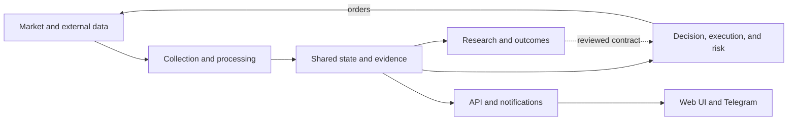
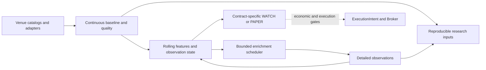
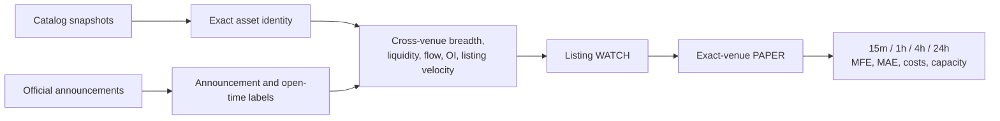

# Target Platform Architecture v1

Status: target. This document describes a reviewed direction, not deployed behavior.

Last reviewed: 2026-09-14 (market-coverage target; no production-state refresh).

The deployed system is documented in [`ARCHITECTURE.md`](../../ARCHITECTURE.md), with
the production Compose files and executable entrypoints as runtime authority. This
document shows the boundaries Schurfer should converge on as it adds venues, signal
families, listing intelligence, on-chain observations, portfolio research, and
eventually offline machine learning.

## Design goals

- Preserve non-recoverable market observations before optimizing research code.
- Keep exchange-specific behavior inside explicit venue adapters.
- Give every event a canonical clock, venue, market, and identity provenance.
- Separate observation, discovery, confirmation, paper, and live promotion.
- Let one failed source, consumer, or research job degrade independently instead of
  exhausting the host or stopping the decision path.
- Reuse capture, identity, outcomes, and delivery infrastructure across long and
  short strategies without merging their research contracts.
- Scale vertically while it is economical, then split storage, capture, research,
  and execution only when measured resource or failure-isolation gates require it.

## Logical target

This level shows responsibilities and primary flows only. It intentionally omits
secondary service dependencies, protocols, and individual stores; those belong in
the current service map and subsystem views described below.

The boxes are responsibility boundaries, not deployable service names. A boundary
becomes a separate process only when latency, ownership, resource isolation, or
recovery measurements justify it.

## Architecture views

No single diagram should claim to be both simple and exhaustive. Schurfer uses three
levels of architecture documentation:

1. **System overview.** The diagram above answers what the platform does and where
   the major feedback loop lives. It shows primary flows only.
2. **Current service map.** [`ARCHITECTURE.md`](../../ARCHITECTURE.md) must enumerate
   every deployed Compose service and its direct runtime dependencies. A dependency
   matrix accompanies that diagram so completeness does not depend on crossing
   arrows.
3. **Subsystem views.** Separate diagrams describe capture, decision and execution,
   research and outcomes, and product delivery. These views may show Redis keys,
   NATS subjects, database tables, queues, retries, and failure boundaries relevant
   to that subsystem only.

Current and target behavior must never share an unlabeled edge. A diagram caption
must say whether it shows primary flows or complete direct dependencies.

## Research and model boundary

Raw observations remain distinct from derived features and strategy verdicts. A
research result may nominate a candidate, but only a new frozen forward contract can
authorize WATCH or PAPER behavior.

Machine learning remains offline until it passes the same
point-in-time, executable-cost, capacity, and forward-confirmation gates as a
handwritten rule. Production inference must not train on live outcomes or mutate a
strategy contract implicitly.

## Shared venue boundary

Each venue adapter should expose only the capabilities the venue actually supports:

- instrument universe and lifecycle;
- public trades;
- ticker, best bid/ask, and mark price;
- open interest and funding;
- optional liquidations, order book, and official pre-listing state;
- authenticated order and account operations in a separately constructed client.

Missing capability is explicit metadata, not a zero value or cross-venue fallback.
Events carry exchange time, local receive time, stream session, market type, exact
market id, and payload/schema version. A shared contract normalizes transport and
provenance; it does not pretend that every exchange has identical semantics.

## Broad market coverage and bounded enrichment

The target is broad observation with different depths of collection. The unit of
capacity is an **exchange + market type + native instrument**, not a ticker base.
One asset traded on ten venues is ten capture streams. Cross-venue aggregation
requires a point-in-time identity mapping, including contract multipliers; unresolved
instruments remain observable separately without an invented asset match.

The repository already has Bybit and Binance momentum-capture entrypoints, shared
aggregation and identity components, and a bounded Bybit hotset. These are reuse
points, not proof of current production coverage. In particular, the current
`momentumcapture.Universe` is frozen per process: drift is reported, but a new
listing does not automatically acquire subscriptions. Audit executable entrypoints
and coverage before relying on older capability-matrix status labels.

| Depth                        | Scope and retained observations                                                                                                                                                                    | Admission and purpose                                                                                                                                                                                                                                                    |
| ---------------------------- | -------------------------------------------------------------------------------------------------------------------------------------------------------------------------------------------------- | ------------------------------------------------------------------------------------------------------------------------------------------------------------------------------------------------------------------------------------------------------------------------ |
| Broad radar                  | Supported venue catalogs, lifecycle and coarse price/turnover observations; the existing 17-venue scanner supplies the starting scope.                                                             | Deterministic eligibility, independent of future returns. Discover instruments and measure the denominator, including non-events. A radar venue does not imply full flow capture or execution support.                                                                   |
| Continuous research baseline | Eligible instruments on the existing deep-capture venues, initially Bybit and Binance: minute bars and buy/sell flow, plus supported OI, funding and quote observations with their actual cadence. | Collect before anomalies so accumulation over hours/days and matched controls are observable. New instruments carry onboarding time, warm-up and gaps. Preserve source semantics; unsupported or stale fields are not zero.                                              |
| Bounded enrichment           | Higher-resolution quotes, L2 depth and additional spot/perpetual feeds for a capped set of candidates and controls.                                                                                | A versioned priority policy with TTL, hysteresis and independent venue budgets. Record every admission, eviction and capacity rejection. Add a prebuffer if the research question requires observations before admission; otherwise mark those observations unavailable. |
| Trade eligibility            | A smaller set of verified instruments with account access, executable size, acceptable costs and healthy order handling.                                                                           | A strategy must pass its own economic and forward gates. Observation coverage and an anomaly alone do not authorize an order.                                                                                                                                            |

Enrichment cannot replace the continuous baseline: starting collection after a
price jump cannot answer whether buying accumulated beforehand. Control sampling
must be specified before outcomes and retain its inclusion policy/probability.
Measure how much of the eligible universe each depth covers, not only how many
successful pumps it captured. Quality gaps and rejected subscriptions must remain
visible even if a later backfill becomes available.

Target primary data flow (responsibilities, not additional services):

### Compute and reuse

- Normalize and aggregate each source once. Reuse venue connection pools, bounded
  queues and batched writes; a new strategy must not create another full market
  feed or a per-instrument REST polling loop. Budget REST by endpoint weight and
  venue, and WebSocket subscriptions/reconnects by the venue's actual constraints.
- Update rolling features incrementally per instrument as observations arrive.
  Keep durable checkpoints and observation transitions in Postgres; Redis is an
  accelerator with explicit freshness, not the only recoverable history. Avoid
  rescanning the entire historical database on every tick.
- Reuse a pure feature implementation between replay and online consumers when
  there are two concrete consumers; otherwise use parity fixtures across existing
  language boundaries. Version feature definitions, clocks and missing-data rules.
  An accumulation/breakout/squeeze/exhaustion label is an observation state, not a
  universal trading score. Long, continuation and delayed-short hypotheses retain
  separate contracts and can all reject the same observation.
- Keep existing Go collection, Python research/execution and API/UI boundaries.
  Send bounded aggregates or transitions through existing messaging where useful;
  do not route every raw trade through every service. Shared observations must not
  couple unrelated strategy failures or make UI availability part of execution.
- Give execution reconciliation and position protection resources independent of
  optional enrichment. On overload, shed optional work with recorded gaps; stale
  mandatory inputs block new entries under the execution contract. Preserve the
  ability to manage existing positions.

### Storage and expansion gates

Timescale/Postgres holds hot observations, catalogs, decisions and bounded state;
versioned Parquet and DuckDB support cold research. Archive verification precedes
eligible hot-data removal. The remote archive is outside deployment and trading
dependencies. Retention changes and data-loss prevention retain their own delivery
gates; this target does not authorize a drop policy.

For capacity planning, 1,000 instrument/venue pairs at one row per minute produce
1.44 million rows per day; the same 1,000 assets on ten venues could produce 14.4
million. These are row-count examples, not measured storage estimates. Measure
actual trades/messages per second, burst rates, CPU, RSS, database write latency,
compressed bytes/day and recovery time. Minute-row counts alone do not bound the
cost of decoding raw trades or maintaining books.

Each expansion records a before/after budget and predeclared canary limits for lag,
gaps, drops, memory, disk headroom and interference with existing workloads. Exercise
disconnects, rate limiting, queue saturation, restarts and new-listing warm-up;
verify identity isolation and offline/online feature parity. Do not claim full
coverage from a green process heartbeat alone.

A new venue earns deeper capture through useful additional eligible coverage or a
specific missing input for a registered candidate, within the measured budget.
Broader execution additionally requires its own positive economic evidence. Split
heavy research off the trading host first when it is the measured source of
contention; shard collection by venue/subscription group only when required.
Kafka, a new analytical database, per-token services and cluster orchestration are
not prerequisites. Reconsider them against a documented bottleneck and a benchmark.

## Listing-intelligence extension

Listing intelligence is a separate research family. It must not be introduced as an
unversioned component of the existing pump-short score.

The first useful product may be announcement reaction rather than true
pre-announcement prediction: an official listing is known, another venue is already
tradable, and the price has not fully adjusted. Prediction before any official signal
requires prospective negative examples and point-in-time catalog history; today's
catalog cannot reconstruct that training set without survivorship bias.

Catalog analysis must distinguish instruments, ticker bases, and exact assets. It
must also classify crypto assets separately from tokenized securities, indices,
leveraged products, and unresolved identities. A listing probability is a catalyst,
not sufficient evidence for automatic portfolio inclusion.

## Failure isolation and scaling

- Every high-rate boundary uses a bounded queue with drops, lag, and backlog exposed.
- Capture persists its own health lease; consumers fail closed when the lease is
  stale.
- Research workloads have memory and CPU preflight gates and never run on the order
  path.
- Notification delivery uses a durable outbox and does not own strategy state.
- Web remains available from the last good bounded snapshot when a research refresh
  fails.
- Storage retention, compression, and off-site backup are explicit per dataset.
- A second host is introduced first for research or storage, not by distributing the
  latency-sensitive order path without evidence that one host is insufficient.

## Deliberate non-goals

- no single universal score for pump-short, early-long, listing, and portfolio ideas;
- no automatic identity approval from a ticker match;
- no production ML before a frozen forward evaluation;
- no twenty-venue rollout before two venue adapters and host-capacity gates are
  proven;
- no big-bang rewrite of working Python services solely for language uniformity;
- no public dashboard that derives research verdicts in the browser.

## Delivery relationship

The active merge order and gates remain in [`ROADMAP.md`](../../ROADMAP.md). The
current momentum WATCH/PAPER and corrected venue canaries remain ahead of a listing
strategy. A bounded catalog-coverage report and point-in-time catalog capture may be
scheduled while those forward cohorts accumulate because catalog history is cheap
and cannot be reconstructed later.
