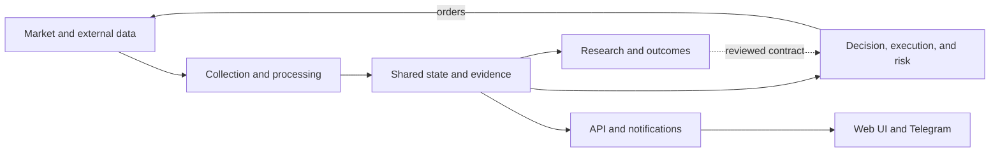
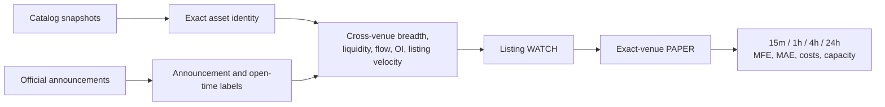

# Target Platform Architecture v1

Status: target. This document describes a reviewed direction, not deployed behavior.

Last reviewed: 2026-08-13.

The deployed system is documented in [`ARCHITECTURE.md`](../../ARCHITECTURE.md), with
the production Compose files and executable entrypoints as runtime authority. This
document shows the boundaries Schurfer should converge on as it adds venues, signal
families, listing intelligence, on-chain observations, portfolio research, and
eventually offline machine learning.

## Design goals

- Preserve non-recoverable market observations before optimizing research code.
- Keep exchange-specific behavior inside explicit venue adapters.
- Give every event a canonical clock, venue, market, and identity provenance.
- Separate observation, discovery, confirmation, paper, and live promotion.
- Let one failed source, consumer, or research job degrade independently instead of
  exhausting the host or stopping the decision path.
- Reuse capture, identity, outcomes, and delivery infrastructure across long and
  short strategies without merging their research contracts.
- Scale vertically while it is economical, then split storage, capture, research,
  and execution only when measured resource or failure-isolation gates require it.

## Logical target

This level shows responsibilities and primary flows only. It intentionally omits
secondary service dependencies, protocols, and individual stores; those belong in
the current service map and subsystem views described below.

The boxes are responsibility boundaries, not deployable service names. A boundary
becomes a separate process only when latency, ownership, resource isolation, or
recovery measurements justify it.

## Architecture views

No single diagram should claim to be both simple and exhaustive. Schurfer uses three
levels of architecture documentation:

1. **System overview.** The diagram above answers what the platform does and where
   the major feedback loop lives. It shows primary flows only.
2. **Current service map.** [`ARCHITECTURE.md`](../../ARCHITECTURE.md) must enumerate
   every deployed Compose service and its direct runtime dependencies. A dependency
   matrix accompanies that diagram so completeness does not depend on crossing
   arrows.
3. **Subsystem views.** Separate diagrams describe capture, decision and execution,
   research and outcomes, and product delivery. These views may show Redis keys,
   NATS subjects, database tables, queues, retries, and failure boundaries relevant
   to that subsystem only.

Current and target behavior must never share an unlabeled edge. A diagram caption
must say whether it shows primary flows or complete direct dependencies.

## Research and model boundary

Raw observations remain distinct from derived features and strategy verdicts. A
research result may nominate a candidate, but only a new frozen forward contract can
authorize WATCH or PAPER behavior.

Machine learning remains offline until it passes the same
point-in-time, executable-cost, capacity, and forward-confirmation gates as a
handwritten rule. Production inference must not train on live outcomes or mutate a
strategy contract implicitly.

## Shared venue boundary

Each venue adapter should expose only the capabilities the venue actually supports:

- instrument universe and lifecycle;
- public trades;
- ticker, best bid/ask, and mark price;
- open interest and funding;
- optional liquidations, order book, and official pre-listing state;
- authenticated order and account operations in a separately constructed client.

Missing capability is explicit metadata, not a zero value or cross-venue fallback.
Events carry exchange time, local receive time, stream session, market type, exact
market id, and payload/schema version. A shared contract normalizes transport and
provenance; it does not pretend that every exchange has identical semantics.

## Listing-intelligence extension

Listing intelligence is a separate research family. It must not be introduced as an
unversioned component of the existing pump-short score.

The first useful product may be announcement reaction rather than true
pre-announcement prediction: an official listing is known, another venue is already
tradable, and the price has not fully adjusted. Prediction before any official signal
requires prospective negative examples and point-in-time catalog history; today's
catalog cannot reconstruct that training set without survivorship bias.

Catalog analysis must distinguish instruments, ticker bases, and exact assets. It
must also classify crypto assets separately from tokenized securities, indices,
leveraged products, and unresolved identities. A listing probability is a catalyst,
not sufficient evidence for automatic portfolio inclusion.

## Failure isolation and scaling

- Every high-rate boundary uses a bounded queue with drops, lag, and backlog exposed.
- Capture persists its own health lease; consumers fail closed when the lease is
  stale.
- Research workloads have memory and CPU preflight gates and never run on the order
  path.
- Notification delivery uses a durable outbox and does not own strategy state.
- Web remains available from the last good bounded snapshot when a research refresh
  fails.
- Storage retention, compression, and off-site backup are explicit per dataset.
- A second host is introduced first for research or storage, not by distributing the
  latency-sensitive order path without evidence that one host is insufficient.

## Deliberate non-goals

- no single universal score for pump-short, early-long, listing, and portfolio ideas;
- no automatic identity approval from a ticker match;
- no production ML before a frozen forward evaluation;
- no twenty-venue rollout before two venue adapters and host-capacity gates are
  proven;
- no big-bang rewrite of working Python services solely for language uniformity;
- no public dashboard that derives research verdicts in the browser.

## Delivery relationship

The active merge order and gates remain in [`ROADMAP.md`](../../ROADMAP.md). The
current momentum WATCH/PAPER and corrected venue canaries remain ahead of a listing
strategy. A bounded catalog-coverage report and point-in-time catalog capture may be
scheduled while those forward cohorts accumulate because catalog history is cheap
and cannot be reconstructed later.
