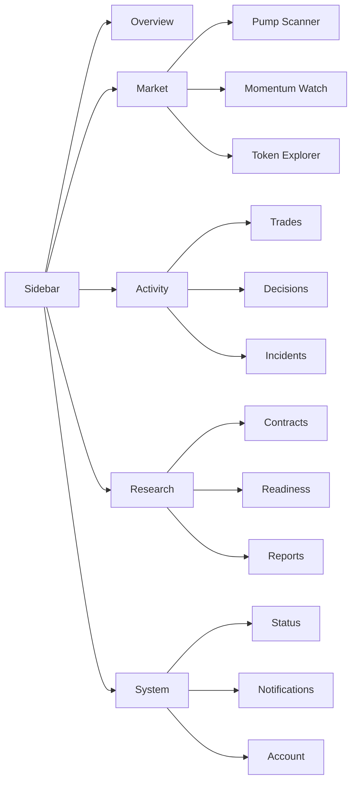
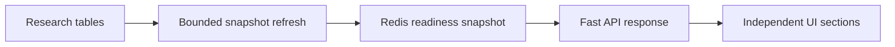

# Web UI Evolution Plan v1

Status: active design and delivery plan.

This document defines how Schurfer's authenticated web application evolves as the
market-data, research, execution, notification, and future on-chain domains grow. It
is not permission for a frontend rewrite. Data correctness, capital safety, and
evidence-producing backend work remain the primary project priorities.

## Current assessment

The current React application is functional and has several sound foundations:

- route-level lazy loading;
- server-side pagination for journals;
- TanStack Query caching with previous data retained during refresh;
- a shared `PageShell` width contract;
- Lightweight Charts isolated from the initial application bundle;
- typed API response shapes.

The application is also beginning to outgrow its MVP component structure:

- `StatusPage`, `ResearchPage`, `TokenPage`, and `TradesPage` are large page modules;
- only a small set of shared UI primitives exists;
- tables, page headers, filters, loading states, error states, freshness indicators,
  formatters, and pagination are implemented inconsistently;
- the token detail route is owned by Pump Scanner even though trades, decisions,
  research, and future momentum events refer to the same asset;
- Research readiness waits for one aggregate API response before rendering any card;
- the web package has no component or end-to-end test suite.

## Priority rule

The web lane must not block:

1. capture correctness and recovery;
2. frozen research contracts and their due reads;
3. strategy and execution safety;
4. non-recoverable forward-data collection.

Run at most one UI PR at a time. Prefer UI work during bounded canaries and passive
evidence-collection windows. Never mix a broad UI refactor into a capture, strategy,
or execution PR. Product-facing analysis tools such as token timelines and event
markers rank above cosmetic polish because they can improve research decisions.

## Technology direction

Keep the current core stack:

- React and Vite;
- Tailwind CSS and semantic CSS variables;
- TanStack Query;
- Lightweight Charts;
- Lucide icons.

Do not perform a big-bang component-library migration. Formalize the existing
open-code, shadcn-style primitives and adopt one accessible headless primitive layer
for interactive controls such as select, tabs, tooltip, dialog, menu, popover, and
mobile drawer. Base UI is the initial candidate; React Aria remains an alternative
until a small proof is reviewed. Existing presentational `Card`, `Badge`, `Button`,
and `Table` components do not need replacement merely to change dependencies.

Apple's native frameworks and visual materials are design references, not a web
dependency. Apply clarity, hierarchy, restrained motion, and accessible interactions.
Do not copy translucent system chrome into a dense operational dashboard without a
demonstrated usability benefit.

## Target information architecture

Use a persistent, collapsible desktop sidebar and a drawer on small screens. Keep a
small global top bar for asset search, environment mode, system health, and account
actions. Local tabs belong inside a selected domain or asset.

Existing routes may remain separate. Navigation grouping must not force unrelated
backend endpoints into one response.

## Shared design contract

The foundation PR must define and reuse:

- spacing, type, radius, and density tokens;
- semantic colors for profit, loss, warning, stale, collecting, ready, and degraded;
- `PageHeader` with title, description, actions, and freshness;
- `AsyncSection` states for initial loading, partial error, stale data, empty data,
  and background refresh;
- `Card` density variants;
- one table shell and one server-pagination control;
- `TokenLink` and canonical base-symbol normalization;
- shared price, percent, USD, duration, date, and byte formatters;
- one typed JSON client and normalized API errors;
- URL-backed filters, pagination, and active tabs where useful;
- keyboard focus, labels, reduced-motion behavior, and responsive acceptance checks.

Page-specific layout exceptions require a domain reason. They must not be introduced
only because a page was implemented separately.

## Canonical token workspace

The canonical asset route is `/tokens/:base`. Preserve `/pumps/:base` as a redirect
until existing links are retired. Every token displayed by Pumps, Trades, Decisions,
Research, source-lead, and momentum views should use the shared `TokenLink`.

The token workspace may expose independently loaded tabs:

- Overview;
- Timeline;
- Signals;
- Trades;
- Decisions;
- Pump episodes;
- Market data.

Pumps remains an opportunity scanner. Trades remains an execution journal. Decisions
remains an audit log. The token workspace connects those views instead of duplicating
their full tables.

## Timeline and chart contract

Add a read-only, typed token-event API before drawing more chart layers. The event
contract should carry a stable id, timestamp, event type, venue, optional price,
label, severity, and bounded metadata. Initial event types are:

- pump detected and peak;
- strategy decision;
- trade entry and exit;
- stop and trailing-stop transition;
- source-lead observation and confirmation;
- large buy and sell flow;
- OI acceleration;
- liquidation.

Use Lightweight Charts series markers for discrete events. Add optional panes for
volume, taker-flow delta, OI, and liquidations only when their source contract and
coverage are explicit. Every layer needs a legend and visibility toggle. Missing or
cross-venue data must remain visibly unresolved.

## Research readiness performance

Research progress changes more slowly than market telemetry. The target read path is:

- refresh database aggregates every 5 to 10 minutes;
- keep fast operational health in Redis at its existing shorter cadence;
- use stale-while-revalidate and retain the last successful snapshot;
- return `generated_at`, `stale`, and refresh error metadata;
- load expensive identity-review details only when opened;
- render cards independently so one failed section does not blank the page;
- measure query time before adding indexes or materialized state.

## Delivery sequence

1. `refactor/web-design-contract-v1`
   - shared tokens, page header, async states, formatters, API client, density variants;
   - review a small Base UI versus React Aria proof and select one primitive layer.
2. `perf/research-readiness-snapshot-v1`
   - measure query timings, add bounded refresh, Redis snapshot, and stale-while-revalidate response.
3. `feat/research-progressive-ui-v1`
   - independent cards and section-level loading, error, stale, and freshness states.
4. `feat/token-workspace-routing-v1`
   - canonical route, compatibility redirect, shared token links, trade token filter.
5. `feat/token-timeline-contract-v1`
   - typed read-only event endpoint with point-in-time provenance.
6. `feat/token-chart-events-v1`
   - event markers, layer toggles, synchronized event list, then proven data panes.
7. `feat/web-sidebar-shell-v1`
   - grouped sidebar, collapsed desktop mode, mobile drawer, compact global top bar.
8. `refactor/activity-workspace-v1`
   - coherent Trades, Decisions, and Incidents navigation with cross-links.
9. `test/web-critical-flows-v1`
   - component tests plus browser smoke tests for login, Pumps to Token, Trades to
     Token, chart markers, and partial Research loading.

The sequence is a dependency order, not permission to run all nine PRs consecutively.
Profit-relevant backend work may interrupt between any two items.

## Non-goals

- no React framework rewrite;
- no visual clone of an exchange terminal or Apple product;
- no new chart library before Lightweight Charts fails a concrete requirement;
- no combined endpoint that loads every token tab eagerly;
- no frontend-derived strategy verdict;
- no style-only big-bang PR.
