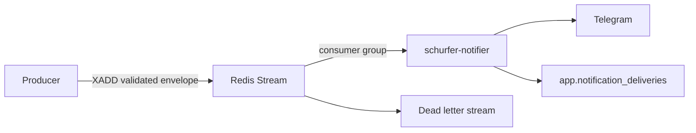

# Notification delivery contract v1

## Purpose

Schurfer currently has several direct Telegram senders. This contract provides one
transport boundary so producers do not need a bot token and every delivery can be
audited. This first change only defines the envelope, Redis outbox, consumer group,
and database audit shape. It does not migrate a producer or send a notification.
The Go decoder is introduced with the consumer, and the publisher is introduced
with the first migrated producer. This keeps unused runtime code out of the
contract-only change.

The machine-readable envelope is
[`notification-envelope-v1.schema.json`](notification-envelope-v1.schema.json).



The notifier consumer and producer migrations are separate changes. Until those
changes are complete, existing Telegram paths continue to work unchanged.

## Redis contract

| Purpose                      | Name                          |
| ---------------------------- | ----------------------------- |
| Outbox stream                | `notifications:outbox:v1`     |
| Consumer group               | `notifier-delivery-v1`        |
| Dead letter stream           | `notifications:outbox:v1:dlq` |
| Stream field containing JSON | `data`                        |

The group is created at stream ID `0`, not `$`, so a notifier deployed after a
producer still receives the backlog. The stream has no `MAXLEN` trim. The consumer
must acknowledge and delete an entry only after it records a durable delivery result
or moves a poison message to the dead letter stream.

Production Redis uses `noeviction` and AOF with `appendfsync everysec`. A host crash
can still lose roughly the latest second of writes. This is an at-least-once delivery
queue, not a transactional outbox shared with a producer's Postgres transaction.

## Envelope

```json
{
  "schema_version": 1,
  "notification_id": "b77f5506-49eb-4c22-9af0-921db72c70d7",
  "dedup_key": "trade:decision-123:closed",
  "producer": "execution",
  "kind": "trade.closed",
  "severity": "trade",
  "created_at": "2026-08-12T12:30:00Z",
  "payload": {
    "text": "PAPER: SHORT BTR closed, +$4.20",
    "metadata": {
      "trade_id": 42
    }
  }
}
```

Rules:

- `notification_id` identifies one publication attempt and must be a UUID.
- `(producer, dedup_key)` identifies one semantic notification. A producer retry must
  reuse its dedup key, even if it creates a new notification ID.
- `producer` and `kind` use stable lower-case names. Examples are `execution`,
  `scanner`, `research-checkpoints`, `trade.closed`, and `scanner.stale`.
- `severity` is one of `critical`, `trade`, `research`, or `info`. The next delivery
  change will use that order when selecting work from a bounded batch.
- `created_at` is the UTC time at which the producer constructed the envelope.
- `payload.text` is final plain text for Telegram and is limited to 4096 characters.
  Producers may attach non-secret structured context in `payload.metadata`.
- The encoded envelope is limited to 64 KiB. Secrets, credentials, and raw exchange
  payloads must never be included.
- The payload hash stored in Postgres is SHA-256 over the normalized v1 payload. It is
  an audit value, not the idempotency key.

## Delivery audit

`app.notification_deliveries` is the durable audit and idempotency record. Its unique
keys are `notification_id` and `(producer, dedup_key)`. Status is one of `pending`,
`delivered`, or `failed`. In v1 the channel is always `telegram`, and every row is
tied to the Redis entry that caused it through a required `stream_entry_id`.

The next consumer change must follow these rules:

1. Decode and validate the envelope before attempting delivery.
2. Create or read the audit row by `(producer, dedup_key)`.
3. Treat the same dedup key with a different payload hash as a conflict and move it
   to the dead letter stream.
4. Skip Telegram when the audit row is already `delivered`.
5. Increment `attempt_count` and set `last_attempted_at` for every Telegram attempt.
6. Mark the row `delivered` before acknowledging and deleting the stream entry.
7. After bounded retries, mark the row `failed`, move the original envelope to the
   dead letter stream, then acknowledge and delete the source entry.

Telegram does not accept an idempotency key. A crash after Telegram accepts a message
but before Postgres records `delivered` can produce a duplicate on retry. The contract
bounds and audits that crash window but does not claim exactly-once delivery.
