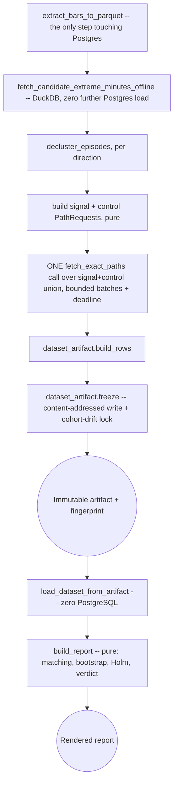

# HYP-016 completion: freeze/evaluate CLI split + offline denominator wiring v1

## Purpose

This is not a new research design. HYP-016's own signal family, entry rule,
control matching, and decision rule are already registered in
`docs/research/market-activity-and-radar-outcomes-v1.md` (HYP-016 section)
and `docs/research/discovery-ledger.md`'s own HYP-016 row, and none of that
changes here. This PR (`research/cex-activity-discovery-completion-v1`)
closes the one thing that kept HYP-016 `parked` /
`report_not_produced_operationally_unresolved`: the report itself had no
way to compute its own candidate universe without either hitting a
300-second statement timeout on a single query, or degrading production
I/O for 12 minutes running the chunked version (both actually happened, in
that order, before this window was parked -- see the discovery ledger row
for the full incident). `research/cex-activity-offline-denominator-v1`
(PR #327, merged) built the fix as infrastructure with no caller; this PR
wires it into `cex_activity_discovery_report.py` itself and splits the CLI
so that the one PostgreSQL-touching step and the report-rendering step can
never be silently re-run together.

**This PR does not perform the formal frozen read.** It makes that read
possible and bounded. Actually running `--freeze-artifact` against
production and recording HYP-016's real verdict is
`research/cex-activity-discovery-result-v1`, a separate, later PR -- see
"Post-merge runbook" below.

## Research question (unchanged, restated for this doc's own context)

Do either of HYP-016's two pre-registered directions -- a five-minute buy
or sell taker-notional burst crossing 10% of the instrument's own strict
trailing 24h volume -- show a favorable 25%-within-24h paired hit-rate edge
over matched same-instrument/same-UTC-time quiet-day controls, in the
already-viewed `2026-08-18T00:00:00Z` through `2026-08-27T00:00:00Z`
window? This window has already been looked at once (the two incident
attempts above); HYP-016's own instruction is that it "may only finish
Discovery" here, never be re-viewed as confirmation of anything found
later.

## Estimand

Paired difference in 25%-within-24h favorable-move hit indicators between
each signal episode and its matched quiet control, whole-symbol cluster
bootstrap (this codebase's shared `clustered_inference` module: fixed
method, seed, iteration count, confidence level), Holm-corrected across
the two registered directions (`buy`, `sell`) so testing both never
inflates the false-positive rate beyond one round of correction covers.

## Frozen parameters

Copied verbatim from `cex_activity_discovery.py`'s own constants (import
these, never retype them elsewhere):

- `HYPOTHESIS_ID = "HYP-016"`, window
  `[DISCOVERY_SINCE, DISCOVERY_UNTIL) = [2026-08-18T00:00:00Z,
2026-08-27T00:00:00Z)` -- matches `discovery-ledger.md`'s own row exactly
  (`test_discovery_window_matches_the_registered_ledger_row` is the
  tripwire).
- Signal: `PRIMARY_MOVE_PCT = 25.0`, `OUTCOME_HORIZON_MINUTES = 1440`
  (24h), five complete one-minute buckets at >=10% of trailing 24h volume,
  $50,000 24h volume floor, 60-minute refractory between episodes for the
  same instrument, entry at the next exact native one-minute bar open.
- Controls: `CONTROL_SEARCH_DAYS = 7`, `CONTROL_QUIET_HOURS = 24`, same
  instrument and same UTC time-of-day as the signal episode,
  `CONTROL_BOUNDARY_POLICY_VERSION = "within_discovery_window_v1"` -- a
  control candidate is only ever proposed strictly inside
  `[since, until)`, never outside the already-registered window (this was
  already the code's behavior; this PR versions and edge-tests it rather
  than changing it).
- Evidence floor (`build_direction_results`, which evaluates the two
  registered directions jointly): `DISCOVERY_MIN_PAIRS = 100`,
  `DISCOVERY_MIN_CLUSTERS = 20`, `DISCOVERY_MIN_WEEKS = 2`, applied per
  direction.
- `MATCHING_POLICY_VERSION = "max_cardinality_bipartite_matching_v1"` --
  control assignment is deterministic maximum-cardinality bipartite
  matching, not first-available greedy (a greedy assignment can
  systematically lose pairs whenever an earlier episode shares a control
  candidate with a later one; see `cex_activity_discovery.py`'s own
  `select_matched_pairs` docstring and its
  `test_pair_selection_maximizes_pairs_instead_of_greedy_first_available`).

## Data flow



`freeze_dataset` (the `--freeze-artifact` CLI mode) is steps A-G.
`load_dataset_from_artifact` + `build_report` (the `--from-artifact` CLI
mode) are steps I-J, and touch neither PostgreSQL nor any repository class
-- proven by
`test_main_from_artifact_never_touches_either_postgres_repository`
(`apps/analytics/tests/test_cex_activity_discovery_report.py`), which
monkeypatches both repository classes' `from_url` to raise and asserts
`--from-artifact` still succeeds.

## Artifact contract

`cex_activity_discovery_dataset_artifact.py`:

- `DATASET_NAME = "cex_activity_hyp016_discovery"`,
  `DATASET_VERSION = "cex_activity_hyp016_discovery_v1"`,
  `SCHEMA_VERSION = "cex_activity_hyp016_dataset_schema_v1"`.
- One row per episode (`ROW_ID_FIELD = "row_id"`, ordered
  `trigger_at ascending, then episode_id ascending`), carrying the
  episode's own signal path AND its full ordered list of control
  requests/paths -- never only the already-selected control, since
  `select_matched_pairs`' own matching must be independently re-derivable
  from the frozen artifact alone.
- Content-addressed via `research_dataset_artifact.write_dataset_artifact`
  (first-successful-write-wins by content fingerprint, excluding
  `code_revision`/`generated_at` from the hash) -- but content-addressing
  alone does not prevent two different contents for the same logical
  cohort (`since`/`until`/`exchange`/`market_type`/`capture_version`/
  `directions`/`control_boundary_policy_version`) from both being written
  as separate artifacts. A second, create-if-absent lock file per cohort
  key records the first successful freeze's own fingerprint as
  authoritative -- written crash-durably (an fsync'd temp file, then
  atomically hard-linked to the final lock path, then the parent
  directory itself fsync'd, since the 2026-09-04 colleague review found
  the original bare `O_CREAT | O_EXCL` write was not durable against a
  crash mid-write); a later freeze for the same cohort that computes a
  different fingerprint raises `CohortDriftDetectedError` rather than
  silently treating the newer result as current. See that module's own
  docstring for the full rationale.
- `read()` requires the cohort lock to exist and to name exactly the
  fingerprint being read, raising `NonAuthoritativeArtifactError`
  otherwise (colleague review, 2026-09-04) -- `freeze()` durably publishes
  the content-addressed artifact BEFORE it claims the cohort lock, so a
  losing (drifted) attempt's own artifact is a fully valid, self-
  consistent artifact on its own; without this check `--from-artifact`
  could successfully evaluate exactly the artifact `freeze()` itself
  rejected. Covers both a losing concurrent-freeze race and a crash
  between publish and claim.
- `contract_fingerprint()` (`cex_activity_discovery.py`) hashes every
  constant the estimand/decision rule depends on -- `move_pct`, horizon,
  control policy, evidence floors, bootstrap seed/iterations/confidence,
  matching policy, candidate/path query versions -- plus
  `extreme_threshold_pct`/`refractory_minutes`/`min_volume_24h_usd`
  (colleague review, 2026-09-04 follow-up round: these three directly
  determine WHICH candidates a freeze selects, the sampling frame itself,
  not just how a frozen result is later evaluated). Computed at freeze
  time, recomputed from the CURRENT code's own constants (and the
  dataset's own recorded threshold values) at render time. `build_report`
  raises `IncompatibleResearchContractError` if they disagree, rather than
  silently applying a changed matching/bootstrap/floor/query contract to
  old frozen raw data while labeling the result with the new code's own
  version strings. `CexActivityManifest` separately carries
  `artifact_code_revision` (the freeze's own recorded code state)
  alongside `code_revision` (the render's own) -- two different points in
  time, never conflated.
- `extreme_threshold_pct`/`refractory_minutes`/`min_volume_24h_usd`/
  `contract_fingerprint` live in `cohort` itself, not only in `extra`
  (colleague review, 2026-09-04 follow-up round) -- `extra` is
  deliberately excluded from `research_dataset_artifact`'s own generic
  fingerprint, so a value that lived only there was never actually bound
  to the artifact/cohort identity a caller addresses the data by. Two
  freezes with byte-identical rows but a different threshold (or a
  different code-level contract) now produce genuinely different
  fingerprints/cohort locks, proven by
  `test_a_different_threshold_produces_a_different_fingerprint_for_identical_rows`
  and its contract-fingerprint counterpart -- never silently absorbed into
  an existing artifact via `ALREADY_EXISTS`.
- `extra` metadata on the manifest carries every remaining operational
  number needed to reconstruct a `CexActivityDataset` on read (caps,
  `database_snapshot_at`, `candidate_query_version`, `path_query_version`),
  plus the offline extract's own provenance (`extract_query_version`,
  `extract_row_count`, `extract_symbol_count`, `extract_parquet_sha256`,
  `extract_wall_seconds`) and phase-timing provenance
  (`extract_completed_at`, `path_fetch_completed_at`, both from
  Postgres's own `now()`) -- a reviewer can see exactly how the candidate
  universe was computed, and the real wall-clock bounds each phase ran in,
  from the frozen artifact alone, without the original run's own logs.
- `--from-artifact` renders reuse the freeze's own recorded
  `database_snapshot_at` for both `generated_at` and
  `database_snapshot_at` on the rendered report's manifest, not
  wall-clock "now" at render time -- two `--from-artifact` calls against
  the same fingerprint are byte-identical
  (`test_freeze_then_load_then_build_report_is_byte_identical_across_calls`).

## Missing-data policy

`ExactPricePath.unresolved_reason` classifies every way a path can fail to
resolve, rather than collapsing to a single boolean (`resolved` is now
_derived_ from `unresolved_reason is None`, so the two can never drift
apart):

| Reason                | Meaning                                                                                                                                                           |
| --------------------- | ----------------------------------------------------------------------------------------------------------------------------------------------------------------- |
| `missing_entry_bar`   | no complete native bar at the entry minute                                                                                                                        |
| `invalid_entry_price` | entry price present but non-finite or <= 0                                                                                                                        |
| `incomplete_24h_path` | fewer than 1440 complete minutes observed in the horizon                                                                                                          |
| `missing_extrema`     | no high/low extrema recorded over the horizon                                                                                                                     |
| `invalid_extrema`     | an extremum present but non-finite or <= 0                                                                                                                        |
| `missing_path_result` | the request_id has no returned row at all (the one shape the dataclass itself cannot represent -- classified by the caller, e.g. `dataset_artifact._encode_path`) |

An episode whose own signal resolved but was never matched into a pair (no
resolved control candidate, or it lost the maximum-cardinality assignment)
is counted explicitly in the funnel as
`unmatched_resolved_signal_episodes`, rather than only showing up as an
implicit gap between `resolved_signal_paths` and `matched_pairs`.

`CexActivityFunnel.signal_unresolved_by_reason`/
`control_unresolved_by_reason` (colleague review, 2026-09-04) break the
unresolved count down by reason, separately for signal and control, so a
systematic selection bias hiding behind one specific reason (e.g. every
`sell`-direction control consistently missing its entry bar) is visible
in the rendered report, not just classified internally and then
collapsed to an aggregate count. `build_report` asserts the
reconciliation invariant directly: `resolved + sum(unresolved_by_reason
.values())` always equals the total request count, on both sides.

## Resource bounds

- Offline extract (`extract_bars_to_parquet`): `MAX_EXTRACT_ROWS =
100,000,000`, `DEFAULT_MAX_EXTRACT_WALL_SECONDS = 900` (15 minutes),
  chunked per-day via `candidate_query_windows` (shared with the live
  path, so the two can never drift on chunk boundaries), each chunk's own
  `statement_timeout` capped to whatever remains of the overall wall
  budget.
- Offline candidate query (`fetch_candidate_extreme_minutes_offline`):
  `MAX_CANDIDATE_ROWS = 1,000,000`, memory-bounded DuckDB connection
  (`memory_limit`/`threads`/`temp_directory`, comfortably under production
  analytics' own container `mem_limit`).
- `check_candidate_count` (report layer): `--max-candidate-minutes`,
  default `DEFAULT_MAX_CANDIDATE_MINUTES` -- a second, report-level guard
  on top of the repository-level `MAX_CANDIDATE_ROWS`.
- Exact-path fetch (`fetch_exact_paths`): `PATH_BATCH_SIZE = 200`,
  `DEFAULT_PATH_MAX_WALL_SECONDS = 900` (15 minutes) as a total-run
  budget, not just a per-batch one, each batch's own `statement_timeout`
  capped to whatever remains.
- `check_path_request_count` (report layer): `--max-path-requests`,
  default `DEFAULT_MAX_PATH_REQUESTS = 200,000` -- covers the combined
  signal + control request count, checked before either fetch runs.
- `--freeze-artifact` refuses a dirty working tree
  (`--no-working-tree-dirty` required) -- a formal freeze that becomes a
  permanent record must not be produced from an uncommitted tree.

## Statistical decision rule

Per direction, independently:

1. **Evidence floor.** `readiness = "discovery_ready"` only once paired
   episodes reach at least 100, distinct asset clusters reach at least
   20, and distinct UTC weeks reach at least 2. Anything short of that is
   `insufficient_data`, regardless of what the point estimate looks like.
2. **Cluster bootstrap.** Once `discovery_ready`, a whole-symbol cluster
   bootstrap 95% CI on the paired hit-rate difference (fixed seed per
   direction, derived deterministically so a re-run is reproducible).
3. **Holm correction.** The two directions' raw p-values go through
   Holm step-down together, not independently -- one correction step
   covers the whole registered family.

## Possible verdicts

| Verdict             | Condition                                                                     |
| ------------------- | ----------------------------------------------------------------------------- |
| `insufficient_data` | evidence floor not met                                                        |
| `forward_candidate` | floor met, Holm-rejected, and the CI's lower bound is positive                |
| `no_evidence`       | floor met, CI's upper bound is <= 0                                           |
| `inconclusive`      | floor met, but neither of the above (CI straddles zero, or not Holm-rejected) |

`select_forward_candidate` picks **at most one** direction: among
directions with verdict `forward_candidate`, the one with the larger
paired hit-rate delta (ties broken by direction name) -- HYP-016's own
"nominate at most one direction for a later untouched forward shadow
cohort" rule, enforced in code, not just in the report's own prose.

## Result limitations

- **A freeze is not one PostgreSQL snapshot across all three phases**
  (colleague review, 2026-09-04, two rounds). `freeze_dataset` reads
  Postgres in three phases: `database_now()`, the offline extract, and
  one `fetch_exact_paths` call over the combined signal+control request
  set. Within that third phase, `fetch_exact_paths` now runs every one of
  its internal batches inside ONE `REPEATABLE READ`, read-only
  transaction, not a new connection/transaction per batch -- an episode's
  own signal path and its matched control (the exact pair the paired
  estimand compares) are therefore guaranteed to come from the same
  consistent snapshot regardless of which batch either lands in, proven
  by a real-Postgres test
  (`test_fetch_exact_paths_holds_one_snapshot_across_batches`) that
  commits a write between two batches of one call and confirms the later
  batch still cannot see it. What remains open is the boundary BETWEEN
  phases: a late backfill/correction landing between the extract and the
  path fetch could still mean the candidate universe was detected under
  one version of the data and its outcome paths read under a corrected
  one. A genuine fix (one `pg_export_snapshot()` shared across both
  phases) was evaluated and rejected: it requires holding a live
  `REPEATABLE READ` transaction against production's
  `timeseries.bybit_momentum_bars_1m` for both phases combined (up to
  ~30 minutes worst-case), holding back autovacuum on that table for the
  whole duration -- exactly the class of production risk
  `research/cex-activity-offline-denominator-v1` (PR #327) exists to
  eliminate. The realistic exposure this leaves is narrow: a HYP-016
  freeze is a one-time, manually triggered run, not a recurring job, so
  the risk is not about how old the underlying bars are -- it is whether
  an operator happens to run a backfill/correction during the specific
  ~15-30 minute window one freeze attempt is in flight.
  `extra["database_snapshot_at"]`/`extra["extract_completed_at"]`/
  `extra["path_fetch_completed_at"]` (from Postgres's own `now()`) record
  the real bounds of each phase for a later audit. This is a documented,
  accepted residual risk, not a solved one -- see
  `cex_activity_discovery_report.py`'s own top-of-file docstring for the
  full reasoning.
- **Discovery only, permanently, for this window.** The
  `2026-08-18`-`2026-08-27` window has already been viewed (twice, via the
  two prior incident attempts). A `forward_candidate` verdict here is not
  itself confirmation -- it only justifies opening a new, untouched
  forward quote-capture cohort starting after the freeze, per HYP-016's
  own instruction. This window can never be re-run as if it were fresh
  evidence.
- **OHLCV paths are outcome proxies, not executable quotes.** Bar
  open/high/low prove a price was reached on that exact native venue; they
  do not prove a fill was achievable at that price, size, or queue
  position.
- **No concentration cap in this family** (unlike, e.g.,
  `liquidation-maker-upper-bound-v1`'s per-side 35%/45% caps) -- the
  evidence floor here is cluster/week counts only. If a future review
  finds this family needs one, that is a parameter change to
  `cex_activity_discovery.py`, reviewed and versioned like any other, not
  retrofitted silently into this PR.
- **The offline extract is disposable working input, not itself frozen
  evidence.** Its own Parquet file is deleted once the candidate query
  has run (unless `--extract-directory` is explicitly passed to keep it
  for inspection) -- what persists permanently is the dataset artifact
  built from its output, not the extract itself. `extract_parquet_sha256`
  in the artifact's own `extra` metadata is the audit trail for what that
  extract actually contained.

## Post-merge runbook

Running the real, formal freeze is `research/cex-activity-discovery-result-v1`,
not this PR -- listed here so the next PR does not have to re-derive it.

```bash
# From your machine, reach production Postgres through the SSH tunnel
# documented in docs/runbooks/README.md:
ssh -L 15432:127.0.0.1:5432 schurfer

# Freeze (the only step that touches Postgres -- a plain indexed-range
# extract, not the live 5m/24h window query). Run from a clean, committed
# tree so --no-working-tree-dirty is genuinely true.
DATABASE_URL='postgresql://schurfer:<password>@localhost:15432/schurfer' \
  make cex-activity-discovery-report ARGS='--freeze-artifact'
# -> prints {"fingerprint": "...", "row_count": N}

# Render (zero DB calls, byte-identical on repeat) -- inspect before
# recording anything in discovery-ledger.md:
make cex-activity-discovery-report ARGS='--from-artifact <fingerprint> --format markdown'
```

That follow-up PR is responsible for: running the freeze for real, reading
the rendered report, and -- only after human review of the actual
numbers -- recording HYP-016's real verdict in
`docs/research/discovery-ledger.md` and updating ROADMAP.md's "Current
focus" block. This PR must not, and does not, fabricate or pre-write that
result.

## Rollback

Nothing here is deployed as a running service -- this is a CLI report
module with no scheduled job, no API route, and no production Make target
of its own yet (`prod-cex-activity-discovery-report` does not exist; the
follow-up PR runs `--freeze-artifact` manually through the SSH tunnel
above, exactly once, not on a schedule). Reverting this PR:

- removes the `--freeze-artifact`/`--from-artifact` CLI split and the
  offline-denominator wiring, returning `cex_activity_discovery_report.py`
  to its pre-PR single-mode shape (still safe -- that mode already refused
  to run without `DATABASE_URL`, and nothing in this repository invokes it
  automatically);
- does not touch any table schema, migration, or already-written data --
  `cex_activity_discovery_dataset_artifact.py`'s own files live under
  `runtime/research-dataset-artifacts/` (or `--artifact-directory`), never
  inside Postgres itself, so a revert leaves any already-frozen artifact
  files in place on disk, inert and harmless;
- has no effect on any other report or production path -- this module has
  no other caller in the repository.
