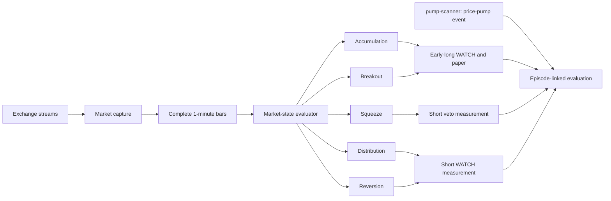

# Momentum Flow Validation Plan v1

Status: active research and delivery plan. This document is not a frozen strategy
contract and does not authorize real trading.

## Purpose

Schurfer is extending its original price-pump detector into a broader market-state
research system. The new line asks whether point-in-time flow and open-interest data
can identify accumulation, breakout, squeeze, distribution, and reversion early
enough to support long entries, short timing, or a veto on premature shorts.

The project must iterate quickly without converting each inspected example into a
production rule. Fast iteration and statistical discipline are both required:

- deploy prospective WATCH and paper measurement early;
- version every changed rule instead of rewriting its history;
- reject weak candidates quickly on pre-declared no-go conditions;
- require a new untouched cohort before calling a discovered pattern confirmed;
- increase capital only after longer regime and execution evidence.

Numerical thresholds for `momentum_flow_watch_v1` will be frozen in its own contract
after the permitted 72-hour calibration read. This plan defines the process and
metrics before that contract exists.

## Component boundaries

The existing `pump-scanner` remains a price-threshold detector and durable pump-event
registrar. It is not the new predictive engine. A future rename to
`price-pump-detector` may be considered separately, with compatibility aliases, after
the new terminology has survived production use.

Capture availability must not depend on strategy availability. The first evaluator
may run as a separate Python process in the analytics image, reading only persisted,
complete bars. This favors research velocity and isolates capture failures. If
measured evaluation latency becomes material, the evaluator can later consume a
versioned completed-bar event or move its proven core to Go. Language migration is a
measured optimization, not a prerequisite.

## Evidence cadence

Different time windows answer different questions. A long confirmation horizon must
not delay the first prospective measurement.

| Window                           | Permitted decision                                                                                    |
| -------------------------------- | ----------------------------------------------------------------------------------------------------- |
| 24 to 72 hours                   | Validate capture, completeness, latency, resource use, and decision plumbing                          |
| 3 to 7 days                      | Stop operationally broken or obviously uneconomic candidates; create a versioned challenger           |
| 7 to 14 days                     | Read descriptive opportunity rate, lead time, false-WATCH rate, MFE/MAE, and after-cost paper results |
| 2 to 4 UTC weeks                 | Run the registered discovery comparison with asset/week stability and multiplicity controls           |
| New untouched cohort             | Confirm at most one selected rule without reusing its discovery observations                          |
| 8 to 12 weeks and realized fills | Test regime stability and capital scaling; never required for early paper measurement                 |

Inspecting a candidate does not prohibit a faster successor. It does prohibit pooling
the successor and predecessor under one version. Keep one stable baseline and no more
than two active challengers at a time.

## Prospective WATCH and paper contract requirements

The first frozen WATCH contract must:

- evaluate the complete eligible Bybit perpetual universe;
- use only observations available by the decision timestamp;
- fail closed on incomplete bars, feed gaps, stale quotes, stale or carried-forward
  OI without a fresh observation, or unresolved identity;
- record qualifying and rejected evaluations with stable reason codes;
- use explicit cooldown and one-position-per-state-episode rules;
- preserve the feature values, lookbacks, contract version, and data-quality state
  used by every decision;
- publish no claim of profitability.

A first paper-long probe may begin with the WATCH deployment:

- `$50` unlevered notional;
- exact-venue executable ask at decision time;
- pre-declared primary stop and exit policy plus bounded outcome horizons;
- complete fees, funding, spread, and observed impact accounting;
- no real capital;
- no retrospective fills when the quote was missing or stale.

Unlevered paper measurement isolates the signal return and avoids making liquidation
assumptions part of the first test. Leverage and collateral survival remain separate
capital-efficiency analyses if the underlying signal becomes positive.

## Timing and latency attribution

Every evaluated state must preserve this chain:

1. exchange event timestamp;
2. local receive timestamp;
3. aggregate bucket close and publish timestamp;
4. evaluator start and completion timestamp;
5. WATCH decision timestamp;
6. executable quote request and response timestamp;
7. simulated fill timestamp;
8. notification enqueue and delivery timestamp;
9. outcome-resolution timestamp.

Report at least:

- `source_to_receive_ms`;
- `receive_to_bucket_ready_ms`;
- `bucket_ready_to_decision_ms`;
- `decision_to_quote_ms`;
- `decision_to_notification_ms`;
- `source_to_paper_fill_ms`.

This separates computational slowness from a deliberately late rule. The old pump
detector may react much later because it waits for a price threshold even when every
service processes its inputs quickly.

## Pump-linked episode analysis

Every durable pump event is a positive outcome label for the question "did a large
price move later occur?" It is not proof that a long entry was knowable in advance.
For each event, join the exact instrument and point-in-time collector window without
copying or relabeling the underlying bars.

Record:

- `pump_event_id`, exact venue market, and identity version;
- first observed, +20%, +30%, peak, and close timestamps where available;
- collector coverage and quality before the event;
- the earliest eligible WATCH of each version;
- lead time to +20% and +30%;
- executable entry price versus later trigger and peak prices;
- WATCH absence or exclusion reason;
- MFE, MAE, outcome horizons, and after-cost paper economics.

Analyzing only later pumps estimates precursor recall and lead time but cannot estimate
precision. Every episode report therefore needs controls.

## Controls and denominators

Use two complementary denominators:

1. **All prospective WATCH evaluations.** These measure opportunity rate, precision,
   and false-WATCH rate without post-event sampling.
2. **Matched non-pump controls.** For descriptive episode studies, select controls
   deterministically from the same venue and UTC period with similar liquidity,
   turnover, listing age, and pre-window volatility, but no pump inside the registered
   outcome horizon.

Do not require all controls to be simultaneously complete with an `AND` condition
that collapses the sample. Record control availability and use the entire frozen set
under one pre-declared aggregation rule. Missing controls are unresolved, not zero.

## Primary measurements

All rates must publish their numerator, denominator, unresolved count, distinct asset
count, and distinct UTC week count.

- `precursor_recall = pumps_with_prior_eligible_watch / pumps_with_complete_pre_window`
- `watch_precision = mature_watches_followed_by_pump / mature_eligible_watches`
- `false_watch_rate = mature_watches_without_pump / mature_eligible_watches`
- `median_lead_minutes = median(pump_trigger_at - watch_at)`
- `opportunities_per_day = eligible_watches / observable_days`
- `cash_inclusive_expectancy = total_net_return / all_eligible_evaluations`
- `trade_expectancy = total_net_return / executed_paper_trades`
- profit factor, win rate, MFE, MAE, drawdown, capital occupancy, and holding time;
- executable depth and impact at the paper notional and estimated capacity ceiling;
- latency percentiles for every timing segment above.

Report long, distribution-short, and short-veto lanes separately. A veto is evaluated
by paired avoided-loss versus missed-winner economics, not by treating cash as a win.

## Statistical rules

- Treat the first inspected window as discovery data.
- Cluster uncertainty by asset and report concentration by asset and UTC week.
- Require at least four UTC weeks before a promotion-oriented inference read.
- Use paired comparisons when baseline and challenger share the same eligible event.
- Apply the registered within-family Holm correction across the three momentum lanes
  or any smaller family frozen before reading outcomes.
- Publish leave-one-asset-out and leave-busiest-week-out sensitivity.
- Define minimum observations, assets, weeks, material effect, and capital-efficiency
  no-go rules in the frozen report contract before its first outcome-bearing read.
- A positive discovery result nominates at most one rule for a new untouched cohort.
- Daily dashboards and 3-to-7-day reads are descriptive and may stop a bad candidate;
  they cannot promote one.

Sequential early stopping is permitted only for pre-declared safety, data-quality, or
economic futility boundaries. Repeatedly checking a nominal p-value and stopping when
it turns positive is not permitted.

## Compute and enrichment tiers

Use pump and WATCH episodes to prioritize expensive analysis without sacrificing the
all-universe denominator.

| Tier | Scope                                  | Work                                                                    |
| ---- | -------------------------------------- | ----------------------------------------------------------------------- |
| 0    | Entire eligible universe               | Cheap continuous 1-minute price, flow, OI, quality, and latency capture |
| 1    | All WATCH and pump events              | Deterministic point-in-time linkage and bounded event windows           |
| 2    | All pumps plus frozen matched controls | Outcome, liquidity, capacity, and multi-lookback report calculations    |
| 3    | Selected case studies                  | Manual charts, news or on-chain enrichment; hypothesis generation only  |

Order-book quotes and other non-recoverable inputs must still be captured at decision
time. Expensive recoverable calculations may run later and locally through a database
tunnel so they do not compete with the always-on capture host.

## Immediate delivery sequence

1. Archive the fixed 72-hour Bybit canary and its calibration result.
2. Merge the perpetual-universe correction and queue-pressure remediation.
3. Add `momentum_flow_watch_v1` as a frozen contract, state evaluator, rejected-event
   audit, latency schema, and WATCH-only output.
4. Deploy the corrected Bybit repeat canary with WATCH enabled.
5. Add the `$50` unlevered exact-venue paper-long probe and bounded outcomes.
6. Implement the Binance adapter and Compose profile disabled by default while the
   Bybit repeat accumulates.
7. Run a 3-to-7-day operational and futility read without promotion claims.
8. Enable a separate Binance canary only after the Bybit and host-capacity gates pass.
9. Add the episode-linked pump/control report and token timeline view.
10. Run the registered 2-to-4-week discovery read, then either stop the family or
    register one untouched Confirmation candidate.

Production incidents and non-recoverable capture defects preempt this order. UI,
documentation, and notification work use the support slot defined in `ROADMAP.md` and
must not delay steps 1 through 5.

## Explicit non-goals

- no real capital from discovery WATCH or paper results;
- no dependence on external Telegram channels as data or ground truth;
- no threshold chosen from one memorable token and presented as pre-registered;
- no silent rule edits under an existing version;
- no pooling Bybit and Binance feeds before their semantics and coverage are compared;
- no ML before a frozen simple baseline and time-split dataset exist;
- no full execution or capture rewrite based only on an outdated ADR.
