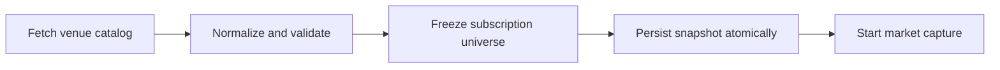

# Momentum universe identity foundation v1

Status: implemented and unit-tested, including a real-Postgres integration
suite and a live upgrade/downgrade/upgrade migration cycle. PR 8 of the
30-PR roadmap (foundation half of "cross-venue identity"), following
`feat/binance-momentum-watch-v1` (PR 7). Designed with a colleague before
implementation started; every section below traces back to a specific
point in that review.

## What this PR is and is not

**Is**: durable, versioned, per-instrument identity metadata (native
market id, base/quote/settle, onboarding time, a fail-closed identity
status) captured alongside each venue's own frozen universe, for both
Bybit and Binance. Before this PR, nothing durable recorded which
instrument a captured symbol actually was at a point in time -- only the
capturing process's own in-memory `Universe`, thrown away on restart.

**Is not** cross-venue matching. Nothing here compares Bybit's own
Instruments against Binance's, computes a cross-venue conflict, or claims
two rows are the same real-world asset. That is a separate, not-yet-built
RESOLUTION step. This distinction is load-bearing enough that it shows up
at the type level: `momentumsource.IdentityStatus` has no
`confirmed`/`conflict` value, because a single venue's own catalog fetch
has no way to know either of those.

## Why two steps, not one

A colleague review, before any code was written, pointed at the existing
`docs/research/ROADMAP.md` "Canonical instrument identity" checklist item
(already used by the pump-scanner's own cross-exchange discovery, a
different subsystem) as precedent: it already splits into a completed
"Foundation" sub-bullet and a still-open full-identity-resolution parent
bullet. This PR is the same split applied to the momentum-flow line.

## The shared type: `momentumsource.Instrument`

Before this PR, `bybit.SymbolCatalog` and `binance.SymbolCatalog` each
carried their own catalog fields with no shared per-instrument shape.
`momentumsource.Instrument` (`internal/momentumsource/instrument.go`) is
now that shared shape, built only through `NewInstrument`, which
classifies `IdentityStatus` itself from the raw inputs -- a caller cannot
construct a "ready" `Instrument` with missing or invalid fields by
skipping validation. `CanonicalMarketType` reuses `bybit.MarketType`/
`binance.MarketType` verbatim (both already `"linear_usdt_perpetual"`)
rather than inventing a second, parallel market-type vocabulary just for
identity.

## Fail-closed identity, enforced twice

`IdentityStatus` is one of five values: `ready`, `missing_onboarded_at`,
`invalid_onboarded_at`, `invalid_assets`, `unsupported_market_type`.
`IdentityKey()` returns a real key only for `ready`. This is enforced at
two independent layers, a colleague review's own explicit ask:

- In Go, `NewInstrument`'s own switch statement is the only place an
  `Instrument` is constructed.
- In Postgres, `momentum_universe_instruments`'
  `identity_key_only_when_ready` CHECK constraint makes the same
  invariant a schema-level guarantee, not just an application-level
  convention, and covers both `identity_key` and `onboarded_at`
  symmetrically -- a bug that somehow produced a `ready` row missing
  either one, or a non-`ready` row with either one non-NULL, fails the
  INSERT outright.

`missing_onboarded_at` and `invalid_onboarded_at` are kept distinct
(rather than one generic "bad onboard date" status) because they point at
different follow-up actions: a field the venue never sent at all versus
one it sent that failed validation are different failures to investigate.
Both venues can produce either: Bybit's `launchTime` (a string) can be
absent, `"0"` (its own "not recorded" sentinel), or an unparseable/
negative string; Binance's `onboardDate` (a JSON number) can be absent,
exactly `0` (its own equivalent sentinel), or negative -- a value it
structurally cannot fail to parse (it is already a number), but can still
be semantically impossible as a real onboard date.

The absent/zero/negative/valid classification rule itself is shared, not
duplicated per venue: `momentumsource.ClassifyOnboardedAtMs` (a
code-review finding -- `bybit.parseLaunchTimeMs` and
`binance.parseOnboardDateMs` originally reimplemented this identically,
and a negative-value fix had to land in both copies separately before
being factored out here). Each venue's own parser only handles its own
wire-format decoding (a JSON string that can be genuinely unparseable for
Bybit, an already-decoded `*int64` for Binance) before delegating to it.

## Why `catalog_version` is separate from `universe_version`

A colleague review's own finding, before implementation started:
`universe_version` (a hash of the frozen symbol list alone, unchanged
since before this PR) cannot detect a case where the symbol SET stays
identical but a symbol's own onboarding metadata silently changes
underneath it -- a delisted-and-relisted ticker reusing the same native
market id. `catalog_version` is a second, independent hash covering every
instrument's own full identity record plus a schema version, computed by
`momentumcapture.computeCatalogVersion`. A regression test
(`TestPersistUniverseSnapshotCatalogVersionChangesWhenOnboardedAtChangesButSymbolSetDoesNot`)
proves the same symbol under two different onboarding times produces two
distinct snapshots, not a silent overwrite or an undetected collision.

## Storage: two tables, not one flat table

Also a colleague review's own recommendation, before implementation
started: `app.momentum_universe_snapshots` (one row per fetch: exchange,
universe/catalog/capture/schema versions, instrument count, a whole-
payload hash) and `app.momentum_universe_instruments` (one row per
instrument, atomically linked to its own snapshot via the natural
composite key `(exchange, universe_version, catalog_version)` both
tables share). No surrogate auto-increment id anywhere -- this schema
matches every other table already in this database (bars, watch runs,
watch states all use natural keys).

## Atomicity, idempotency, and the mismatch-must-fail-loud rule

`momentumcapture.UniverseSnapshotWriter.PersistUniverseSnapshot` writes
the snapshot row and every instrument row in one Postgres transaction --
a partially-written snapshot must never be observable. Real-database
tests prove this end to end, not just by inspection:

- `TestPersistUniverseSnapshotIsAtomicOnAConstraintViolation` forces a
  primary-key violation partway through the instrument batch and confirms
  the already-inserted snapshot row is rolled back too, not left orphaned.
- `TestPersistUniverseSnapshotIsIdempotent` proves a retry with
  byte-identical instruments (e.g. after a process restart before
  confirming its own earlier write) succeeds without duplicating rows.
- `TestPersistUniverseSnapshotRejectsPayloadMismatchUnderTheSameKey`
  corrupts the already-stored `payload_hash` directly (standing in for a
  hash-computation change without a `schema_version` bump, or any other
  way a stored row could stop matching a fresh, correct computation for
  the same identity content) and confirms a retry with the same
  instruments returns `ErrSnapshotPayloadMismatch` rather than silently
  overwriting the existing row.
- `TestPersistUniverseSnapshotCaptureVersionChangeIsNotAMismatch` proves
  the opposite direction of the same fix: a retry with only
  `captureVersion` different succeeds as an idempotent no-op, since
  `captureVersion` is deliberately excluded from `payload_hash` (see the
  code-review finding note above).
- `TestPersistUniverseSnapshotIsIdempotentAgainstConcurrentWriters` runs
  several writers concurrently against the same identical instruments and
  key, on real Postgres, and confirms they all succeed with exactly one
  row set persisted -- the check-then-insert inside `persistOnce` is not
  atomic across transactions, so a writer that loses a `unique_violation`
  race on its own INSERT is expected to recheck against the row that won,
  not surface a raw constraint error (a code-review finding).
- `TestMomentumUniverseInstrumentsRejectsOnboardedAtOnNonReadyRow` proves
  `identity_key_only_when_ready` at the DB level directly (bypassing
  `PersistUniverseSnapshot`, which never produces this shape itself): a
  non-ready row with a non-NULL `onboarded_at` is rejected, not just one
  with a non-NULL `identity_key` -- an earlier version of the constraint
  only checked the latter (a code-review finding).

`computeCatalogVersion`'s own per-instrument metadata hashes are returned
as a slice positionally aligned with the already-sorted instrument list,
not a map keyed by `native_market_id` (a code-review finding: a map would
silently let two instruments sharing the same `native_market_id`
overwrite each other's hash -- currently unreachable in practice, since
the instruments table's own primary key rejects a duplicate
`native_market_id` before any row commits, but the hash computation
itself should not depend on that downstream constraint to be correct).

`payload_hash` is deliberately a wider hash than `catalog_version`: it
also covers the snapshot's own scalar fields (exchange, universe/capture/
schema version, instrument count), so a bug that produced the right
`catalog_version` but a wrong `instrument_count`, for example, is still
caught as a mismatch rather than silently accepted.

## Capture-startup invariant

A colleague review's own explicit sequencing requirement, now the actual
order in both `cmd/momentumcapture/main.go` (Bybit, live) and
`cmd/momentumcapturebinance/main.go` (Binance, not yet deployed):

Freeze comes before persist, not after: `universe_version` is part of the
snapshot's own primary key, so the universe hash has to be computed before
there is anything to persist it under. "Freeze" here means computing that
hash and `captured_at` from the already-fetched catalog, not opening any
subscription -- no I/O happens between freeze and persist, so this
ordering is a naming/documentation question, not a race.

If the snapshot write fails, the process closes its database pool and
returns an error before opening any trade/ticker stream -- it must never
capture bars for a universe with no matching identity catalog durably
recorded. This is not separately integration-tested at the `run()` level
(neither binary has ever unit-tested `run()` directly, a pre-existing
pattern this PR does not change): the guarantee is visible by inspection
(a plain early return, no goroutines started past that point) and its
one real failure mode -- `PersistUniverseSnapshot` itself returning an
error -- already has its own comprehensive real-database test coverage
above.

Both binaries call this through the same shared
`momentumcapture.PersistCaptureStartupSnapshot` helper (a code-review
finding: the two `main.go` files originally had this block, including its
own doc comment, copy-pasted verbatim) rather than each wiring
`UniverseSnapshotWriter` and its own pool-close-on-error handling
separately.

## Operational note

This PR touches `cmd/momentumcapture/main.go`, the source of the
currently-running Bybit canary process, in a way that is a genuine new
behavior, not a passive field addition: it adds a new database write to
its own startup sequence. Deploying it restarts that process the same as
any other change to its own file, subject to the same standing deploy
discipline as every other PR in this roadmap -- and, per the colleague
review's own explicit agreement, should land only at a deliberate capture-
epoch boundary, not mid-canary: restarting the Bybit process should never
retroactively change an already-accepted research cohort's own boundary.

## What a future resolution PR inherits

- Every instrument this foundation persisted, queryable by
  `identity_key` (a partial index already exists:
  `ix_momentum_universe_instruments_identity_key`).
- The exact fail-closed vocabulary a resolution step must extend, not
  reinvent: per the colleague review's own explicit list, a future
  cross-venue match should produce one of `candidate`, `confirmed`,
  `conflict`, `insufficient_evidence`, `manual_review_required`,
  `not_same_asset` -- never an automatic `confirmed` from a bare ticker
  match alone. `base=BTR` on two venues with close onboarding dates is a
  candidate, not proof of the same asset.
