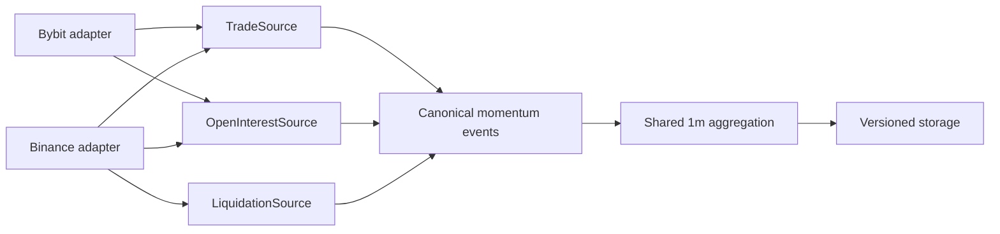

# Momentum venue capability matrix v1

Status: pre-expansion contract; no venue is enabled by this document.

As-of: 2026-08-12 UTC.

This matrix is the fail-closed boundary between venue-specific public APIs and the
future canonical momentum capture. It does not treat an endpoint mentioned in
official documentation as a working Schurfer feed. The states are:

- `implemented`: code, fixtures, and current capture semantics exist in Schurfer;
- `officially_documented`: an official venue contract exists, but no Schurfer adapter
  or live canary has proved it;
- `probe_required`: a plausible path exists, but semantics or operational behavior
  are unresolved;
- `unsupported`: the reviewed contract cannot provide the capability;
- `not_audited`: no capability claim has been made.

The typed source of truth and its validation rules live in
`apps/collector/internal/momentumvenue/capabilities.go`. This document is the review
view; future adapter PRs must update both together.

## Architectural decision

Do not create one large `Exchange` interface whose every implementation pretends to
support trades, OI, liquidations, order books, and execution. The canonical layer
will use narrow optional interfaces such as `UniverseSource`, `TradeSource`,
`OpenInterestSource`, `LiquidationSource`, and `LifecycleSource`. Each accepted event
must preserve:

- exchange and market type;
- exact venue instrument identity;
- exchange event time and local receive time;
- native versus derived value provenance;
- feed/session identity and gap state;
- adapter and capability-contract versions.

Missing capability is never zero, neutral, or a cross-venue fallback. It is
`unsupported`, `not_audited`, stale, interrupted, or unresolved with an explicit
reason.

## Reviewed matrix

| Venue              | Intended role          | Universe                                 | Trades                                            | OI amount                       | OI value              | Liquidations                                                             | Lifecycle                                    |
| ------------------ | ---------------------- | ---------------------------------------- | ------------------------------------------------- | ------------------------------- | --------------------- | ------------------------------------------------------------------------ | -------------------------------------------- |
| Bybit linear USDT  | confirmation/execution | implemented with contract-type scope gap | implemented individual taker-side trades          | implemented native WS           | implemented native WS | officially documented, not implemented                                   | implemented session IDs and per-shard events |
| Binance USD-M      | confirmation/execution | officially documented                    | officially documented `aggTrade`, not implemented | officially documented REST poll | probe required        | officially documented but censored to the latest event per symbol/second | probe required                               |
| OKX linear USDT    | confirmation/execution | not audited                              | not audited                                       | not audited                     | not audited           | not audited                                                              | not audited                                  |
| Bitget linear USDT | confirmation/execution | not audited                              | not audited                                       | not audited                     | not audited           | not audited                                                              | not audited                                  |
| Gate linear USDT   | discovery source       | not audited                              | not audited                                       | not audited                     | not audited           | not audited                                                              | not audited                                  |
| MEXC linear USDT   | discovery source       | not audited                              | not audited                                       | not audited                     | not audited           | not audited                                                              | not audited                                  |
| XT linear USDT     | discovery source       | not audited                              | not audited                                       | not audited                     | not audited           | not audited                                                              | not audited                                  |

## Findings that constrain the Binance adapter

1. Binance's reviewed futures stream exposes `aggTrade`, grouping trades with the
   same price and taking side over 100 ms. That is not the same object as Bybit's
   individual public trade. Total taker notional may remain useful, but top-K and
   large-trade histogram comparisons are prohibited until a contract explicitly
   resolves this granularity mismatch.
2. The reviewed current-open-interest endpoint provides native contract quantity and
   a response timestamp, but does not establish a native current OI-value field.
   `openInterest * current price` is not an acceptable silent substitute: it would
   need a frozen price source, timestamp alignment, unit conversion, and derived-value
   provenance.
3. Binance's all-market force-order stream emits at most the latest liquidation per
   symbol per 1000 ms. It is a censored signal, not a complete liquidation tape.
4. Official documentation is necessary but insufficient. Before capture, the adapter
   needs static payload fixtures, a bounded live probe, rate-limit accounting,
   reconnect/session semantics, gap injection tests, and a separate canary.

## Existing Bybit scope gap exposed by the matrix

`FetchSymbols()` currently requests `category=linear`, `status=Trading` and retains
symbols whose quote and settlement coins are both USDT. It does not decode or filter
the venue's `contractType` field. The current capture therefore has a working venue
universe implementation, but the stronger claim "perpetual-only" is not yet proved by
the adapter itself. Do not change the running canary mid-window; the canonical
interface PR must add the exact contract-type field, fixture, filter, and a report of
whether the frozen canary universe contained any non-perpetual instruments.

## Evidence

Bybit:

- [ticker and native OI fields](https://bybit-exchange.github.io/docs/v5/websocket/public/ticker)
- [public trade contract](https://bybit-exchange.github.io/docs/v5/websocket/public/trade)
- [all-liquidation stream](https://bybit-exchange.github.io/docs/v5/websocket/public/all-liquidation)
- [instrument catalog](https://bybit-exchange.github.io/docs/v5/market/instrument)

Binance USD-M:

- [WebSocket market streams](https://developers.binance.com/en/docs/catalog/core-trading-derivatives-trading-usd-s-m-futures/api/ws-streams/market)
- [REST market data, exchange information, and current open interest](https://developers.binance.com/en/docs/catalog/core-trading-derivatives-trading-usd-s-m-futures/api/rest-api/market-data)

## Gate to the next PR

This matrix does not bypass the Bybit 72-hour checkpoint. If that checkpoint passes,
the next PR may define the narrow canonical interfaces and port the existing Bybit
wiring without changing its stored semantics. Only after that refactor is verified
may a Binance adapter and its own bounded canary start. If the checkpoint fails, the
measured failure is fixed first and no venue is added.
